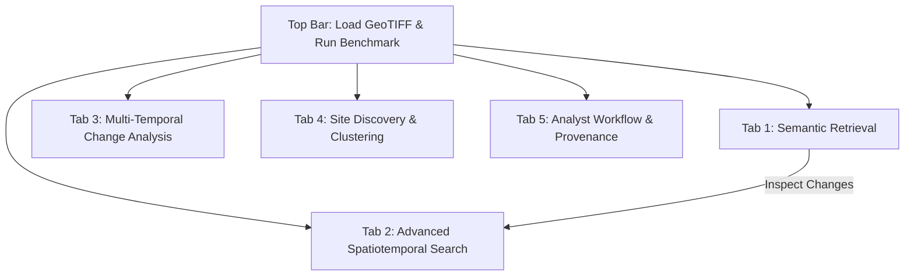

# GeoSemanticSat: Analyst User Guide & Dataset Ingestion Manual

**MoD / Indian Army (DGIS) • Problem Statement ID: 26227**  
*Semantic Retrieval and Multi-Temporal Change Analysis of Satellite Imagery*

---

## 1. Quick Start: Launching the Application

GeoSemanticSat runs on an air-gapped, on-premises Linux or Windows workstation with 100% offline intelligence.

### Launch the Desktop GUI
```bash
DOTNET_CLI_HOME=/home/non_qualities/.gemini/antigravity/scratch/.dotnet \
NUGET_PACKAGES=/home/non_qualities/.gemini/antigravity/scratch/.nuget/packages \
dotnet run --project src/GeoSemanticSat.UI
```

### Launch the Command Line Interface (CLI)
```bash
DOTNET_CLI_HOME=/home/non_qualities/.gemini/antigravity/scratch/.dotnet \
NUGET_PACKAGES=/home/non_qualities/.gemini/antigravity/scratch/.nuget/packages \
dotnet run --project src/GeoSemanticSat.Cli -- --help
```

---

## 2. Navigating the Analyst Console: Tab-by-Tab Walkthrough

The interface is structured into **5 operational tabs** tailored for military and geospatial intelligence analysts:



---

### Tab 1: Semantic Retrieval
*Objective: Find imagery patches across massive archives using natural language descriptions or visual similarity without needing prior coordinates.*

#### Controls & Buttons:
1. **Search Box & "Search Archive" Button**:
   - Type free-text search queries such as `"newly built structures near a river"`, `"aircraft on tarmac"`, `"soil clearance and earthworks"`.
   - The offline text encoder maps military remote sensing terminology into the 128-dimensional multi-spectral embedding space.
2. **Quick Query Chips**:
   - Click one of the preset chips (*"Structures near river"*, *"Vehicle concentrations"*, *"Airfield & runway"*, *"Deforestation / cleared land"*) for immediate single-click demonstration.
3. **Visualization Mode Dropdown**:
   - **True Color RGB**: Standard red-green-blue composite.
   - **False Color IR**: Near-Infrared (NIR) visualization (vegetation appears bright red, water absorbs NIR).
   - **NDVI Heatmap**: Normalized Difference Vegetation Index gradient (reveals biomass clearing vs. lush growth).
4. **Per-Result Buttons**:
   - **"Discover Similar"**: Uses image-to-image patch similarity. Takes the selected patch's 128-D vector to find semantically identical structures elsewhere in the theater.
   - **"Inspect Changes"**: **Pivots directly to Tab 2 (Advanced Spatiotemporal Search)**! It copies the exact latitude and longitude of the patch into the spatiotemporal filter, switches the active tab, and executes change detection over that location.

---

### Tab 2: Advanced Spatiotemporal Search
*Objective: Multi-criteria spatial, temporal, and semantic change verification with Before/After visual comparison.*

#### Controls & Buttons:
1. **Latitude, Longitude & Radius**:
   - Enter central coordinates (e.g., `28.6050°N, 77.2080°E`) and search radius in kilometers (e.g., `5.0 km`).
   - Uses geodesic **Haversine radial filtering** to isolate candidates within the specified zone of interest.
2. **Change Type Filter**:
   - Filter specifically for `Construction`, `Clearance`, `WaterExtentVariation`, `RoadDevelopment`, or `ActivityConcentration`.
3. **Sector Presets**:
   - **Sector Alpha**: Facility Ground (`28.605°N, 77.208°E`) — checks for new structures and building activity.
   - **Sector Bravo**: River Corridor (`28.592°N, 77.203°E`) — checks for water boundary variations and flood/dam alterations.
   - **Sector Charlie**: Clearance Plot (`28.604°N, 77.218°E`) — checks for deforestation and earth clearing.
4. **Dual Before & After Visual Panels**:
   - Displays side-by-side thumbnails showing the exact pre-event baseline ($T_1$) versus the post-event state ($T_2$).
5. **"Confirm Candidate" & "Reject (False Alarm)"**:
   - Logs the analyst's operational decision into the secure W3C PROV-O audit queue.

---

### Tab 3: Multi-Temporal Change Analysis & Heatmap Viewer
*Objective: Full-tile pixel-level change detection with automated false-alarm suppression.*

#### Controls & Buttons:
1. **"Run Multi-Temporal Change Detection"**:
   - Triggers the automated multi-spectral change engine between baseline scene $T_1$ and current scene $T_2$.
   - Performs:
     - **Radiometric Normalization**: Pseudo-Invariant Feature (PIF) relative normalization to remove atmospheric and solar elevation differences.
     - **Sub-Pixel Jitter Filtering**: Eliminates 1-pixel boundary misregistration noise.
     - **Seasonal Phenology Suppression**: Distinguishes cyclical vegetation growth from actual physical land clearance.
2. **Tri-Panel Visual Display**:
   - **Panel 1**: Baseline Scene ($T_1$ - Pre-event).
   - **Panel 2**: Current Acquisition ($T_2$ - Post-event).
   - **Panel 3**: **Change Heatmap Overlay** — highlights verified physical modifications (Red = Construction, Amber = Clearance, Cyan = Water change).

---

### Tab 4: Site Discovery & Spatial-Semantic Clustering
*Objective: Discover emerging unknown sites, unlisted bases, or tactical developments by clustering related changes.*

#### Controls & Buttons:
1. **"Cluster Archive Sites"**:
   - Executes spatial-semantic **DBSCAN** combining embedding cosine distance and geospatial Euclidean distance.
   - Groups scattered construction patches into unified tactical sites (e.g., identifying that 4 separate construction patches form a single new airfield or forward logistics hub).

---

### Tab 5: Analyst Workflow & Provenance Audit Trail
*Objective: Active learning model adaptation and tamper-evident provenance reporting.*

#### Controls & Buttons:
1. **"Active Learning Rerank"**:
   - Executes the **Rocchio Relevance Feedback Algorithm**:
     $$Q_{new} = \alpha Q_{orig} + \beta \frac{1}{|D_R|}\sum_{d \in D_R} d - \gamma \frac{1}{|D_{NR}|}\sum_{d \in D_{NR}} d$$
   - Modifies search embeddings using your confirmed vs. rejected decisions to improve future retrieval accuracy on subsequent queries.
2. **"Export W3C PROV-O GeoJSON"**:
   - Exports the entire audit trail to standard GeoJSON with W3C PROV-O provenance tags:
     - Tile IDs, acquisition dates, algorithm version, input SHA-256 hashes, analyst ID, and timestamped decisions.

---

## 3. How to Plug In External Satellite Datasets

GeoSemanticSat supports multi-spectral, multi-temporal, and multi-sensor datasets (Sentinel-2, Landsat 8/9, ISRO Bhuvan/Cartosat, PlanetScope, aerial drones).

### Method A: Direct Ingestion from the GUI
1. In the top-right header of the application, click the green button: **Load GeoTIFF**.
2. Select one or more `.tif` or `.tiff` files from your filesystem.
3. The engine automatically:
   - Reads the TIFF headers, projection tags (EPSG:4326 WGS84 or UTM), and tiepoints via `GeoTiffReader`.
   - Extracts multi-spectral bands (Red, Green, Blue, NIR, SWIR).
   - Tesselates the tile into 64×64 pixel patches.
   - Computes 128-dimensional embedding vectors using `MultiSpectralVisionEncoder`.
   - Adds patches into the live vector index.
   - Updates status: `"Successfully ingested N GeoTIFF(s), extracted & indexed M patches."`

---

### Method B: Automated Batch Ingestion via CLI
For automated data pipelines or archiving incoming passes from ground stations:

```bash
# Ingest an entire directory of GeoTIFFs into an index file:
dotnet run --project src/GeoSemanticSat.Cli -- index \
  --data-dir /path/to/satellite/imagery \
  --output /var/data/geosemantic_index.bin

# Run offline search against the indexed archive:
dotnet run --project src/GeoSemanticSat.Cli -- search \
  --index /var/data/geosemantic_index.bin \
  --query "new structures near water" \
  --top-k 10

# Execute multi-temporal change detection directly between two rasters:
dotnet run --project src/GeoSemanticSat.Cli -- search-change \
  --lat 28.6050 --lon 77.2080 --radius 5.0 \
  --change-type Construction
```

---

### Method C: Programmatic C# API Integration
If integrating GeoSemanticSat into an existing defence or GIS pipeline:

```csharp
using GeoSemanticSat.Core.Raster;
using GeoSemanticSat.Core.Model;
using GeoSemanticSat.Engine.Retrieval;

// 1. Read any standard GeoTIFF (WGS84 EPSG:4326 or projected)
var tile = GeoTiffReader.Read(
    filePath: "/data/acquisitions/2024_02_15_S2.tif",
    platform: SensorPlatform.Sentinel2_Optical,
    acquisitionTime: DateTime.UtcNow
);

// 2. Ingest into the Vector Index
int patchCount = searchEngine.IngestTile(tile, patchSize: 64);
Console.WriteLine($"Ingested {patchCount} patches from {tile.TileId}");

// 3. Persist updated index to disk
vectorIndex.Save("/var/data/geosemantic_index.bin");
```

---

## 4. Supported Bands & Multi-Sensor Compatibility

| Sensor Platform | Bands Recognized | Key Indices Computed |
| :--- | :--- | :--- |
| **Sentinel-2 (MSI)** | B02 (Blue), B03 (Green), B04 (Red), B08 (NIR), B11 (SWIR) | NDVI, NDWI, NDBI, MNDWI, BSI |
| **Landsat 8/9 (OLI)** | Band 2, Band 3, Band 4, Band 5, Band 6 | NDVI, NDWI, NDBI, MNDWI, BSI |
| **ISRO Bhuvan / Cartosat** | VNIR (Red, Green, Blue, NIR) | NDVI, NDWI, Sobel Edge Contrast |
| **Commercial / Drone (RGB)**| Band 1 (Red), Band 2 (Green), Band 3 (Blue) | Synthetic Green-Red Indices, Texture |
| **Sentinel-1 (SAR)** | VV, VH Polarizations | Surface Roughness, Water/Metal Dielectric Ratio |

---

## 5. False Alarm Suppression Guarantees

When external datasets are ingested across different seasons or weather conditions, the built-in filters automatically protect against spurious alerts:
- **Cloud & Cloud Shadow Filter**: Discards pixels with high cirrus reflection and ray-cast cloud shadow vectors.
- **Relative Radiometric Normalization (RRN)**: Normalizes contrast between different dates using Pseudo-Invariant Features (roads, deep water, bare bedrock).
- **Registration Jitter Filter**: Blocks sub-pixel edge jitter from triggering false road or building alerts.
- **Phenology Filter**: Distinguishes agricultural cycles (summer greening vs. autumn harvest) from genuine earth clearance.
