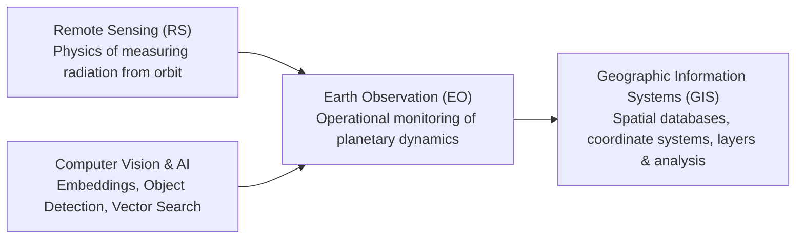

# Comprehensive Primer: GIS, Remote Sensing & Earth Observation for GeoSemanticSat

This primer provides the foundational domain knowledge—spanning physics, satellite sensor design, geographic coordinates, spectral mathematics, and specific satellite constellations—necessary to fully understand what **GeoSemanticSat** does and why its algorithmic decisions were made.

---

## 1. Core Distinctions: GIS vs. Remote Sensing vs. Earth Observation



* **Remote Sensing (RS)**: The science and technique of obtaining information about the Earth's surface without being in physical contact with it, primarily by measuring reflected solar radiation or emitted microwave energy captured by satellite-borne sensors.
* **Earth Observation (EO)**: The systematic, operational collection and analysis of remote sensing data over time to track terrestrial, oceanic, and atmospheric changes.
* **Geographic Information Systems (GIS)**: The software and data structures used to capture, store, manipulate, analyze, manage, and present spatially referenced geographical data.

---

## 2. From Pixels to the Globe: Coordinate Systems & Georeferencing

A regular digital photo (e.g., a JPEG from a smartphone) has an $X, Y$ pixel grid with no geographic meaning. A satellite image, however, is **georeferenced**: every single pixel corresponds to a precise latitude, longitude, and elevation on the Earth.

### 2.1 Raster vs. Vector Data
* **Raster Data**: A grid of regular square cells (pixels), where each cell contains numerical sensor values (e.g., reflectance in the Red band). Satellite images, digital elevation models (DEMs), and heatmaps are rasters.
* **Vector Data**: Geometry-based representations defined by mathematical vertices:
  * **Points**: Specific coordinates (e.g., an observation tower or vehicle location).
  * **Polylines**: Connected vertices (e.g., roads, rivers, trench lines).
  * **Polygons**: Closed boundaries (e.g., an airfield perimeter or agricultural parcel).

### 2.2 Coordinate Reference Systems (CRS) & Projections
The Earth is an irregular, squished ellipsoid (a geoid). To place data onto a map:
1. **Geographic Coordinate Systems (GCS)**: Express locations in angular degrees:
   * **WGS84 (EPSG:4326)**: The global GPS standard. Uses Latitude ($-90^\circ$ to $+90^\circ$) and Longitude ($-180^\circ$ to $+180^\circ$).
2. **Projected Coordinate Systems (PCS)**: Project the 3D globe onto a flat 2D plane measured in metric meters:
   * **UTM (Universal Transverse Mercator)**: Divides the Earth into 60 longitudinal zones of $6^\circ$ each. Within a zone, distances and areas can be calculated in standard meters without complex spherical trigonometry.

### 2.3 The Affine GeoTransform
In a GeoTIFF, an **Affine Transformation matrix** defines the mathematical mapping between pixel space $(x, y)$ and world coordinates $(X, Y)$:
$$\begin{bmatrix} X \\ Y \end{bmatrix} = \begin{bmatrix} A & B \\ D & E \end{bmatrix} \begin{bmatrix} x \\ y \end{bmatrix} + \begin{bmatrix} C \\ F \end{bmatrix}$$
* $C$: Longitude/Easting of the top-left corner.
* $F$: Latitude/Northing of the top-left corner.
* $A$: Pixel width ($X$ resolution) in map units (degrees or meters).
* $E$: Pixel height ($Y$ resolution, typically negative because raster rows increment downwards while latitudes increment northwards).
* $B, D$: Rotation and shear parameters (equal to $0$ for North-Up images).

---

## 3. The Electromagnetic Spectrum & Why Multi-Spectral Matters

Standard cameras capture only three wavelengths visible to human eyes: **Red** (~650 nm), **Green** (~550 nm), and **Blue** (~450 nm). Satellites capture a much wider range of the electromagnetic spectrum:

```
┌──────────────┬──────────────────┬─────────────────┬──────────────────┬──────────────────┐
│ Blue (B2)    │ Green (B3)       │ Red (B4)        │ Near-IR (NIR B8) │ Shortwave-IR     │
│ 490 nm       │ 560 nm           │ 665 nm          │ 842 nm           │ (SWIR B11/B12)   │
│              │                  │                 │                  │ 1610 / 2190 nm   │
├──────────────┴──────────────────┴─────────────────┼──────────────────┼──────────────────┤
│ Visible Light (Human Perception)                  │ Solar Reflected  │ Absorption       │
│ Clear water penetration, atmospheric aerosols     │ Cell walls of    │ Soil moisture,   │
│                                                   │ vegetation       │ minerals, burnt  │
└───────────────────────────────────────────────────┴──────────────────┴──────────────────┘
```

### 3.1 The Physics of Vegetation: "The Red Edge"
* Healthy plants contain **chlorophyll**, which absorbs blue and red light for photosynthesis.
* The spongy mesophyll cell structure inside healthy leaves **scatters and reflects over 50% of incoming Near-Infrared (NIR) light** to prevent thermal overheating.
* The steep transition between strong Red absorption and intense NIR reflection is called the **"Red Edge"**.
* When vegetation dries, dies, or is cleared by bulldozers, its NIR reflectance drops abruptly while its Red reflectance increases.

### 3.2 The Physics of Water
* Pure water bodies absorb virtually all NIR and SWIR radiation (reflectance near 0%).
* As a result, water bodies appear pitch black in NIR and SWIR imagery, providing razor-sharp contrast against land.

### 3.3 The Physics of Built-Up Structures & Concrete
* Man-made materials (concrete, asphalt, metal roofing, brick) have low NIR reflectance but high SWIR reflectance.
* This is the exact inverse of vegetation.

---

## 4. Mathematical Spectral Indices

Raw satellite values (Digital Numbers - DN) fluctuate based on sun angle, terrain slope, and atmospheric haze. Remote sensing scientists use **spectral band ratioing** to normalize illumination and isolate physical materials:

| Index | Formula | Physical Interpretation |
| :--- | :--- | :--- |
| **NDVI** (Normalized Difference Vegetation Index) | $\frac{\text{NIR} - \text{Red}}{\text{NIR} + \text{Red}}$ | **Biomass Health & Density**: Values between $+0.4$ and $+0.8$ indicate dense green vegetation; values near $0$ indicate bare soil; negative values indicate water. |
| **NDWI** (Normalized Difference Water Index) | $\frac{\text{Green} - \text{NIR}}{\text{Green} + \text{NIR}}$ | **Surface Water Delineation**: Water reflects more Green than NIR ($\text{NDWI} > 0$), while terrestrial features have $\text{NDWI} < 0$. |
| **NDBI** (Normalized Difference Built-up Index) | $\frac{\text{SWIR} - \text{NIR}}{\text{SWIR} + \text{NIR}}$ | **Man-Made Structures**: Concrete and buildings reflect more SWIR than NIR ($\text{NDBI} > 0$). |
| **NDSI** (Normalized Difference Snow Index) | $\frac{\text{Green} - \text{SWIR}}{\text{Green} + \text{SWIR}}$ | **Snow vs. Cloud Discrimination**: Snow reflects brightly in Green but strongly absorbs SWIR ($\text{NDSI} > 0.42$). Clouds reflect strongly in both ($\text{NDSI} < 0.40$). |
| **BSI** (Bare Soil Index) | $\frac{(\text{SWIR} + \text{Red}) - (\text{NIR} + \text{Blue})}{(\text{SWIR} + \text{Red}) + (\text{NIR} + \text{Blue})}$ | **Soil Clearance & Earthworks**: Isolates bare ground from built infrastructure and vegetation. |

---

## 5. The Core Challenge: Why Naive Image Differencing Fails

A common misconception is that satellite change detection is simply subtracting image $T_1$ from image $T_2$:
$$\Delta I = |I_{T_2} - I_{T_1}|$$
In real-world operational Earth Observation, **this formula produces over 95% false alarms**. Here is why:

1. **Solar Illumination Drift**: An image taken in June has a solar elevation of $65^\circ$, while an image taken in December has an elevation of $32^\circ$. Hilltops cast long shadows in winter that do not exist in summer.
2. **Atmospheric Optical Depth (AOD)**: Haze, aerosols, and humidity alter surface brightness unevenly across different spectral bands.
3. **Seasonal Phenology**: Agricultural fields naturally change from bare soil in planting season to bright green in summer, and back to dry brown in harvest. This is cyclical natural phenology, not military activity.
4. **Sub-Pixel Jitter**: Satellite push-broom line scanners travelling at 7.5 km/s in orbit experience micro-vibrations and orbital drift, leading to $\pm 1$ pixel spatial misregistration. At building borders and roads, subtracting unaligned pixels creates false bright edge dipoles.

### How GeoSemanticSat Solves This:
* **Relative Radiometric Normalization (RRN)** fits invariant ground features (deep water, roads, rock) to cancel atmospheric shift.
* **Sobel Jitter Tolerancing** checks adjacent neighborhood pixels to suppress 1-pixel boundary misregistrations.
* **Phenology-Aware Filtering** compares NDVI and Bare Soil Index (BSI) to differentiate seasonal crop cycles from real earthworks.
* **CUSUM Multi-Temporal Tracking** requires changes to persist across multiple observations before sounding an alarm.

---

## 6. Datasets & Sensor Constellations in GeoSemanticSat

GeoSemanticSat is built to handle the major international and Indian Earth Observation constellations:

### 6.1 Copernicus Sentinel-2 (European Space Agency)
* **Sensor**: Multi-Spectral Instrument (MSI).
* **Payload Bands**: 13 spectral bands ranging from visible to SWIR.
  * **10-meter resolution**: B02 (Blue), B03 (Green), B04 (Red), B08 (NIR).
  * **20-meter resolution**: B05, B06, B07 (Red Edge), B8A (Narrow NIR), B11 (SWIR-1), B12 (SWIR-2).
  * **60-meter resolution**: B01 (Coastal Aerosol), B09 (Water Vapour), B10 (Cirrus Cloud).
* **Revisit Cycle**: 5 days (constellation of 2 satellites: 2A and 2B).
* **Role in GeoSemanticSat**: Primary source for high-frequency regional surveillance and change analysis.

### 6.2 USGS / NASA Landsat 8 & 9
* **Sensor**: Operational Land Imager (OLI) and Thermal Infrared Sensor (TIRS).
* **Bands**: 30-meter multi-spectral (B1–B7), 15-meter panchromatic (B8), 100-meter thermal (B10–B11).
* **Role in GeoSemanticSat**: Deep historical baseline analysis (Landsat has continuously imaged the Earth since 1972).

### 6.3 ISRO Cartosat & Resourcesat (Indian Space Research Organisation)
* **Cartosat-2/3**: High-resolution panchromatic and multi-spectral sensors ($< 1$ meter to $0.25$ meter GSD) tailored for military cartography, terrain mapping, and target analysis.
* **Resourcesat (LISS-IV & AWiFS)**:
  * LISS-IV: 5.8-meter multispectral (Green, Red, NIR).
  * AWiFS: 56-meter wide-swath for rapid theater-wide synoptic coverage.
* **Role in GeoSemanticSat**: Supported via the unified GeoTIFF ingestion engine and standard EPSG:4326 / UTM georeferencing.

### 6.4 Synthetic Aperture Radar (SAR) - Sentinel-1 & RISAT
* **Physics**: Unlike optical sensors which depend on sunlight, SAR transmits active microwave pulses (C-band ~5.6 cm) and measures the backscattered signal.
* **Key Advantages**:
  * **All-Weather, Day-and-Night**: Microwave pulses penetrate cloud cover, monsoonal rain, smoke, and darkness.
  * **Polarization (VV, VH)**: Vertical-transmit/Vertical-receive vs. Vertical-transmit/Horizontal-receive discriminates metal structures, smooth water, and rough terrain.
* **Role in GeoSemanticSat**: Included as a distinct sensor platform option (`SensorPlatform.Sentinel1_SAR`) to support operational tracking during monsoon seasons.

### 6.5 The Benchmarking & Synthetic Ground Truth Datasets
To evaluate the system objectively without data leakage, GeoSemanticSat includes a synthetic multi-temporal scene generator (`BenchmarkRunner`):
* Generates real, standard multi-band GeoTIFF rasters on disk (`scene_t1.tif` through `scene_t4.tif`) with genuine WGS84 GeoTIFF tags and EPSG:4326 metadata.
* Embeds controlled, ground-truth physical phenomena:
  * River corridors with seasonal boundary fluctuations.
  * Forest tracts undergoing land clearance and deforestation.
  * Industrial facility grounds with new concrete construction and vehicle concentrations.
  * Road corridors and linear infrastructure developments.
* Provides a 100% reproducible baseline where ground-truth bounding boxes are known, enabling automated calculation of Precision, Recall, F1-Score, and false-alarm suppression rates.
