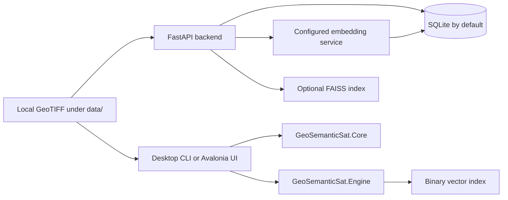

# GeoSemanticSat-V2

GeoSemanticSat-V2 contains two independently runnable applications for local geospatial analysis:

- `app/` is a FastAPI service that stores observation metadata and embeddings, ingests local GeoTIFF files, and exposes search, change, review, mission, export, and AI-oriented routes.
- `Desktop_App/Upgrahan2/` is a .NET 9/Avalonia desktop application. It runs Core and Engine analysis in-process; it does **not** call the FastAPI service.



## Runtime boundaries

The backend and desktop application share source concepts and may operate on the same local rasters, but the C# source contains no `:8000` client. Start the backend only for its REST API. The desktop map service can retrieve public basemap tiles in `Auto` or `OnlinePreferred` mode; `OfflineStrict` reads only local cache.

## Backend

Compose starts an `api` container on port 8000. It defaults to SQLite at `/app/dbdata/satintel.db` in the `api_db` named volume. A PostGIS image is available only through the `postgres` profile; ORM entities use ordinary columns rather than PostGIS geometry types.

```powershell
docker compose up -d
docker compose exec api python scripts/init_db.py
docker compose exec api python scripts/create_sample_data.py
```

Open `http://127.0.0.1:8000/docs` for the version-matched API contract. Ingestion is `POST /api/v1/ingest`; its path is relative to `DATA_ROOT`, must remain under that directory, and must name a GeoTIFF.

## Desktop and CLI

```powershell
dotnet run --project "Desktop_App\Upgrahan2\src\GeoSemanticSat.UI\GeoSemanticSat.UI.csproj"
dotnet run --project "Desktop_App\Upgrahan2\src\GeoSemanticSat.Cli\GeoSemanticSat.Cli.csproj" -- help
```

The CLI supports `benchmark`, `index`, `search`, `detect`, and `search-change`. `index` writes a local binary index; `detect` writes GeoJSON provenance.

## Tests

```powershell
docker compose exec api pytest -v
dotnet test "Desktop_App\Upgrahan2\src\GeoSemanticSat.Tests\GeoSemanticSat.Tests.csproj"
```

The source-aligned documentation is in [documentation/README.md](documentation/README.md).