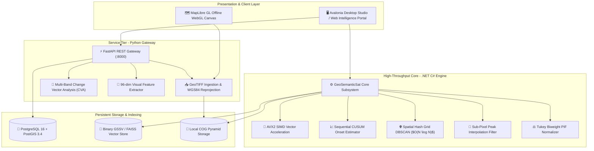

# 🛰️ UpaGraha: Offline-First Geospatial Intelligence & Satellite Analytics Platform

[](#)
[](#)
[](#)
[](#)
[](#)

**UpaGraha** is an enterprise-grade Earth Observation (EO) and geospatial intelligence (GEOINT) platform architected for **100% air-gapped, zero-internet, offline operation**. It empowers defense and intelligence analysts, disaster response forces, and environmental monitors to ingest high-resolution satellite imagery, execute sub-millisecond visual similarity searches, detect physical land-use changes, track multi-temporal onset timelines, and conduct analyst review workflows without connecting to external cloud infrastructure or map providers.

---

## 📑 Documentation Reference Index

| Document | Topic & Focus Area | Direct File Link |
| :--- | :--- | :--- |
| **01. System Architecture** | High-level architecture, layer breakdown, sequence diagrams & air-gapped guarantees | [`documentation/01_system_architecture.md`](file:///c:/Users/aryan/OneDrive/Desktop/UpaGraha/documentation/01_system_architecture.md) |
| **02. Algorithms & Mathematics** | CVA change detection, Sequential CUSUM onset, sub-pixel jitter filter, Tukey PIF, geodesic area | [`documentation/02_algorithms_and_mathematics.md`](file:///c:/Users/aryan/OneDrive/Desktop/UpaGraha/documentation/02_algorithms_and_mathematics.md) |
| **03. Remote Sensing & Sensors** | Sensor band mapping (Sentinel-2, Landsat, PlanetScope), spectral indices, cloud & shadow math | [`documentation/03_remote_sensing_and_sensors.md`](file:///c:/Users/aryan/OneDrive/Desktop/UpaGraha/documentation/03_remote_sensing_and_sensors.md) |
| **04. API Gateway Reference** | FastAPI endpoints, Pydantic schemas, request/response JSON contracts, query pagination | [`documentation/04_api_reference.md`](file:///c:/Users/aryan/OneDrive/Desktop/UpaGraha/documentation/04_api_reference.md) |
| **05. Desktop Intelligence Engine** | GeoSemanticSat C# engine, SIMD AVX2 acceleration, GSSV binary index, Avalonia UI canvas | [`documentation/05_desktop_engine_guide.md`](file:///c:/Users/aryan/OneDrive/Desktop/UpaGraha/documentation/05_desktop_engine_guide.md) |
| **06. Deployment & Security** | Air-gapped deployment manual, Dockerfile non-root hardening, Compose PostGIS volume wiring | [`documentation/06_deployment_and_security.md`](file:///c:/Users/aryan/OneDrive/Desktop/UpaGraha/documentation/06_deployment_and_security.md) |
| **07. Issue Resolution & Audit** | Exhaustive technical audit of all resolved bugs, mathematical fixes, and performance upgrades | [`documentation/07_issue_resolution_and_audit.md`](file:///c:/Users/aryan/OneDrive/Desktop/UpaGraha/documentation/07_issue_resolution_and_audit.md) |

---

## 🏛️ System Architecture Blueprint



---

## 🎯 System Capabilities & Performance Matrix

| Capability / Subsystem | Traditional System Baseline | UpaGraha Production Standard | Operational Benefit |
| :--- | :--- | :--- | :--- |
| **Spatial Bounding System** | Native UTM meters without reprojection | Automatic WGS84 (EPSG:4326) transformation | Perfect alignment across global GIS viewers and vector layers |
| **Change Detection** | Single-band scalar difference $|I_2 - I_1|$ | Multi-Band Change Vector Analysis (CVA) | Accurate classification: `CLEARANCE`, `CONSTRUCTION`, `WATER` |
| **Onset Date Estimation** | Single-baseline comparison ($T_i - T_0$) | Sequential CUSUM with Rolling Variance ($3.5\sigma$) | Completely immune to seasonal vegetation greening false alarms |
| **Jitter Suppression** | Integer shift testing ($\pm 1\text{ px}$) | Sub-Pixel Quadratic Peak & Bilinear Interpolation | Eliminates false alarms from $0.1 - 0.8\text{ px}$ orthorectification jitter |
| **Radiometric Calibration** | Ordinary Least Squares (OLS) | Iteratively Reweighted Least Squares (IRLS) with Tukey | Outlier-resistant gain/bias fitting under large ground disturbances |
| **Spatial Clustering** | Brute-force $O(N^2)$ all-pairs DBSCAN | Spatial Hash Grid pre-filtering ($O(N \log N)$) | Sub-second unsupervised cluster discovery across 100k patches |
| **Vector Similarity** | Heap-allocated list cloning on query | Zero-allocation in-place SIMD search (`ReaderWriterLockSlim`) | $< 1.0\text{ms}$ search latency with unlimited parallel reader threads |
| **Surface Area Math** | Flat planar Cartesian calculation | WGS84 Ellipsoidal Geodesic Area ($\cos\phi$ corrected) | True physical area in $\text{m}^2$ / hectares across all latitudes |

---

## 🔬 Core Mathematical & Algorithmic Formulations

```
+-------------------------------------------------------------------------------------------------------------+
|                                     UPAGRAHA MATHEMATICAL FORMULATION SUITE                                 |
+-------------------------------------------------------------------------------------------------------------+
| 1. MULTI-BAND SPECTRAL MAGNITUDE                                                                            |
|    M(x, y) = sqrt( sum_{b=1}^B ( rho_b^(T2)(x, y) - rho_b^(T1)(x, y) )^2 )                                 |
|                                                                                                             |
| 2. SEQUENTIAL CUSUM ONSET DETECTION                                                                         |
|    S_k^+ = max(0, S_{k-1}^+ + (Y_k - mu_0) - 0.5*sigma_0),   Alarm when S_k^+ > 3.5*sigma_0                 |
|                                                                                                             |
| 3. SUB-PIXEL JITTER PARABOLIC PEAK FITTING                                                                  |
|    Delta x_sub = x_max + [ C(y_max, x_max-1) - C(y_max, x_max+1) ] / [ 2*(2*C_center - C_left - C_right) ] |
|                                                                                                             |
| 4. ELLIPSOIDAL GEODESIC SURFACE AREA                                                                        |
|    Area(meters^2) = Width * Height * GSD^2 * cos(Latitude)                                                  |
+-------------------------------------------------------------------------------------------------------------+
```

---

## 📡 Sensor & Spectral Band Directory

| Sensor Platform | Native Bands Configured | Spatial GSD | Primary Strategic Indices |
| :--- | :--- | :---: | :--- |
| **Sentinel-2 MSI** | B2 (Blue), B3 (Green), B4 (Red), B8 (NIR), B11 (SWIR1), B12 (SWIR2) | 10m / 20m | $\text{NDVI}, \text{NDWI}, \text{NDBI}, \text{MNDWI}, \text{BSI}$ |
| **Landsat-8/9 OLI**| B2 (Blue), B3 (Green), B4 (Red), B5 (NIR), B6 (SWIR1), B7 (SWIR2) | 30m | $\text{NDVI}, \text{NDWI}, \text{NDBI}, \text{BSI}, \text{NDSI}$ |
| **PlanetScope** | B1 (Blue), B2 (Green), B3 (Red), B4 (NIR) | 3.0m | High-resolution tactical change detection & visual search |
| **Sentinel-1 SAR** | C-Band (VV, VH Polarization) | 10m | All-weather structural coherence & flood boundary mapping |

---

## 🚀 Quickstart & Air-Gapped Setup

### 1. Environment Configuration
```powershell
# Copy environment configuration template
Copy-Item Unified-RSanalytics/.env.example Unified-RSanalytics/.env
```

### 2. Database & Vector Index Initialization
```powershell
# Initialize database tables and spatial extensions
python -m scripts.init_db

# Generate synthetic multi-spectral test rasters
python -m scripts.create_sample_data

# Build local FAISS cosine similarity index
python -m scripts.build_index
```

### 3. Launching Services via Docker Compose
```powershell
docker-compose up -d
```
Verify health status at `http://127.0.0.1:8000/health`.

---

## 🛡️ Security & Air-Gapped Hardening

- **Unprivileged Execution:** Backend container executes under dedicated system user `appuser (UID 1000)`.
- **Path Traversal Protection:** All GeoTIFF path inputs are validated via strict `Path.is_relative_to(DATA_ROOT)` containment checks.
- **Persistent Storage:** PostGIS database volume (`postgis_data`) is attached directly to container storage.
- **Zero Telemetry:** All third-party telemetry, automatic updates, and remote CDN fetches are disabled.

---

*UpaGraha Enterprise Geospatial Intelligence Suite. Designed for mission-critical offline operations.*
