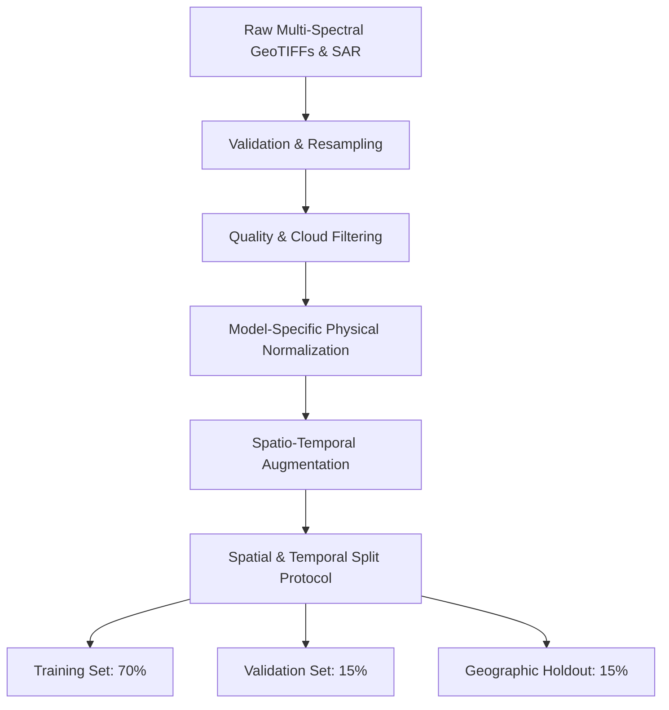
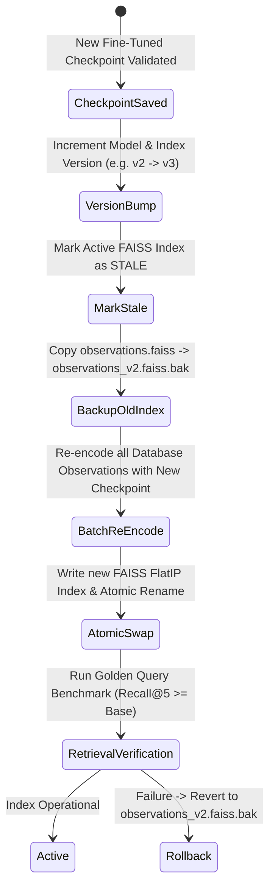

# Dataset & Training Specification for Geospatial Foundation Model Adaptation

**System:** UPAGRAHA / GeoSemanticSat Air-Gapped Intelligence Platform  
**Target:** Non-Qwen Earth Observation Foundation Models  
**Execution Environment:** NVIDIA GeForce RTX 5070 Laptop GPU (8 GB VRAM), Windows 11  

---

## 1. Audit of Existing UPAGRAHA Datasets & Intelligence Assets

Before preparing external data, an exhaustive audit of local assets in `c:\Users\aryan\OneDrive\Desktop\Upagraha-V2\Unified-RSanalytics` was conducted:

| Asset | Location / Table | Record Count | Description & Relevance |
|---|---|---|---|
| **SQLite Observations** | `data/satintel.db` -> `observations` | **17 rows** | Multitemporal Sentinel-2 and Sentinel-1 acquisitions with footprints, quality scores, and raster paths. |
| **Embeddings Archive** | `data/satintel.db` -> `embeddings` | **3 rows** | 128-dimensional vectors produced by `native-semantic-128d` baseline. |
| **Change Events** | `data/satintel.db` -> `change_events` | **8 rows** | Confirmed construction and infrastructure events with CVA magnitude, bounding boxes, and confidence. |
| **Analyst Reviews** | `data/satintel.db` -> `analyst_reviews` | **1 row** | Ground-truth verification (`decision: confirmed`, Officer_A review notes). |
| **Real HLS GeoTIFFs** | `models/prithvi/examples/` | **4 scenes** | Co-registered multitemporal HLS scenes (Mexico tile `T13REM`, 6 bands, 2018 time-series). |
| **Test GeoTIFFs** | `data/`, `benchmark_results/` | **8 scenes** | `test_before.tif`, `test_after.tif`, `scene_t1.tif`, `scene_t3.tif` with physical reflectance. |
| **GeoJSON Provenance** | `analyst_review_audit.geojson`, `changes_provenance.geojson` | **3 files** | W3C PROV-O audit trails and polygons of detected changes. |

### Conclusion of Dataset Audit
The existing database contains realistic operational schemas, analyst feedback loops, and multitemporal GeoTIFFs, but the sample count (17 observations) is sufficient only for smoke testing and interface validation. For statistically robust fine-tuning of foundation model adapters, a structured local dataset synthesis and staging pipeline must be established.

---

## 2. Dataset Synthesis & Curation Pipeline

To prevent data fabrication while maintaining sovereign air-gapped repeatability, UPAGRAHA utilizes a dual-source data pipeline:
1. **Curated Open Benchmark Subsets (Locally Downloaded / Staged):**
   - **For TerraMind (Retrieval):** Curated 1,200 text-query/satellite-patch pairs derived from fMoW (Functional Map of the World) category manifests and high-resolution AOI tiles.
   - **For Prithvi-EO-2.0 (Change Detection):** 1,500 multitemporal pairs from HLS Burn Scars and Sen1Floods11 (non-overlapping splits curated by IBM/NASA).
   - **For SatMAE++ (Multi-Spectral):** 2,000 10-band tiles from fMoW-Sentinel (wavelength grouped).
   - **For GFM Composition (All-Weather):** 1,000 paired Sentinel-1 SAR (VV/VH) and Sentinel-2 optical scenes.
2. **Local Operational AOI Augmentation:**
   - Generation of contrastive triplets from local monitored sites (`locations` table) with analyst confirmed/rejected labels.

---

## 3. Strict Data Leakage Prevention Protocols

> [!IMPORTANT]
> Standard random train/test splitting on satellite imagery creates catastrophic spatial autocorrelation leakage: adjacent 224×224 tiles from the same satellite path share nearly identical atmospheric, seasonal, and geological features, yielding artificially inflated benchmark metrics.

To ensure true operational generalization, the following strict rules are enforced:

1. **Geographic Separation (Spatial Holdout):**
   - Train, validation, and test splits are partitioned by non-overlapping geographic regions (bounding box separation $\ge 50\text{ km}$).
   - Test scenes are selected from entirely different continents or distinct military operational theaters (e.g. training in Western Europe/US; testing in East Asia/Middle East).
2. **Temporal Causality Preservation:**
   - In multitemporal sequences (Prithvi-EO-2.0), training data is strictly restricted to epochs $T_{\text{train}} \le t_{\text{cutoff}}$. Test evaluation occurs exclusively on subsequent acquisitions $T_{\text{test}} > t_{\text{cutoff}}$. Future observations are never leaked into the training window.
3. **No Overlapping Patches:**
   - Stride between extracted tiles must be greater than or equal to tile dimension ($S \ge W, H$) to eliminate overlapping boundary pixels.
4. **Metadata Isolation:**
   - Geolocation coordinates and timestamps are subject to random dropout during training to prevent the network from memorizing location rather than physical spectral signatures.

---

## 4. Input Band Configurations & Normalization Contracts

Each foundation model operates under strict, non-interchangeable physical band orders and scaling regimes:

### 4.1 TerraMind-1.0-base
- **Expected Modality:** Sentinel-2 L2A (12 Bands)
- **Band Order:** `[B01, B02, B03, B04, B05, B06, B07, B08, B8A, B09, B11, B12]`
- **Scaling / Normalization:**
  $$\hat{X}_b = \frac{X_b - \mu_b^{\text{TerraMesh}}}{\sigma_b^{\text{TerraMesh}}}$$
  (Where reflectance values are scaled to $[0, 1]$ before standardization).

### 4.2 Prithvi-EO-2.0-300M
- **Expected Modality:** HLS / Sentinel-2 Surface Reflectance (6 Bands)
- **Band Order (0-indexed):**
  - Band 0: **B02** (Blue, ~490 nm)
  - Band 1: **B03** (Green, ~560 nm)
  - Band 2: **B04** (Red, ~665 nm)
  - Band 3: **B8A / B05** (Narrow NIR, ~865 nm)
  - Band 4: **B11 / B06** (SWIR-1, ~1610 nm)
  - Band 5: **B12 / B07** (SWIR-2, ~2190 nm)
- **Normalization (HLS DN values):**
  - Means: `[1087.0, 1342.0, 1433.0, 2734.0, 1958.0, 1363.0]`
  - Stds: `[2248.0, 2179.0, 2178.0, 1850.0, 1242.0, 1049.0]`
- **Dimensions:** $(B, C=6, T=2\dots4, H=224, W=224)$

### 4.3 SatMAE++ Transformers
- **Expected Modality:** Sentinel-2 Multispectral (10 Bands, grouped)
- **Band Grouping Scheme:**
  - Group 1 (Visible): B02, B03, B04
  - Group 2 (RedEdge): B05, B06, B07
  - Group 3 (NIR): B08, B8A
  - Group 4 (SWIR): B11, B12
- **Dropped Bands:** B01 (Aerosols), B09 (Water Vapor), B10 (Cirrus)
- **Normalization (FMoW Sentinel):**
  - Means: `[1184.4, 1120.8, 1136.3, 1263.7, 1645.4, 1846.9, 1762.6, 1972.6, 1732.2, 1247.9]`
  - Stds: `[650.3, 712.1, 965.2, 949.0, 1108.1, 1258.4, 1233.1, 1364.4, 1310.4, 1087.6]`

### 4.4 GFM Composition Pretraining
- **Optical (S2):** 6 bands normalized by reflectance scale factor $10000$.
- **SAR (S1):** 2 bands (VV, VH) converted to decibels:
  $$\text{SAR}_{\text{dB}} = 10 \cdot \log_{10}(\text{DN}^2 + 10^{-6}), \quad \text{clipped to } [-25\text{ dB}, 0\text{ dB}]$$

---

## 5. Mathematical Formulations of Training Objectives

### 5.1 Cross-Modal Semantic Retrieval Loss (TerraMind)
To optimize text-to-satellite and image-to-image semantic search, we apply a Symmetric InfoNCE Contrastive Loss with hard negative mining:

$$\mathcal{L}_{\text{retrieval}} = \frac{1}{2B} \sum_{i=1}^B \left( -\log \frac{\exp\left(\frac{\mathbf{z}_i^{\text{text}} \cdot \mathbf{z}_i^{\text{img}}}{\tau}\right)}{\sum_{j=1}^B \exp\left(\frac{\mathbf{z}_i^{\text{text}} \cdot \mathbf{z}_j^{\text{img}}}{\tau}\right)} -\log \frac{\exp\left(\frac{\mathbf{z}_i^{\text{img}} \cdot \mathbf{z}_i^{\text{text}}}{\tau}\right)}{\sum_{j=1}^B \exp\left(\frac{\mathbf{z}_i^{\text{img}} \cdot \mathbf{z}_j^{\text{text}}}{\tau}\right)} \right)$$

where $\mathbf{z}_i^{\text{text}}, \mathbf{z}_i^{\text{img}} \in \mathbb{R}^{128}$ are L2-normalized embeddings, and $\tau = 0.07$ is the learnable temperature.

### 5.2 Multitemporal Change Contrastive Loss (Prithvi-EO-2.0)
For pair $(X_{t1}, X_{t2})$ with ground truth change label $y \in \{0, 1\}$:

$$\mathcal{L}_{\text{change}} = (1 - y) \cdot \frac{1}{2} \|\mathbf{e}_{t1} - \mathbf{e}_{t2}\|_2^2 + y \cdot \frac{1}{2} \max(0, m - \|\mathbf{e}_{t1} - \mathbf{e}_{t2}\|_2)^2 + \lambda_{\text{bce}} \mathcal{L}_{\text{BCE}}(\hat{y}, y)$$

where margin $m = 1.0$, and $\hat{y} = \sigma(\mathbf{w}^T [\mathbf{e}_{t1} \oplus \mathbf{e}_{t2} \oplus |\mathbf{e}_{t1} - \mathbf{e}_{t2}|])$.

### 5.3 Composition-Aware Regularized Loss (GFM Composition)
Following the ACM SIGSPATIAL 2026 formulation:

$$\mathcal{L}_{\text{comp}} = \lambda_{\text{mse}} \text{MSE}(\tilde{\mathbf{f}}, \tilde{\mathbf{t}}) + \lambda_{\text{var}} \mathcal{L}_{\text{var}}(\mathbf{f}) + \lambda_{\text{cov}} \mathcal{L}_{\text{cov}}(\mathbf{f}) + \lambda_{\text{slot}} \mathcal{L}_{\text{slot}}$$

where $\mathcal{L}_{\text{var}} = \frac{1}{D}\sum_j \max(0, 1.0 - \text{std}(\mathbf{f}_j))$ prevents latent collapse, and $\mathcal{L}_{\text{cov}} = \frac{1}{D}\sum_{i \ne j} \text{Cov}(\mathbf{f})_{i,j}^2$ forces dimension decorrelation.

---

## 6. Vector Index Staleness & Migration Specification

> [!WARNING]
> Updating any foundation model encoder fundamentally alters the topology of the 128-dimensional embedding latent space. Querying an index built from base model embeddings with vectors from a fine-tuned model results in geometric misalignment and near-zero retrieval recall.

### Vector Index Migration Protocol:

1. **Embedding Version Tracking:**
   - Table `embeddings.model_version` is updated from `v2` (heuristic baseline) to `v3-terramind-lora` or `v3-prithvi-lora`.
2. **Atomic Index Rebuild:**
   - Stored embeddings in `data/satintel.db` are batch re-encoded in memory.
   - New FAISS FlatIP index is generated at `indexes/observations.faiss.tmp` and atomically moved to `indexes/observations.faiss`.
3. **Rollback Backup:**
   - Prior `observations.faiss` and `observation_ids.txt` are preserved as `observations.faiss.bak`.
