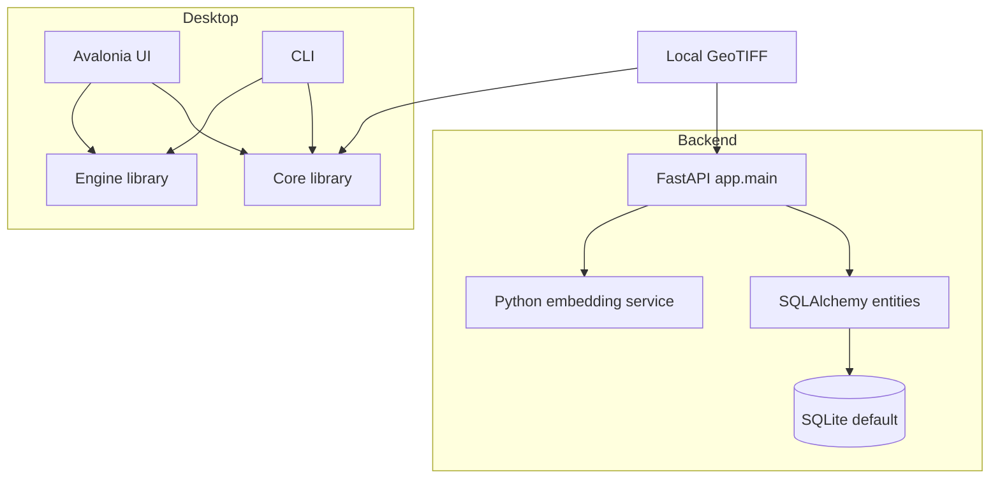

# System overview

GeoSemanticSat-V2 has a Python REST backend and a C# desktop stack. They are separate execution paths.

The backend creates database tables during lifespan startup. The desktop application consists of Core, Engine, CLI, UI, and xUnit test projects, all targeting `net9.0`. The C# source contains no FastAPI endpoint client.

`app/core/config.py` configures `data`, `models`, `indexes`, and `checkpoints` and creates these paths at settings load. A path existing does not establish that expected artifacts are present.