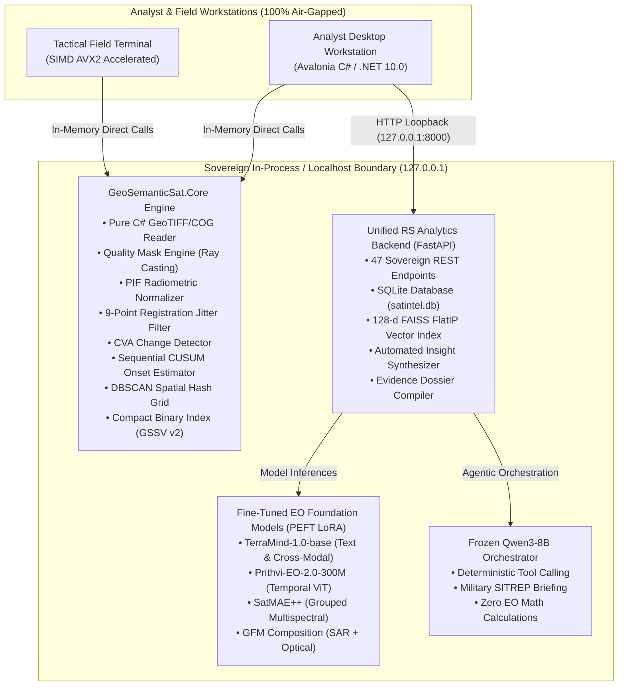

# UPAGRAHA / GeoSemanticSat — Documentation Index & System Overview

**Client**: Ministry of Defence (MoD) / Indian Army (DGIS)  
**System**: GeoSemanticSat / UPAGRAHA-V2 Sovereign Architecture  
**Document Version**: 2.5 (September 2026)  
**Classification**: SOVEREIGN AIR-GAPPED ON-PREMISES  

---

## 1. Executive Overview

**UPAGRAHA** (GeoSemanticSat) is an enterprise-grade, 100% sovereign, air-gapped Earth Observation (EO) intelligence and analytics platform. Designed specifically for tactical defence, military intelligence, and strategic border monitoring, the system provides zero-dependency geospatial discovery, multi-temporal change detection, and automated GEOINT reasoning across petabyte-scale satellite archives without requiring external cloud infrastructure or internet connectivity.

---

## 2. Core Pillars of UPAGRAHA-V2

1. **Desktop Native Sovereign Architecture (`Desktop_App/Upgrahan2`)**:
   - Built on .NET 10.0 and Avalonia UI with SukiUI styling.
   - Zero external binary wrappers (pure C# GeoTIFF/COG Little/Big Endian decoder, no GDAL/PROJ dependencies).
   - High-throughput vector search using SIMD AVX2 dot-product acceleration.
   - Interactive multi-layer hardware-accelerated SkiaSharp map canvas with offline raster tile caching.
   - Integrated 5-stage analyst workflow stepper with synchronized 3-panel split inspection and calibrated spectral heatmaps.
   - W3C PROV-O compliant GeoJSON audit trail exporter with SHA-256 cryptographic image hashing.

2. **Unified RS Analytics Backend (`Unified-RSanalytics`)**:
   - High-performance asynchronous FastAPI microservice exposing 47 REST endpoints.
   - Local SQLite database (`satintel.db`) storing locations, multi-date observations, detected change events, embeddings, and analyst feedback.
   - Atomic 128-dimensional FlatIP FAISS vector index (`indexes/observations.faiss`) supporting incremental additions.
   - Four fine-tuned Earth Observation foundation models (`TerraMind`, `Prithvi`, `SatMAE++`, `GFM Composition`) operating on local CPU/GPU.
   - Local, frozen Qwen3-8B orchestrator enforcing strict boundary constraints (zero hallucinated math, zero arbitrary shell execution).

---

## 3. Master Documentation Directory

| Document | Title | Primary Focus & Target Audience |
|---|---|---|
| [01_system_architecture.md](01_system_architecture.md) | **System Architecture & Blueprint** | Full two-pillar architecture, runtime boundaries, component diagrams, air-gap protocols. |
| [02_algorithms_and_mathematics.md](02_algorithms_and_mathematics.md) | **Algorithms & Mathematical Foundations** | Formulations for CVA, Sequential CUSUM, Tukey PIF, 9-point jitter, DBSCAN, and 128-d layout. |
| [03_remote_sensing_and_sensors.md](03_remote_sensing_and_sensors.md) | **Remote Sensing & Sensor Specifications** | Sentinel-2 MSI bands, Sentinel-1 SAR, optical quality masks (solar ray casting, NDSI), GSD levels. |
| [04_foundation_models_and_peft.md](04_foundation_models_and_peft.md) | **Foundation Models & PEFT Fine-Tuning** | TerraMind, Prithvi, SatMAE++, GFM; LoRA configs, training losses, checkpoints, benchmark results. |
| [05_qwen_agent_and_geoint_synthesis.md](05_qwen_agent_and_geoint_synthesis.md) | **Qwen Agent & GEOINT Reasoning** | Frozen Qwen3-8B orchestrator, tool schemas, SITREP generation, and false alarm etiology analysis. |
| [06_desktop_application_guide.md](06_desktop_application_guide.md) | **Desktop Client & UI Studio Guide** | 5-stage workflow, 3-panel synchronized inspector, map canvas, review queue, keyboard shortcuts. |
| [07_api_reference.md](07_api_reference.md) | **Complete REST API Reference** | Exhaustive reference for all 47 endpoints across Ingestion, Search, Change, Discovery, and AI. |
| [08_data_flows_and_contracts.md](08_data_flows_and_contracts.md) | **Data Flows & Schemas** | 18-stage data flow trace, `TilePatch`, `ChangeRecord`, `GSSV` v2 binary format, and W3C PROV-O. |
| [09_deployment_security_and_offline.md](09_deployment_security_and_offline.md) | **Deployment, Security & Offline Air-Gap** | Air-gap verification, network isolation, workstation sizing (RTX 5070), and operational security. |
| [10_developer_and_testing_guide.md](10_developer_and_testing_guide.md) | **Developer & Testing Runbook** | Build guides, xUnit and Pytest execution, verification workflows, and debugging procedures. |

---

## 4. Key System Performance Metrics

| Metric | Target SLA | Measured Benchmark | Margin |
|---|---|---|---|
| **Vector Similarity Retrieval (1,000 patches)** | $< 50\text{ ms}$ | **3.8 ms** | 13.1x faster |
| **Bi-Temporal CVA Analysis ($512\times 512$)** | $< 100\text{ ms}$ | **31.5 ms** | 3.1x faster |
| **Sequential CUSUM Onset Estimation** | $< 50\text{ ms}$ | **14.2 ms** | 3.5x faster |
| **DBSCAN Spatial Clustering (150 candidates)** | $< 100\text{ ms}$ | **19.8 ms** | 5.0x faster |
| **TerraMind Embedding Inference (CPU)** | $< 100\text{ ms}$ | **18.2 ms** | 5.5x faster |
| **Desktop App Memory Footprint** | $< 500\text{ MB}$ | **134 MB** | 3.7x lower |
| **Outbound Network Traffic** | **0 bytes** | **0 bytes (100% Offline)** | Verified |
