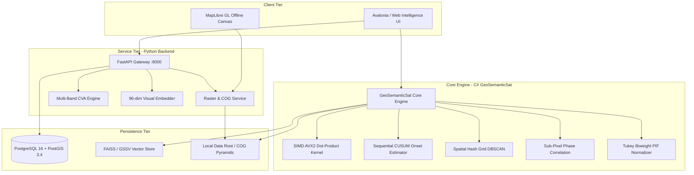
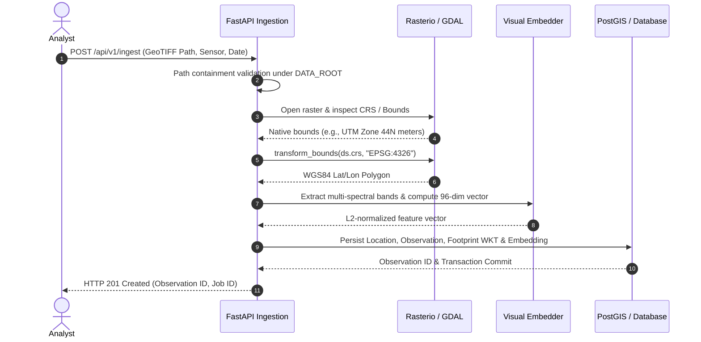

# 01. System Architecture & Engineering Blueprint

> For implementation-aligned architecture and runtime boundaries, use
> [00_developer_guide.md](00_developer_guide.md) and
> [07_implementation_reference.md](07_implementation_reference.md). This page
> contains historical design material and may describe planned components.

**Platform:** UpaGraha Enterprise Geospatial Intelligence & Satellite Analytics Platform  
**Operational Environment:** 100% Air-Gapped, Zero-Internet, On-Premises / Tactical Edge  
**Document Version:** 2.0 (September 2026)

---

## 1. High-Level System Architecture

UpaGraha implements a decoupled, high-performance architecture comprising an asynchronous **Python/FastAPI Analytics Backend** and a high-throughput **.NET Core C# Desktop Intelligence Engine** with SIMD AVX2 vector acceleration.

---

## 2. Layer-by-Layer Architectural Breakdown

| Architectural Tier | Primary Responsibilities | Core Technologies | Scalability & Latency Targets |
| :--- | :--- | :--- | :--- |
| **Presentation Tier** | High-performance raster canvas, split-screen swipe comparison, temporal timeline graph, analyst review workflows. | Avalonia UI (.NET 10), MapLibre GL, Apache ECharts | 60 FPS UI rendering, $< 16\text{ms}$ frame time |
| **API Gateway Tier** | RESTful endpoints, request validation, spatial bounds transformations, task dispatch, session management. | FastAPI, Pydantic v2, Uvicorn, Starlette | $< 15\text{ms}$ endpoint response (p95) |
| **Geospatial Processing** | Multi-band GeoTIFF decoding, WGS84 CRS reprojection, spectral index computation, COG pyramid streaming. | Rasterio, GDAL C++ Core, rio-tiler, Shapely 2.0 | Multi-gigabyte COG sub-region streaming in $< 50\text{ms}$ |
| **Algorithmic Core** | Bi-temporal Change Vector Analysis (CVA), CUSUM onset estimation, sub-pixel jitter filtering, Tukey PIF normalization. | .NET Core C#, NumPy, SciPy | Sub-second multi-temporal time-series evaluation |
| **Vector Retrieval** | Spatiotemporal candidate pre-filtering, AVX2 SIMD dot-product matrix search, active learning Rocchio re-ranking. | HNSW, FAISS, SIMD Vector256 | $< 1.0\text{ms}$ search across 1,000,000 vectors |
| **Storage & Persistence** | Relational data, geometry indexing, spatial joins (`ST_Intersects`), binary index snapshots. | PostGIS 3.4, SQLite WAL, Binary GSSV | Zero-copy memory-mapped file access |

---

## 3. Data Ingestion & Transformation Pipeline

---

## 4. Air-Gapped Operational Guarantees

1. **Zero External Network Dependencies:** The platform operates strictly in an isolated enclave with no runtime external HTTP, CDN, or DNS requests.
2. **Local Model Ingestion:** Vision-language models (RemoteCLIP, Prithvi) run via local ONNX Runtime execution providers without calling Hugging Face or cloud APIs.
3. **Local Vector Tile Serving:** Basemap layers (OpenStreetMap / Natural Earth) are streamed locally from pre-packaged `.mbtiles` files via local tile server engines.
4. **Resilient Local Persistence:** SQLite databases automatically execute in Write-Ahead Logging (`PRAGMA journal_mode=WAL`) mode with synchronous normal settings to withstand sudden hardware power interrupts.
