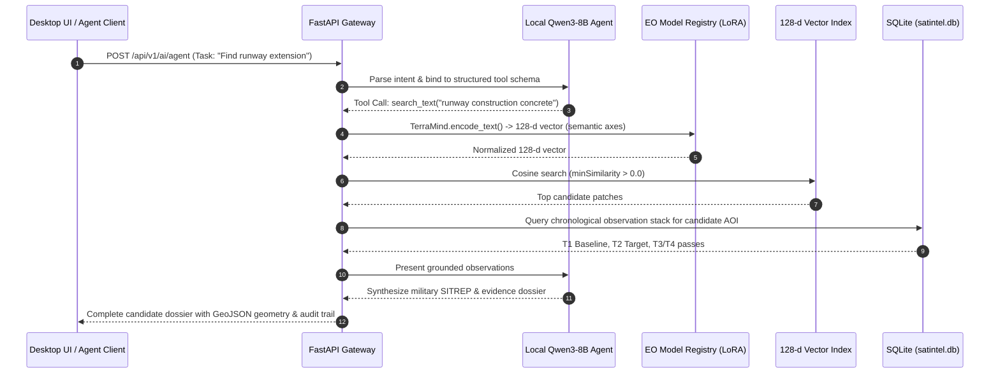

# 01. System Architecture & Engineering Blueprint

**Project**: GeoSemanticSat / UPAGRAHA-V2 Sovereign Architecture  
**Document**: System Architecture Specification  
**Classification**: 100% AIR-GAPPED / SOVEREIGN TACTICAL  

---

## 1. High-Level Architectural Decomposition

UPAGRAHA-V2 is architected around a decoupled, two-pillar design that separates high-throughput client-side interactive rendering from heavy deep learning inference and relational persistence.

```mermaid
graph TB
    subgraph "Desktop Native Tier (.NET 10.0 / Avalonia UI)"
        UI["MainWindow (SukiUI 5-Stage Stepper)"]
        Inspector["3-Panel Synchronized View<br/>(TrueColor, FalseColor, Calibrated Heatmaps)"]
        Map["Hardware MapCanvas (SkiaSharp Pan/Zoom/Pins)"]
        CoreEngine["GeoSemanticSat.Core Engine"]
        
        UI --> Inspector
        UI --> Map
        UI --> CoreEngine
    end

    subgraph "Pure C# Mathematical Kernels (GeoSemanticSat.Core)"
        GeoTiffReader["GeoTiffReader (Pure C# Little/Big Endian COG Decoder)"]
        QualityEngine["QualityMaskEngine (Ray Casting, Snow NDSI, Saturation)"]
        Normalizer["RadiometricNormalizer (Tukey Biweight Robust PIF)"]
        JitterFilter["RegistrationJitterFilter (9-Point Parabolic Surface)"]
        CVAEngine["MultiTemporalChangeDetector (CVA ||Δρ||_2 & Trajectory θ)"]
        CUSUM["OnsetEstimator (Sequential CUSUM Onset Detector)"]
        DBSCAN["SpatialSemanticClusterer (DBSCAN ε=0.22 + Spatial Hash)"]
        VIndex["VectorIndex (128-d Cosine SIMD + GSSV v2 Binary Persistence)"]
        Review["ReviewQueue & ProvenanceAuditTrail (W3C PROV-O GeoJSON)"]
        
        CoreEngine --> GeoTiffReader
        CoreEngine --> QualityEngine
        CoreEngine --> Normalizer
        CoreEngine --> JitterFilter
        CoreEngine --> CVAEngine
        CoreEngine --> CUSUM
        CoreEngine --> DBSCAN
        CoreEngine --> VIndex
        CoreEngine --> Review
    end

    subgraph "Loopback IPC Boundary (127.0.0.1:8000)"
        AgentClient["AgentClientService.cs"]
        AnalystChat["AnalystChatService.cs"]
    end

    subgraph "Python Analytics Backend (FastAPI)"
        Gateway["FastAPI Gateway (47 REST Endpoints)"]
        Synthesizer["Automated Insight Synthesizer"]
        Dossier["Grounded GEOINT Dossier Compiler"]
        DB[(SQLite satintel.db)]
        FAISS[(FAISS 128-d FlatIP Index)]
        
        Gateway --> Synthesizer
        Gateway --> Dossier
        Gateway --> DB
        Gateway --> FAISS
    end

    subgraph "Foundation Model Registry & In-Process Inference"
        TM["TerraMind-1.0-base (Text & Cross-Modal Retrieval LoRA)"]
        PR["Prithvi-EO-2.0-300M (Temporal Sequence LoRA)"]
        SM["SatMAE++ (Multispectral Grouped Bands LoRA)"]
        GFM["GFM Composition (SAR+Optical Slots)"]
        QWEN["Frozen Qwen3-8B Orchestrator (Deterministic Tool Calls)"]
        
        Gateway --> TM
        Gateway --> PR
        Gateway --> SM
        Gateway --> GFM
        Gateway --> QWEN
    end

    UI --> AgentClient
    UI --> AnalystChat
    AgentClient --> Gateway
    AnalystChat --> Gateway
```

---

## 2. Desktop Application Architecture (`Desktop_App/Upgrahan2`)

The desktop application is divided into three focused assemblies:
1. **`GeoSemanticSat.Core`**:
   - Zero external binary dependencies. Contains pure C# implementations of the entire raster decoding and mathematical processing pipeline.
   - Built with SIMD hardware intrinsics (`System.Numerics.Vector<float>`) for vector cosine similarity and raster map arithmetic.
   - Thread-safe memory index (`VectorIndex.cs`) using `System.Threading.ReaderWriterLockSlim`.
2. **`GeoSemanticSat.Engine`**:
   - Coordinates retrieval workflows, client-side embedding generation, and integration with the backend service.
   - `AgentClientService.cs` communicates over `127.0.0.1:8000` to execute natural-language geospatial tasks.
   - `AnalystChatService.cs` formats GEOINT conversational queries and retrieves automated situational intelligence briefs.
   - Resilient design: If the Python service is offline, the desktop engine automatically falls back to in-process deterministic analysis without throwing unhandled exceptions.
3. **`GeoSemanticSat.UI`**:
   - Modern, military-grade interface styled using SukiUI dark/light theme tokens.
   - Features a 5-stage workflow stepper (`Find Images` $\rightarrow$ `Pick Location` $\rightarrow$ `Check Changes` $\rightarrow$ `Group Places` $\rightarrow$ `Review & Export`).
   - Hardware-accelerated map canvas rendering pins, AOI bounding boxes, and clustering polygons.
   - 3-panel split inspection view synchronizing True-Color RGB, False-Color NIR, and calibrated spectral index heatmaps (NDVI, NDBI, NDWI, BSI).

---

## 3. Python Foundation Model Analytics Architecture (`app/`)

The Python backend provides enterprise Earth Observation microservices:

---

## 4. Hardware Sizing & Sovereign Air-Gap Boundaries

- **Target Workstation Environment**:
  - Operating System: Windows 11 Enterprise (x64) / Rocky Linux 9 (Air-gapped)
  - Memory: 16 GB to 32 GB DDR5 RAM
  - GPU: NVIDIA GeForce RTX 5070 Laptop GPU (8 GB VRAM) / RTX 4080 Desktop
  - Storage: NVMe PCIe 4.0 SSD for rapid COG raster caching
- **Air-Gap Enforcement**:
  - `HF_HUB_OFFLINE=1`, `TRANSFORMERS_OFFLINE=1`
  - Zero outbound connections; loopback binding only (`127.0.0.1:8000`)
  - No telemetry, analytics pings, or cloud API integrations
