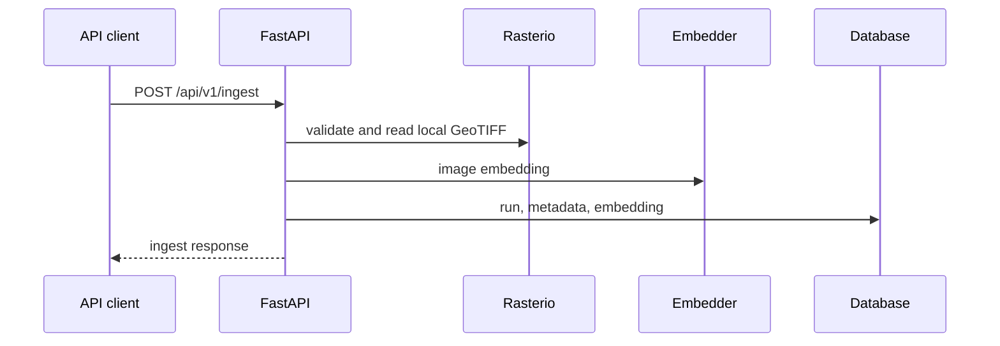

# System architecture

## Backend

`app/main.py` owns FastAPI startup, middleware, and routes. `app/db/session.py` supplies SQLAlchemy sessions. The backend persists locations, sources, observations, processing runs, embeddings, changes, reviews, missions, and alerts.

Compose defaults to SQLite in the named `api_db` volume. The optional `db` service runs only with the `postgres` profile.

## Desktop

The UI invokes `GeoSemanticSat.Core` and `GeoSemanticSat.Engine` directly. Core contains GeoTIFF handling, change detection, quality masks, clustering, vector indexing, reviews, and provenance. Engine contains embedding, retrieval, benchmarking, and local intelligence services. The map tile service can use network providers except in `OfflineStrict` mode.