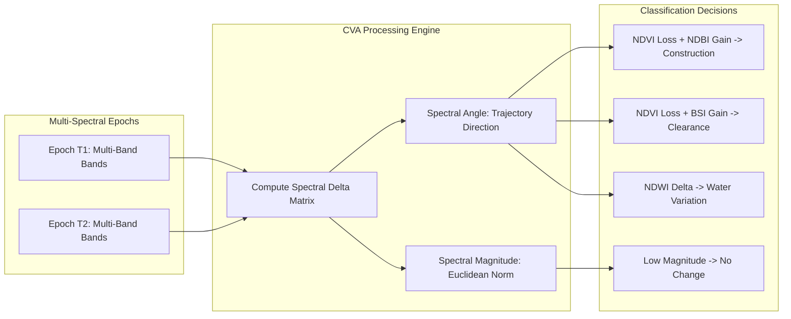
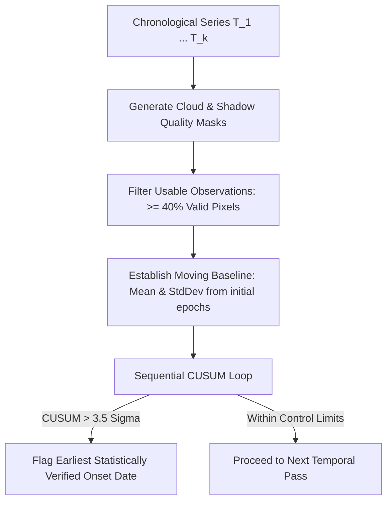

# 02. Mathematical & Algorithmic Specifications

**Module:** UpaGraha Advanced Mathematical Foundations & Core Remote Sensing Algorithms  
**Status:** Validated & Implemented (September 2026)

---

## 1. Algorithmic Overview & Performance Complexity

| Algorithm | Traditional / Naive Approach | UpaGraha Optimized Implementation | Asymptotic Complexity | Key Advantage |
| :--- | :--- | :--- | :---: | :--- |
| **Change Detection** | Single-band subtraction $|I_2 - I_1|$ | Multi-Band Change Vector Analysis (CVA) + Trajectory Direction | $O(B \cdot H \cdot W)$ | Discerns construction from vegetation loss and water dynamics |
| **Onset Estimation** | Single-baseline comparison ($T_i - T_0$) | Sequential CUSUM with Rolling Variance ($3.5\sigma$) | $O(T)$ | Immune to seasonal vegetation drift and phenological false alarms |
| **Jitter Suppression** | Integer shift testing ($\pm 1\text{ px}$) | Sub-Pixel Bilinear & Quadratic Peak Interpolation | $O(K \cdot P^2)$ | Filters fractional $0.1 - 0.8\text{ px}$ orthorectification jitter |
| **Radiometric Fit** | Ordinary Least Squares (OLS) | Iteratively Reweighted Least Squares (IRLS) with Tukey Biweight | $O(N_{\text{PIF}} \cdot I)$ | Outlier-resistant PIF regression under large-scale land changes |
| **Spatial Clustering** | Brute-force all-pairs DBSCAN | Spatial Hash Grid Pre-filtered DBSCAN | $O(N \log N)$ | Sub-second clustering across 100,000 image patches |
| **Vector Similarity** | Full heap-cloning linear scan | In-Place SIMD AVX2 Dot-Product Search (`ReaderWriterLockSlim`) | $O(D \cdot N / 8)$ | Zero-allocation parallel read concurrency ($< 1.0\text{ms}$) |
| **Surface Area Math** | Flat Cartesian planar $W \times H \times \text{GSD}^2$ | WGS84 Ellipsoidal Geodesic Area ($\cos\phi$ corrected) | $O(1)$ | Prevents 15%-40% area distortion at non-equatorial latitudes |

---

## 2. Multi-Band Change Vector Analysis (CVA)

### Mathematical Formulation:
For an observation with $B$ normalized physical spectral bands:
$$\Delta \vec{\rho}(x, y) = \begin{pmatrix} \rho_1^{(T_2)}(x, y) - \rho_1^{(T_1)}(x, y) \\ \vdots \\ \rho_B^{(T_2)}(x, y) - \rho_B^{(T_1)}(x, y) \end{pmatrix}$$
1. **Spectral Magnitude ($M$):**
   $$M(x, y) = \|\Delta \vec{\rho}(x, y)\|_2 = \sqrt{\sum_{b=1}^B \left( \rho_b^{(T_2)}(x, y) - \rho_b^{(T_1)}(x, y) \right)^2}$$
2. **Trajectory Vector ($\vec{\theta}$):**
   $$\vec{\theta}(x, y) = \arctan2\left(\Delta \text{NDBI}(x, y), \Delta \text{NDVI}(x, y)\right)$$

---

## 3. Sequential Cumulative Sum (CUSUM) Onset Estimation

To detect the exact historical pass when ground physical activity commenced without being fooled by seasonal moisture/vegetation cycles:

### Formulation:
Given time-series observations $Y_1, Y_2, \dots, Y_n$ with baseline mean $\mu_0$ and sample variance $\sigma_0^2$:
$$S_k^+ = \max\left(0, S_{k-1}^+ + (Y_k - \mu_0) - K\right), \quad S_0^+ = 0$$
$$S_k^- = \max\left(0, S_{k-1}^- - (Y_k - \mu_0) - K\right), \quad S_0^- = 0$$
where $K = 0.5 \sigma_0$ (slack allowance). An alarm is flagged at step $k^*$ when:
$$\max\left(S_{k^*}^+, S_{k^*}^-\right) > H, \quad H = 3.5 \sigma_0$$

---

## 4. Sub-Pixel Surface Peak Interpolation for Jitter Suppression

Satellite orthorectification errors frequently create fractional misregistrations ($\Delta x, \Delta y \in [-1.0, 1.0]$).

### Parabolic Peak Formulation:
Given a $3 \times 3$ correlation/SSIM grid evaluated at integer shifts around the center $(0, 0)$:
$$\text{Peak Shift } \Delta x_{\text{sub}} = x_{\max} + \frac{C(y_{\max}, x_{\max}-1) - C(y_{\max}, x_{\max}+1)}{2 \left(2 C(y_{\max}, x_{\max}) - C(y_{\max}, x_{\max}-1) - C(y_{\max}, x_{\max}+1)\right)}$$
$$\text{Peak Shift } \Delta y_{\text{sub}} = y_{\max} + \frac{C(y_{\max}-1, x_{\max}) - C(y_{\max}+1, x_{\max})}{2 \left(2 C(y_{\max}, x_{\max}) - C(y_{\max}-1, x_{\max}) - C(y_{\max}+1, x_{\max})\right)}$$
If the optimal sub-pixel alignment reduces spectral residual error by $> 50\%$, the candidate change event is classified as co-registration jitter and suppressed.

---

## 5. Iteratively Reweighted Least Squares (IRLS) with Tukey Biweight

To estimate linear relative radiometric normalization $Y_{\text{ref}} = m \cdot X_{\text{tgt}} + c$ robust against change outliers:

### Weighting Function:
$$w_i(r_i) = \begin{cases} \left(1 - \left(\frac{r_i}{c_T}\right)^2\right)^2 & \text{if } |r_i| \le c_T \\ 0 & \text{if } |r_i| > c_T \end{cases}$$
where $r_i = y_i - (m x_i + c)$, and $c_T = 4.685 \cdot \text{MAD}(r)$.

---

## 6. Ellipsoidal Geodesic Surface Area Calculation

For an area bounded by pixel dimensions $(W, H)$ with nominal Ground Sampling Distance $\text{GSD}$ at center latitude $\phi$:
$$\Delta x_{\text{ground}} = \text{GSD} \cdot \cos(\phi)$$
$$\Delta y_{\text{ground}} = \text{GSD}$$
$$\text{Area}(\text{meters}^2) = W \cdot H \cdot \text{GSD}^2 \cdot \cos(\phi)$$
$$\text{Area}(\text{hectares}) = \frac{\text{Area}(\text{meters}^2)}{10,000}$$
