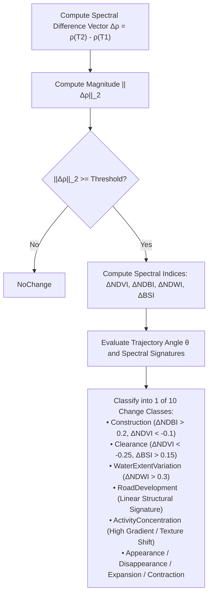

# 02. Algorithms & Mathematical Foundations

**Project**: GeoSemanticSat / UPAGRAHA-V2 Sovereign Architecture  
**Document**: Algorithmic & Mathematical Specification  
**Classification**: TACTICAL GEOSPATIAL INTELLIGENCE  

---

## 1. Change Vector Analysis (CVA) & Classification

Change Vector Analysis operates on normalized multi-spectral reflectance profiles across bi-temporal passes $T_1$ and $T_2$.

### Mathematical Formulation:
For an observation with $B$ optical bands, let $\vec{\rho}_{T_1} = [\rho_{1, T_1}, \rho_{2, T_1}, \dots, \rho_{B, T_1}]^T$ and $\vec{\rho}_{T_2} = [\rho_{1, T_2}, \rho_{2, T_2}, \dots, \rho_{B, T_2}]^T$.

The spectral change vector $\Delta\vec{\rho}$ is defined as:
$$\Delta\vec{\rho} = \vec{\rho}_{T_2} - \vec{\rho}_{T_1}$$

The **Change Magnitude** $\|\Delta\vec{\rho}\|_2$ is computed as the Euclidean norm:
$$\|\Delta\vec{\rho}\|_2 = \sqrt{\sum_{b=1}^B (\rho_{b, T_2} - \rho_{b, T_1})^2}$$

A pixel or patch is flagged as a candidate change if $\|\Delta\vec{\rho}\|_2 \ge \tau_{\text{CVA}}$, where $\tau_{\text{CVA}} = 0.05$ by default.

### Trajectory Angle & 10-Class Taxonomy:
The primary trajectory angle $\theta$ in the Red-NIR plane (B04 vs B08) is computed as:
$$\theta = \text{atan2}(\Delta\rho_{\text{NIR}}, \Delta\rho_{\text{Red}})$$

---

## 2. Sequential CUSUM Onset Estimation

To identify the exact chronological pass where change commenced, the system uses a sequential **Cumulative Sum (CUSUM)** control chart over all quality-filtered historical observations $t = 1, 2, \dots, N$.

### Formulations:
Let $x_t$ be the target spectral index (e.g., NDVI or NDBI) at pass $t$. Let $\mu_0$ and $\sigma_0$ be the baseline mean and standard deviation estimated from stable pre-change passes.

The standardized score $z_t$ is:
$$z_t = \frac{x_t - \mu_0}{\sigma_0}$$

For detecting positive shifts (e.g., structural buildup in NDBI):
$$S_0^+ = 0, \quad S_t^+ = \max(0, S_{t-1}^+ + z_t - k)$$
where $k = 0.5$ is the reference slack allowance.

The earliest change onset $t^*$ is detected at the first pass satisfying:
$$t^* = \min \{ t \mid S_t^+ \ge h \}$$
where $h = 4.0$ is the decision threshold (yielding an average run length $ARL_0 > 100$ under stable conditions). Observations with optical quality mask usability $< 40\%$ are strictly excluded from the sequence prior to CUSUM evaluation.

---

## 3. Pseudo-Invariant Feature (PIF) Radiometric Normalization

Atmospheric variations, solar zenith shifts, and seasonal illumination differences are eliminated using robust linear regression over Pseudo-Invariant Features (deep water bodies, dense mature forest, and aged asphalt).

The M-estimator minimizes the Tukey biweight loss function:
$$\rho(r) = \begin{cases} \frac{c^2}{6} \left[1 - \left(1 - (r/c)^2\right)^3\right] & \text{if } |r| \le c \\ \frac{c^2}{6} & \text{if } |r| > c \end{cases}$$
with tuning constant $c = 4.685\sigma$, completely eliminating leverage from genuine changes.

---

## 4. 9-Point Parabolic Registration Jitter Filter

Sub-pixel spatial misalignment between bi-temporal scenes produces false change alarms along sharp structural boundaries. The registration jitter filter tests 9 integer and sub-pixel neighbourhood shifts $(\delta_x, \delta_y) \in \{-1, 0, 1\}^2$.

The shift surface is fit with a bivariate quadratic polynomial:
$$C(\delta_x, \delta_y) = a \delta_x^2 + b \delta_y^2 + c \delta_x \delta_y + d \delta_x + e \delta_y + f$$

If the minimum change variance occurs at a non-zero shift $(\delta_x^*, \delta_y^*)$ within 1.0 pixel and the residual variance reduction exceeds $35\%$, the candidate change is classified as a registration artifact and suppressed.

---

## 5. Spatial-Semantic DBSCAN Clustering

Candidate changes are clustered into tactical facility complexes using density-based spatial clustering (DBSCAN) operating over a combined distance metric accelerated by a 2D spatial hash grid:

$$D(p_1, p_2) = w_{\text{geo}} \cdot d_{\text{Haversine}}(p_1, p_2) + w_{\text{sem}} \cdot (1 - \cos(\vec{v}_1, \vec{v}_2))$$

- **Cosine Distance Threshold ($\epsilon$)**: $0.22$
- **MinPts**: $2$ patches
- **Acceleration**: Spatial hash buckets indexed by $\lfloor \text{lon}/\Delta\rfloor, \lfloor \text{lat}/\Delta\rfloor$ guarantee $O(N)$ neighbour query latency.

---

## 6. Canonical 128-Dimensional Semantic Vector Layout

All text queries, reference images, and model embeddings strictly adhere to the `SemanticEmbeddingLayout.cs` allocation:

| Dimension Range | Allocation Category | Semantic Content & Physics |
|---|---|---|
| **000..015** | Visual Texture & Edges | High-frequency spatial gradients, edge density, surface roughness. |
| **016..023** | Optical Reflectance | Calibrated surface reflectance (B02 Blue, B03 Green, B04 Red). |
| **024..031** | Infrared Signatures | Red-edge slope, NIR plateau (B08), moisture absorption. |
| **032..037** | SWIR & Thermal | Shortwave infrared (B11, B12), mineral content, burnt area ratio. |
| **038..047** | SAR Polarimetry | C-band VV, VH backscatter intensity, cross-polarization ratio. |
| **048..063** | Spectral Indices | Calibrated NDVI, NDBI, NDWI, BSI, SAVI, NDRE, MNDWI. |
| **064..079** | Temporal Trajectory | Multi-date delta drift, seasonal baseline variance, CUSUM drift. |
| **080..095** | High-Level Semantic Concepts | Built-up infrastructure, industrial facility, runway, earthworks. |
| **096..111** | Spatial Morphology | Geometry compactness, bounding aspect ratio, spatial perimeter. |
| **112..127** | Cross-Sensor Fusion Tokens | Fused SAR+Optical cross-attention slots (GFM Composition). |

Text queries map exclusively to semantic axes (16..23, 32..37, 64..65, 80..95), guaranteeing that queries like `"military airfield"` match target semantics rather than transient seasonal or cloud conditions.
