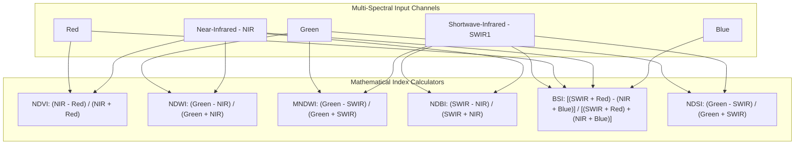

# 03. Remote Sensing & Sensor Calibration Guide

**Module:** Multispectral Band Mapping, Quality Masking & Earth Observation Formulas  
**Status:** Production Standard (September 2026)

---

## 1. Satellite Sensor Band Alignment Matrix

| Sensor Platform | Native Bands & Wavelengths | Spatial Resolution | UpaGraha Logical Channel Mapping |
| :--- | :--- | :---: | :--- |
| **Sentinel-2 MSI** | B2 (Blue 490nm), B3 (Green 560nm), B4 (Red 665nm), B8 (NIR 842nm), B11 (SWIR1 1610nm), B12 (SWIR2 2190nm) | 10m / 20m | $\text{Blue}=2, \text{Green}=3, \text{Red}=4, \text{NIR}=8, \text{SWIR1}=11, \text{SWIR2}=12$ |
| **Landsat-8/9 OLI**| B2 (Blue 482nm), B3 (Green 561nm), B4 (Red 655nm), B5 (NIR 865nm), B6 (SWIR1 1609nm), B7 (SWIR2 2201nm) | 30m | $\text{Blue}=2, \text{Green}=3, \text{Red}=4, \text{NIR}=5, \text{SWIR1}=6, \text{SWIR2}=7$ |
| **PlanetScope** | B1 (Blue), B2 (Green), B3 (Red), B4 (NIR) | 3.0m | $\text{Blue}=1, \text{Green}=2, \text{Red}=3, \text{NIR}=4$ |
| **Sentinel-1 SAR** | C-Band (VV Polarization, VH Cross-Polarization) | 10m | $\text{SAR\_VV}=1, \text{SAR\_VH}=2$ |
| **Standard RGB** | Red (Band 1), Green (Band 2), Blue (Band 3) | Sub-meter / Variable | $\text{Red}=1, \text{Green}=2, \text{Blue}=3$ |

---

## 2. Standard Spectral Index Formulations



### Mathematical Formulations:

1. **Normalized Difference Vegetation Index (NDVI):**
   $$\text{NDVI} = \frac{\rho_{\text{NIR}} - \rho_{\text{Red}}}{\rho_{\text{NIR}} + \rho_{\text{Red}} + 10^{-6}}$$
   *Domain:* $[-1.0, 1.0]$. Values $> 0.40$ indicate healthy dense vegetation; values $< 0.15$ indicate bare ground or built structures.

2. **Normalized Difference Water Index (NDWI):**
   $$\text{NDWI} = \frac{\rho_{\text{Green}} - \rho_{\text{NIR}}}{\rho_{\text{Green}} + \rho_{\text{NIR}} + 10^{-6}}$$
   *Domain:* $[-1.0, 1.0]$. Values $> 0.0$ indicate open water surface or active inundation.

3. **Modified Normalized Difference Water Index (MNDWI):**
   $$\text{MNDWI} = \frac{\rho_{\text{Green}} - \rho_{\text{SWIR1}}}{\rho_{\text{Green}} + \rho_{\text{SWIR1}} + 10^{-6}}$$
   *Domain:* $[-1.0, 1.0]$. Enhances water bodies in urban landscapes while suppressing built-up noise.

4. **Normalized Difference Built-Up Index (NDBI):**
   $$\text{NDBI} = \frac{\rho_{\text{SWIR1}} - \rho_{\text{NIR}}}{\rho_{\text{SWIR1}} + \rho_{\text{NIR}} + 10^{-6}}$$
   *Domain:* $[-1.0, 1.0]$. Values $> 0.10$ indicate concrete, asphalt, building roofs, and structural assets.

5. **Bare Soil Index (BSI):**
   $$\text{BSI} = \frac{(\rho_{\text{SWIR1}} + \rho_{\text{Red}}) - (\rho_{\text{NIR}} + \rho_{\text{Blue}})}{(\rho_{\text{SWIR1}} + \rho_{\text{Red}}) + (\rho_{\text{NIR}} + \rho_{\text{Blue}}) + 10^{-6}}$$
   *Domain:* $[-1.0, 1.0]$. Distinguishes cleared soil / ground excavations from asphalt and gravel.

6. **Normalized Difference Snow Index (NDSI):**
   $$\text{NDSI} = \frac{\rho_{\text{Green}} - \rho_{\text{SWIR1}}}{\rho_{\text{Green}} + \rho_{\text{SWIR1}} + 10^{-6}}$$
   *Domain:* $[-1.0, 1.0]$. Values $> 0.42$ with $\rho_{\text{SWIR1}} < 0.08$ distinguish high-altitude snow/ice from clouds.

---

## 3. Directional Cloud Shadow Ray-Casting & Cloud Fringe Dilation

```mermaid
flowchart LR
    A[Sun Position: Azimuth phi_s, Elevation theta_s] --> B[Calculate Shadow Ray Angle: (phi_s + 180 deg) % 360 deg]
    B --> C[Compute Horizontal Shadow Distance in Pixels: (H_cloud / tan theta_s) / GSD]
    C --> D[Cast Directional Search Ray for Low-NIR Pixels]
    D --> E[Flag Shadow Pixels]
    E --> F[Apply 1-Pixel Morphological Dilation on Cloud Edges]
```

### Formulation:
- **Shadow Direction Angle:** $\theta_{\text{shadow}} = (\text{SunAzimuth} + 180^{\circ}) \pmod{360^{\circ}}$
- **Horizontal Distance:** $D_{\text{pixels}} = \frac{H_{\text{cloud}}}{\tan(\theta_{\text{elev}} \cdot \frac{\pi}{180})} \cdot \frac{1}{\text{GSD}}$
- **Cloud Fringe Dilation:** A $3 \times 3$ structuring element dilates detected thick cloud masks by 1 pixel to eliminate semi-transparent aerosol edge noise.
