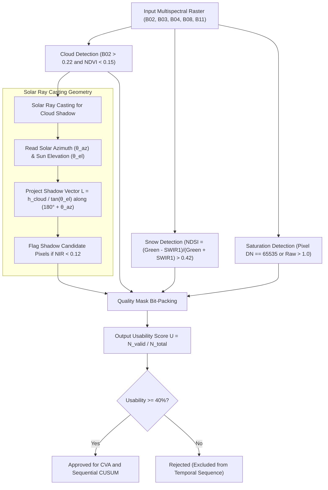

# 03. Remote Sensing & Sensor Specifications

**Project**: GeoSemanticSat / UPAGRAHA-V2 Sovereign Architecture  
**Document**: Sensor Physics & Quality Masking Specification  
**Classification**: EARTH OBSERVATION / SENSOR EXPLOITATION  

---

## 1. Sentinel-2 Multi-Spectral Instrument (MSI)

UPAGRAHA ingests Sentinel-2 Level-2A Bottom-Of-Atmosphere (BOA) surface reflectance imagery. Reflectance values are scaled to the physical range $[0.0, 1.0]$.

| Band ID | Spectral Region | Central Wavelength ($\lambda$) | Bandwidth ($\Delta\lambda$) | Native GSD | Primary GEOINT & Physical Utility |
|---|---|---|---|---|---|
| **B01** | Coastal Aerosol | 443 nm | 20 nm | 60 m | Atmospheric correction, coastal water clarity, aerosol loading. |
| **B02** | Blue | 490 nm | 65 nm | **10 m** | Deep water penetration, soil differentiation, cloud screening. |
| **B03** | Green | 560 nm | 35 nm | **10 m** | Vegetation vigor assessment, surface water contrast (NDWI). |
| **B04** | Red | 665 nm | 30 nm | **10 m** | Chlorophyll absorption, built-up contrast, boundary definition. |
| **B05** | Red Edge 1 | 705 nm | 15 nm | 20 m | Plant chlorophyll status, early vegetative stress indication. |
| **B06** | Red Edge 2 | 740 nm | 15 nm | 20 m | Leaf area index (LAI), structural canopy density. |
| **B07** | Red Edge 3 | 783 nm | 20 nm | 20 m | Forest biomass and canopy nitrogen differentiation. |
| **B08** | Broad NIR | 842 nm | 115 nm | **10 m** | High NIR plateau, water-land interface delineation (NDVI). |
| **B8A** | Narrow NIR | 865 nm | 20 nm | 20 m | Water vapor absorption correction, atmospheric normalization. |
| **B09** | Water Vapor | 945 nm | 20 nm | 60 m | Atmospheric water vapor column estimation. |
| **B10** | Cirrus | 1375 nm | 30 nm | 60 m | High-altitude thin cirrus cloud detection. |
| **B11** | SWIR-1 | 1610 nm | 90 nm | 20 m | Soil and vegetation moisture, snow-cloud separation, NDBI. |
| **B12** | SWIR-2 | 2190 nm | 180 nm | 20 m | Geology, burnt scars, concrete structural signature, BSI. |

---

## 2. Sentinel-1 C-Band Synthetic Aperture Radar (SAR)

UPAGRAHA ingests Sentinel-1 Level-1 Ground Range Detected (GRD) products:
- **Radar Frequency**: $5.405\text{ GHz}$ (C-Band, $\lambda \approx 5.55\text{ cm}$).
- **Polarizations**: Dual-polarization $\text{VV}$ (Vertical transmit / Vertical receive) and $\text{VH}$ (Vertical transmit / Horizontal receive).
- **Spatial Resolution**: $10\text{ m}$ pixel spacing (IW mode).
- **All-Weather Capability**: Operates through persistent monsoon cloud cover, haze, smoke, and total night conditions.
- **Physical Signature**:
  - $\text{VV}$: Sensitive to surface roughness, water boundary capillary waves, and direct urban dihedral returns.
  - $\text{VH}$: Sensitive to volume scattering in vegetation and complex metallic structures.
  - Cross-Ratio $\gamma = \text{VH} / \text{VV}$: Identifies structural geometry changes independent of radar incidence angle.

---

## 3. Optical Quality Mask Engine (`QualityMaskEngine.cs`)

The quality engine computes pixel-level bitmasks to isolate and exclude confounding atmospheric artifacts.

### Quality Bitmask Layout:
- `Bit 0 (0x01)`: Valid Data (Not NoData)
- `Bit 1 (0x02)`: Cloud Detected (Opaque or Cirrus)
- `Bit 2 (0x04)`: Cloud Shadow (Solar Geometry Ray-Cast)
- `Bit 3 (0x08)`: Snow / Ice (NDSI Verified)
- `Bit 4 (0x10)`: Sensor Detector Saturation
- `Bit 5 (0x20)`: High Registration Uncertainty ($> 0.75\text{ px}$)

---

## 4. Spectral Index Formulations

UPAGRAHA computes calibrated physical spectral indices used across the CVA classification and UI heatmaps:

1. **Normalized Difference Vegetation Index (NDVI)**:
   $$\text{NDVI} = \frac{\rho_{\text{NIR}} - \rho_{\text{Red}}}{\rho_{\text{NIR}} + \rho_{\text{Red}}} = \frac{\text{B08} - \text{B04}}{\text{B08} + \text{B04}}$$
2. **Normalized Difference Built-up Index (NDBI)**:
   $$\text{NDBI} = \frac{\rho_{\text{SWIR1}} - \rho_{\text{NIR}}}{\rho_{\text{SWIR1}} + \rho_{\text{NIR}}} = \frac{\text{B11} - \text{B08}}{\text{B11} + \text{B08}}$$
3. **Normalized Difference Water Index (NDWI)**:
   $$\text{NDWI} = \frac{\rho_{\text{Green}} - \rho_{\text{NIR}}}{\rho_{\text{Green}} + \rho_{\text{NIR}}} = \frac{\text{B03} - \text{B08}}{\text{B03} + \text{B08}}$$
4. **Bare Soil Index (BSI)**:
   $$\text{BSI} = \frac{(\rho_{\text{SWIR1}} + \rho_{\text{Red}}) - (\rho_{\text{NIR}} + \rho_{\text{Blue}})}{(\rho_{\text{SWIR1}} + \rho_{\text{Red}}) + (\rho_{\text{NIR}} + \rho_{\text{Blue}})} = \frac{(\text{B11} + \text{B04}) - (\text{B08} + \text{B02})}{(\text{B11} + \text{B04}) + (\text{B08} + \text{B02})}$$
