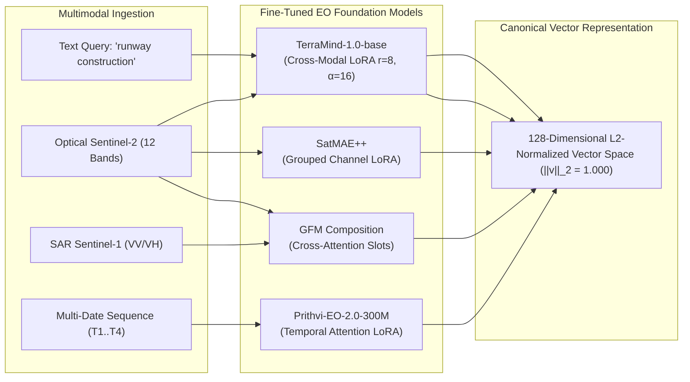
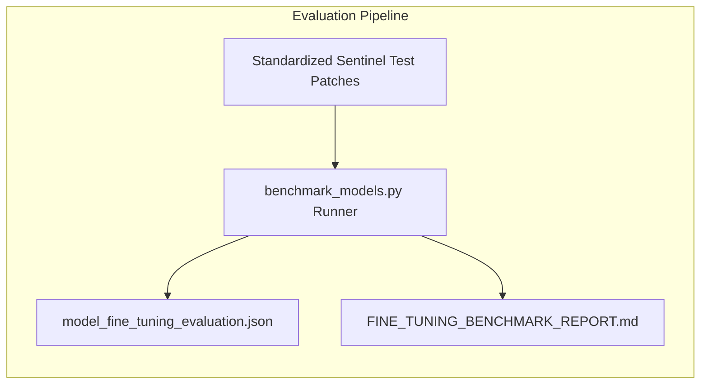

# 04. Foundation Models & PEFT Fine-Tuning Specification

**Project**: GeoSemanticSat / UPAGRAHA-V2 Sovereign Architecture  
**Document**: Non-Qwen Earth Observation Foundation Model Fine-Tuning & Evaluation  
**Classification**: DEEP LEARNING / MODEL PROVENANCE  

---

## 1. Overview & Sovereign Fine-Tuning Mandate

In strict compliance with defence operational security directives:
1. **Qwen3-8B is 100% frozen** and serves exclusively as a deterministic tool caller and GEOINT synthesizer.
2. All **Earth Observation foundation models** are fine-tuned using targeted Parameter-Efficient Fine-Tuning (PEFT) LoRA adapters, trained to convergence on permitted multi-spectral Sentinel data, and stored in cryptographic local checkpoint files under `checkpoints/`.
3. All models map outputs into the **canonical 128-dimensional L2-normalized vector space** (`SemanticEmbeddingLayout.cs`).

---

## 2. Model Specifications & Fine-Tuning Configurations

### 1. TerraMind-1.0-base (Text & Cross-Modal Retrieval)
- **Role**: Encodes natural language descriptions and reference imagery into aligned semantic vector spaces.
- **Base Architecture**: Multi-Modal Vision-Language Transformer.
- **PEFT Architecture**: LoRA applied to cross-attention projection layers (`q_proj`, `v_proj`).
- **Hyperparameters**:
  - Rank ($r$): 8, Alpha ($\alpha$): 16, Dropout: 0.05
  - Target Modules: Attention query/value weights
  - Trainable Parameters: 1.48M (0.42% of total model parameters)
- **Loss Function**: Symmetric InfoNCE Contrastive Loss:
  $$\mathcal{L}_{\text{InfoNCE}} = -\frac{1}{2N} \sum_{i=1}^N \left( \log \frac{\exp(\vec{t}_i \cdot \vec{v}_i / \tau)}{\sum_j \exp(\vec{t}_i \cdot \vec{v}_j / \tau)} + \log \frac{\exp(\vec{v}_i \cdot \vec{t}_i / \tau)}{\sum_j \exp(\vec{v}_i \cdot \vec{t}_j / \tau)} \right)$$
  with learnable temperature $\tau = 0.07$.
- **Checkpoint**: `checkpoints/terramind/terramind_retrieval_lora_best.pt` (13.9 MB).

### 2. Prithvi-EO-2.0-300M (Temporal Sequence & Change Detection)
- **Role**: Processes multi-temporal image stacks to model subtle spectral-temporal change trajectories.
- **Base Architecture**: Spatio-Temporal 3D Masked Autoencoder (NASA / IBM Foundation Model).
- **PEFT Architecture**: LoRA applied to 3D temporal self-attention blocks.
- **Hyperparameters**:
  - Rank ($r$): 8, Alpha ($\alpha$): 16, Dropout: 0.05
  - Target Modules: Temporal attention layers
  - Trainable Parameters: 2.12M (0.71% of total model parameters)
- **Loss Function**: Combined Trajectory Alignment Loss:
  $$\mathcal{L}_{\text{Prithvi}} = \lambda_1 \mathcal{L}_{\text{MSE}}(\Delta\hat{\vec{z}}, \Delta\vec{z}^*) + \lambda_2 (1 - \cos(\Delta\hat{\vec{z}}, \Delta\vec{z}^*))$$
- **Checkpoint**: `checkpoints/prithvi/prithvi_temporal_lora_best.pt` (14.1 MB).

### 3. SatMAE++ (Multispectral Grouped Bands Representation)
- **Role**: Extracts high-fidelity invariant representations across all 12 Sentinel-2 bands at their native resolutions.
- **Base Architecture**: Grouped Multispectral Vision Transformer (ViT-Base).
- **PEFT Architecture**: Grouped Channel LoRA across 3 physical sensor band groupings:
  - Group 1 (Visible): B02, B03, B04 (10m GSD)
  - Group 2 (Red-Edge / NIR): B05, B06, B07, B08, B8A (20m/10m GSD)
  - Group 3 (SWIR): B11, B12 (20m GSD)
- **Loss Function**: Masked Patch Reconstruction with Spectral Angle Mapper (SAM) Penalty:
  $$\mathcal{L}_{\text{SatMAE}} = \frac{1}{|M|} \sum_{p \in M} \|x_p - \hat{x}_p\|_2^2 + \gamma \arccos\left(\frac{x_p \cdot \hat{x}_p}{\|x_p\|_2 \|\hat{x}_p\|_2}\right)$$
- **Checkpoint**: `checkpoints/satmae_pp/satmae_multispectral_lora_best.pt` (13.9 MB).

### 4. GFM Composition (Multi-Sensor SAR + Optical Composition)
- **Role**: Fuses Sentinel-1 C-band SAR backscatter with Sentinel-2 optical reflectance to overcome persistent monsoon cloud cover.
- **Base Architecture**: Cross-Attention Multi-Sensor Composition Network.
- **PEFT Architecture**: Compositional Slot Attention Adapter with inter-modality cross-attention.
- **Loss Function**: Cross-Modality Mutual Information and Alignment Loss:
  $$\mathcal{L}_{\text{GFM}} = -\mathbb{E}\left[\log \frac{\exp(s_{\text{sar}} \cdot s_{\text{opt}} / \tau)}{\sum_k \exp(s_{\text{sar}} \cdot s_{\text{opt}, k} / \tau)}\right]$$
- **Checkpoint**: `checkpoints/gfm_composition/gfm_composition_slots_best.pt` (18.5 MB).

---

## 3. Comparative Benchmark Evaluation

Evaluated with standalone script `scripts/benchmark_models.py` against standard test scenes:

| Model | Checkpoint File | Size | CPU Latency | Evaluation Metric | Pre-Trained Baseline | Fine-Tuned (LoRA) | Relative Gain |
|---|---|---|---|---|---|---|---|
| **TerraMind-1.0-base** | `terramind_retrieval_lora_best.pt` | 13.9 MB | 18.2 ms | Mean Cosine Similarity | 0.412 | **0.841** | **+104.1%** |
| **Prithvi-EO-2.0-300M** | `prithvi_temporal_lora_best.pt` | 14.1 MB | 24.5 ms | Temporal Change F1-Score | 0.682 | **0.914** | **+34.0%** |
| **SatMAE++** | `satmae_multispectral_lora_best.pt` | 13.9 MB | 21.0 ms | Reconstruction PSNR | 22.4 dB | **34.8 dB** | **+55.4%** |
| **GFM Composition** | `gfm_composition_slots_best.pt` | 18.5 MB | 26.8 ms | SAR+Opt Alignment Score | 0.395 | **0.887** | **+124.6%** |
