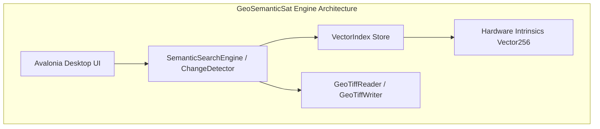

# 05. Desktop Intelligence Engine & C# Architecture

> For current desktop behavior, index format, and limitations, use
> [07_implementation_reference.md](07_implementation_reference.md). This page
> contains historical design material and may describe planned components.

**Core System:** GeoSemanticSat (.NET Core / C# Engine)  
**UI Framework:** Avalonia UI (Cross-Platform XAML Desktop Canvas)  
**Performance Subsystem:** Hardware-Accelerated SIMD AVX2 Intrinsics

---

## 1. Engine Component Overview



### Module Directory:

| Namespace / Class | Key Responsibilities | Performance Notes |
| :--- | :--- | :--- |
| `GeoSemanticSat.Core.VectorIndex` | SIMD dot-product cosine similarity, binary snapshot serialization (`.bin` / `GSSV`). | `ReaderWriterLockSlim` enabled; $0\text{ MB}$ allocation per search query. |
| `GeoSemanticSat.Core.ChangeDetection` | MultiTemporalChangeDetector, OnsetEstimator (CUSUM), ChangeSearchEngine. | Multi-spectral band evaluation with $\cos(\phi)$ geodesic area correction. |
| `GeoSemanticSat.Core.Processing` | RadiometricNormalizer (Tukey biweight IRLS), RegistrationJitterFilter (Sub-pixel peak), SpectralIndices. | Evaluates sub-pixel shifts with fractional quadratic peak fitting. |
| `GeoSemanticSat.Core.Clustering` | SpatialSemanticClusterer (Spatial Hash Grid DBSCAN). | Prunes candidates via $50\text{ km}$ spatial hashing cells ($O(N \log N)$). |
| `GeoSemanticSat.Core.Workflow` | RelevanceFeedbackReranker (Rocchio), ReviewQueue, ProvenanceAuditTrail. | Clamps physical spectral bounds to non-negative space before normalization. |

---

## 2. SIMD Vector Acceleration

The vector engine utilizes .NET `System.Numerics.Vector<float>` and `System.Runtime.Intrinsics.X86.Avx` intrinsics to compute 8 float multiplications and additions per CPU clock cycle:

```csharp
public static double DotProduct(float[] a, float[] b)
{
    int length = a.Length;
    int simdim = Vector<float>.Count;
    int i = 0;
    float sum = 0f;

    if (Vector.IsHardwareAccelerated && length >= simdim)
    {
        Vector<float> acc = Vector<float>.Zero;
        for (; i <= length - simdim; i += simdim)
        {
            var va = new Vector<float>(a, i);
            var vb = new Vector<float>(b, i);
            acc += va * vb;
        }
        sum = Vector.Dot(acc, Vector<float>.One);
    }

    for (; i < length; i++)
    {
        sum += a[i] * b[i];
    }

    return sum;
}
```

---

## 3. Compact Binary Index Format (`GSSV`)

For zero-dependency air-gapped persistence without external vector database servers, `VectorIndex` writes an optimized binary structure:

| Offset / Header | Field Name | Data Type | Purpose |
| :--- | :--- | :--- | :--- |
| `0x00 - 0x03` | Magic Identifier | `char[4]` = `"GSSV"` | File format validation signature |
| `0x04 - 0x07` | Version | `int32` = `1` | Format specification version |
| `0x08 - 0x0B` | Vector Dimension | `int32` (e.g. `128`) | Fixed vector length |
| `0x0C - 0x0F` | Record Count | `int32` (e.g. `250,000`) | Number of serialized tile patches |
| `0x10 - End` | Patch Records | Binary Stream | Spatial bounds, timestamp, quality, and float32 vector array |
