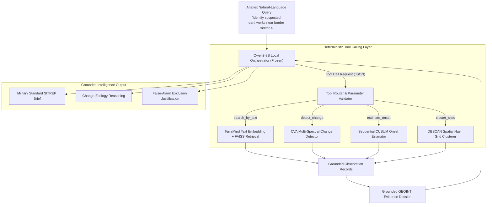

# 05. Qwen Agent & GEOINT Reasoning Engine

**Project**: GeoSemanticSat / UPAGRAHA-V2 Sovereign Architecture  
**Document**: Local LLM Orchestration & Automated Intelligence Synthesis  
**Classification**: SOVEREIGN AGENTIC / MILITARY SITREP  

---

## 1. Frozen Local LLM Operational Concept

In the UPAGRAHA-V2 architecture, the local large language model (**Qwen3-8B**) serves as a strategic orchestrator and natural language intelligence synthesizer. It is governed by two immutable architectural constraints:
1. **Model Weights are 100% Frozen**: Zero parameter fine-tuning is performed on Qwen. It acts strictly as an instruction-tuned conversational agent.
2. **Zero Mathematical or Geospatial Calculation Delegation**: Qwen never calculates pixel differences, spectral indices, Euclidean norms, CUSUM drifts, or coordinate reprojections. All deterministic calculations are executed by pure C# and Python algorithms; Qwen receives verified deterministic outputs and compiles tactical military intelligence reports.

---

## 2. Deterministic Tool Schema Definitions

The agent interacts with the underlying geospatial engine through strictly typed JSON tool schemas:

| Tool Name | Parameters | Target Execution Engine | Output Contract |
|---|---|---|---|
| `search_by_text` | `query: str`, `top_k: int`, `min_sim: float` | `TerraMindEmbedder` + FAISS FlatIP | Ranked list of `TilePatch` candidate IDs and scores. |
| `search_by_image` | `image_path: str`, `top_k: int` | `MultiSpectralVisionEncoder` + FAISS | Top-K visually and spectrally similar patches. |
| `filter_spatiotemporal` | `bounds: BBox`, `start: str`, `end: str` | SQLite Query / Spatial Filter | Filtered candidate sequence matching spatial/date bounds. |
| `detect_change` | `t1_id: str`, `t2_id: str`, `threshold: float` | `MultiTemporalChangeDetector` (CVA) | `ChangeRecord`: $\|\Delta\rho\|_2$, trajectory angle $\theta$, change class. |
| `estimate_onset` | `observation_ids: list[str]`, `index: str` | `OnsetEstimator` (Sequential CUSUM) | Earliest supported change date $t^*$, CUSUM score, usability $>40\%$. |
| `cluster_candidates` | `patch_ids: list[str]`, `eps: float` | `SpatialSemanticClusterer` (DBSCAN) | Grouped facility clusters, centroids, enclosing bounding boxes. |
| `compile_dossier` | `change_id: str` | `EvidenceReportService` | Comprehensive GEOINT dossier with W3C PROV-O metadata. |

---

## 3. Automated Insight Synthesizer & SITREP Generation

When candidates are triaged, the insight synthesizer evaluates change metrics and produces structured intelligence:

### Military SITREP Format:
1. **SITUATION**: Coordinates, AOI description, sensor platform (Sentinel-2 L2A / Sentinel-1 C-SAR), acquisition dates ($T_1, T_2$), and overall usability score.
2. **OBSERVED CHANGE**: Detected change class (`Construction`, `Clearance`, etc.), affected area in square meters, change magnitude $\|\Delta\rho\|_2$, and dominant spectral index shift ($\Delta\text{NDBI}$, $\Delta\text{NDVI}$).
3. **CHRONOLOGY & ONSET**: Earliest confirmed change date determined by sequential CUSUM over quality-verified passes.
4. **FALSE-ALARM ASSESSMENT**: Confirmation that seasonal drift, cloud shadow, and registration jitter were evaluated and rejected.
5. **INTELLIGENCE ASSESSMENT & RECOMMENDATION**: Tactical recommendation for commander review, queue priority rating (`CRITICAL`, `ELEVATED`, `ROUTINE`), and action options.

---

## 4. Security Sandboxing & Grounding Rules

- **Strict Grounding Enforcement**: The system prompt instructs Qwen to base all statements strictly on the returned evidence dossier. If a coordinate, date, or metric is missing, Qwen explicitly states that the parameter was not detected rather than fabricating plausible values.
- **Zero Arbitrary Execution**: Qwen cannot access the operating system command prompt, PowerShell, Python `eval()`, or local directories outside `data/` and `evidence_export/`.
