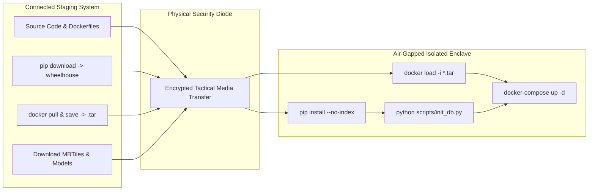

# 06. Air-Gapped Deployment, DevOps & Security

> For the actual Compose defaults and network caveats, use
> [00_developer_guide.md](00_developer_guide.md) and
> [07_implementation_reference.md](07_implementation_reference.md). This page
> contains historical deployment material and may describe planned components.

**Environment:** Production Offline Enclave / Defense SCIF / Tactical Field Unit  
**Security Standard:** Hardened Non-Root Containerization & Air-Gapped Staging

---

## 1. Air-Gapped Deployment Architecture



---

## 2. Hardened Production Configuration

### 2.1. Non-Root Multi-Stage Dockerfile
The backend container runs under an unprivileged system user (`appuser:1000`):
```dockerfile
FROM python:3.11-slim
WORKDIR /app
ENV PYTHONDONTWRITEBYTECODE=1 PYTHONUNBUFFERED=1

RUN groupadd -g 1000 appgroup && \
    useradd -u 1000 -g appgroup -s /bin/bash -m appuser

COPY requirements.txt .
RUN pip install --no-cache-dir -r requirements.txt

COPY . .
RUN mkdir -p /app/data /app/models /app/indexes && \
    chown -R appuser:appgroup /app

USER appuser
EXPOSE 8000
CMD ["uvicorn", "app.main:app", "--host", "0.0.0.0", "--port", "8000"]
```

---

### 2.2. Production `docker-compose.yml`
```yaml
services:
  api:
    build: .
    ports:
      - "8000:8000"
    env_file:
      - .env
    environment:
      DATABASE_URL: postgresql+psycopg://${POSTGRES_USER:-satintel}:${POSTGRES_PASSWORD:-change-me-offline}@db:5432/${POSTGRES_DB:-satintel}
    volumes:
      - ./data:/app/data
      - ./models:/app/models
      - ./indexes:/app/indexes
    depends_on:
      - db

  db:
    image: postgis/postgis:16-3.4
    environment:
      POSTGRES_DB: ${POSTGRES_DB:-satintel}
      POSTGRES_USER: ${POSTGRES_USER:-satintel}
      POSTGRES_PASSWORD: ${POSTGRES_PASSWORD:-change-me-offline}
    volumes:
      - postgis_data:/var/lib/postgresql/data
    ports:
      - "5432:5432"

volumes:
  postgis_data: {}
```

---

## 3. Step-by-Step Offline Operations

```powershell
# 1. Staging on Target Air-Gapped Server
Copy-Item .env.example .env

# 2. Database Initialization & Sample Data Generation
python -m scripts.init_db
python -m scripts.create_sample_data
python -m scripts.build_index

# 3. Launch Local Backend Services
docker-compose up -d

# 4. Verify Local Health Endpoint
curl http://127.0.0.1:8000/health
```
