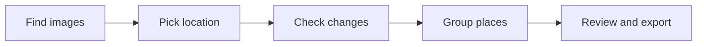

# Desktop application guide

Run the Avalonia UI:

```powershell
dotnet run --project "Desktop_App\Upgrahan2\src\GeoSemanticSat.UI\GeoSemanticSat.UI.csproj"
```

The main window coordinates five UI stages: find images, pick location, check changes, group places, and review/export. It initializes an in-memory vector index, search engine, change-search engine, review queue, map controls, and local services. The UI uses code-behind rather than an MVVM framework.



Map modes are `Auto`, `OfflineStrict`, and `OnlinePreferred`. `OfflineStrict` never starts network tile requests. The other modes may use configured provider URLs after memory and disk cache misses. Provider keys are read from environment configuration.

The CLI is `GeoSemanticSat.Cli`; use `help` for its exact arguments.