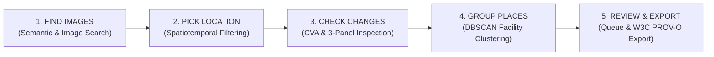

# 06. Desktop Native Application & UI Studio Guide

**Project**: GeoSemanticSat / UPAGRAHA-V2 Sovereign Architecture  
**Document**: Desktop Client User Interface & Operational Manual  
**Classification**: OPERATIONAL USER GUIDE / ANALYST CONSOLE  

---

## 1. Interface Architecture & 5-Stage Stepper

The UPAGRAHA desktop client (`Desktop_App/Upgrahan2`) is built on .NET 10.0 and Avalonia UI, utilizing SukiUI modern theme tokens and SkiaSharp hardware-accelerated raster rendering. The analyst workflow is guided by an intuitive 5-stage stepper:

---

## 2. 5-Stage Workflow Deep Dive

### Stage 1: Find Images (Semantic & Visual Discovery)
- **Natural Language Search**: Enter free-text tactical prompts (e.g., `"military runway"`, `"air defense radar facility"`, `"deep water reservoir"`). Text queries project exclusively onto semantic axes (16..23, 32..37, 64..65, 80..95), filtering out appearance and weather bias.
- **Reference Image Search**: Upload a local GeoTIFF or PNG reference patch to find spectrally and structurally identical satellite scenes.
- **Instant Result Cards**: Displays thumbnail preview, coordinate bounds, acquisition date, sensor type, and cosine similarity score.

### Stage 2: Pick Location (Spatiotemporal Filtering & Sequence Stacking)
- **Interactive Map Canvas**: Pan, zoom, and draw bounding boxes (AOI).
- **Temporal Filter**: Specify start and end dates to retrieve multi-pass time-series stacks.
- **Sensor Selector**: Filter by Sentinel-2 MSI, Sentinel-1 C-SAR, or multi-sensor fused passes.
- **Optical Usability Filter**: Sliders enforce minimum quality score ($\ge 40\%$) and maximum cloud cover percentage.

### Stage 3: Check Changes (Synchronized 3-Panel Inspection)
- **Panel 1 (T1 Baseline)**: Pre-change reference observation displayed in True-Color RGB or False-Color NIR.
- **Panel 2 (T2 Target)**: Post-change target observation with synchronized pan and zoom.
- **Panel 3 (Calibrated Heatmap & Reflectance Profile)**:
  - Toggle between CVA change magnitude, $\Delta\text{NDVI}$ (vegetation loss/gain), $\Delta\text{NDBI}$ (built-up construction), $\Delta\text{NDWI}$ (water changes), and $\Delta\text{BSI}$ (earthworks/clearing).
  - Multi-spectral reflectance profile plot comparing 12 individual bands.

### Stage 4: Group Places (DBSCAN Facility Clustering)
- **Automated Complex Aggregation**: Runs spatial-semantic DBSCAN ($\epsilon=0.22$) to cluster individual candidate patches into unified facility complexes (e.g., aggregating 8 tarmac patches into a single airfield complex).
- **Cluster Convex Hulls**: Visualizes enclosing polygon perimeters and area calculations ($m^2$).

### Stage 5: Review & Export (Analyst Triage & Cryptographic Export)
- **Prioritized Review Queue**: Candidates ranked by analytical confidence and change magnitude.
- **Analyst Decisions**: One-click **Confirm** or **Reject** with custom analyst comments.
- **Automatic Persistence**: Decisions immediately synchronize to `analyst_review_audit.geojson` on disk.
- **W3C PROV-O GeoJSON Export**: Exports full evidence package with polygon coordinates, source tile IDs, processing parameters, and SHA-256 integrity hashes.

---

## 3. Keyboard Shortcuts Cheat Sheet

| Shortcut | Scope | Action Performed |
|---|---|---|
| **`Ctrl + 1`** | Global | Navigate to Stage 1: Find Images |
| **`Ctrl + 2`** | Global | Navigate to Stage 2: Pick Location |
| **`Ctrl + 3`** | Global | Navigate to Stage 3: Check Changes |
| **`Ctrl + 4`** | Global | Navigate to Stage 4: Group Places |
| **`Ctrl + 5`** | Global | Navigate to Stage 5: Review & Export |
| **`Ctrl + O`** | Global | Open GeoTIFF file dialog (or Drag & Drop) |
| **`Ctrl + F`** | Stage 1 | Focus natural language search bar |
| **`F5`** | Global | Run automated evaluation benchmark suite |
| **`F1`** | Global | Open analyst help guide & shortcuts flyout |
| **`C`** | Stage 3 / 5 | **Confirm** active change candidate |
| **`R`** | Stage 3 / 5 | **Reject** active change candidate (False Alarm) |
| **`N`** | Stage 3 | Flag active candidate for additional review |
| **`M`** | Stages 2 / 4 | Fit map canvas to all active pins |
| **`F`** | Map Canvas | Toggle map canvas fullscreen mode |
| **`Esc`** | Global | Exit fullscreen or dismiss modal dialogs |
