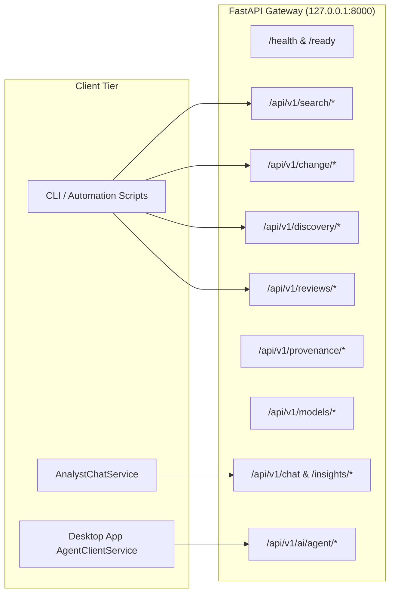

# 07. REST API Reference & Endpoint Specification

**Project**: GeoSemanticSat / UPAGRAHA-V2 Sovereign Architecture  
**Document**: FastAPI REST Microservice Interface  
**Protocol**: HTTP/1.1 Loopback (http://127.0.0.1:8000)  
**Classification**: SOVEREIGN AIR-GAPPED API  

---

## 1. Overview & Authentication

The UPAGRAHA backend runs as a high-throughput, asynchronous FastAPI service exposing 47 sovereign endpoints. In air-gapped tactical deployments, the API binds strictly to `127.0.0.1:8000` to prevent unauthorized off-host access.

---

## 2. Health & System Status Endpoints

| Method | Endpoint | Description | Query / Body Parameters | Response Format |
|---|---|---|---|---|
| `GET` | `/health` | Liveness check | None | `{"status": "ok", "version": "2.5.0", "offline": true}` |
| `GET` | `/ready` | Readiness check | None | `{"ready": true, "db_connected": true, "index_loaded": true}` |

---

## 3. Ingestion Endpoints

| Method | Endpoint | Description | Request Payload | Response Format |
|---|---|---|---|---|
| `POST` | `/api/v1/ingest` | Ingest single GeoTIFF raster | `{"file_path": str, "sensor": str, "timestamp": str}` | `{"observation_id": str, "bounds": BBox, "status": "indexed"}` |
| `POST` | `/api/v1/ingest/batch` | Ingest folder of GeoTIFFs | `{"directory": str, "sensor": str}` | `{"ingested_count": int, "observation_ids": list[str]}` |

---

## 4. Semantic & Multimodal Search Endpoints

| Method | Endpoint | Description | Request Payload | Response Format |
|---|---|---|---|---|
| `GET` | `/api/v1/search/text` | Free-text semantic query | `query: str, top_k: int=10, min_similarity: float=0.0` | `{"results": list[SearchResultItem]}` |
| `POST` | `/api/v1/search/image` | Reference image search | `{"image_path": str, "top_k": int=10}` | `{"results": list[SearchResultItem]}` |
| `POST` | `/api/v1/search/spatiotemporal` | Bounding box & date search | `{"bounds": BBox, "start_date": str, "end_date": str}` | `{"matches": list[ObservationItem]}` |

---

## 5. Change Detection & Onset Analysis Endpoints

| Method | Endpoint | Description | Request Payload | Response Format |
|---|---|---|---|---|
| `POST` | `/api/v1/change/detect` | Bi-temporal CVA change detection | `{"t1_obs_id": str, "t2_obs_id": str, "threshold": float=0.05}` | `{"changes": list[ChangeRecord]}` |
| `POST` | `/api/v1/change/onset` | Sequential CUSUM onset estimation | `{"observation_ids": list[str], "spectral_index": str="NDBI"}` | `{"earliest_date": str, "cusum_score": float, "valid": bool}` |
| `GET` | `/api/v1/change/timeline` | Multi-pass timeline spectral profile | `observation_id: str, lat: float, lon: float` | `{"dates": list[str], "values": list[float]}` |
| `GET` | `/api/v1/change/events` | List recorded change events | `limit: int=50, offset: int=0` | `{"events": list[ChangeEventRecord]}` |

---

## 6. Discovery & Clustering Endpoints

| Method | Endpoint | Description | Request Payload | Response Format |
|---|---|---|---|---|
| `POST` | `/api/v1/discovery/cluster` | DBSCAN spatial-semantic clustering | `{"patch_ids": list[str], "eps": float=0.22, "min_pts": int=2}` | `{"clusters": list[ClusterItem]}` |
| `POST` | `/api/v1/discovery/similar-sites` | Find matching tactical complexes | `{"reference_cluster_id": str, "top_k": int=5}` | `{"similar_clusters": list[ClusterItem]}` |

---

## 7. Optical Quality & Preprocessing Endpoints

| Method | Endpoint | Description | Request Payload | Response Format |
|---|---|---|---|---|
| `POST` | `/api/v1/quality/mask` | Compute optical quality bitmask | `{"file_path": str, "sun_elevation": float, "sun_azimuth": float}` | `{"cloud_cover": float, "usability": float, "mask_path": str}` |
| `POST` | `/api/v1/quality/normalize` | Run Tukey PIF regression | `{"t1_path": str, "t2_path": str}` | `{"slope": float, "intercept": float, "rmse": float}` |
| `POST` | `/api/v1/quality/jitter` | Test 9-point parabolic registration | `{"t1_path": str, "t2_path": str, "patch_bounds": BBox}` | `{"shift_x": float, "shift_y": float, "is_jitter": bool}` |

---

## 8. Analyst Reviews & Provenance Endpoints

| Method | Endpoint | Description | Request Payload | Response Format |
|---|---|---|---|---|
| `GET` | `/api/v1/reviews` | Get ranked review queue items | `status: str="pending", limit: int=50` | `{"items": list[ReviewItem]}` |
| `POST` | `/api/v1/reviews/confirm` | Confirm candidate change | `{"change_id": str, "analyst_notes": str}` | `{"status": "confirmed", "persisted": true}` |
| `POST` | `/api/v1/reviews/reject` | Reject false alarm candidate | `{"change_id": str, "analyst_notes": str}` | `{"status": "rejected", "persisted": true}` |
| `GET` | `/api/v1/provenance/{id}` | Get W3C PROV-O metadata | None | `{"id": str, "prov": dict, "hashes": dict}` |
| `GET` | `/api/v1/provenance/export/geojson` | Export audit trail as GeoJSON | None | `FeatureCollection` (GeoJSON CRS84) |

---

## 9. Foundation Models & AI Agent Endpoints

| Method | Endpoint | Description | Request Payload | Response Format |
|---|---|---|---|---|
| `GET` | `/api/v1/models/status` | Get loaded status of all 5 models | None | `{"models": dict[str, bool]}` |
| `POST` | `/api/v1/models/load` | Load model into RAM/VRAM | `{"model_name": str}` | `{"status": "loaded", "device": str}` |
| `POST` | `/api/v1/chat` | Conversational GEOINT assistant | `{"prompt": str, "context": dict}` | `{"reply": str, "citations": list[str]}` |
| `POST` | `/api/v1/insights/generate` | Generate military SITREP brief | `{"change_id": str}` | `{"severity": str, "sitrep": str}` |
| `POST` | `/api/v1/ai/agent` | Execute autonomous agent task | `{"task": str, "aoi": BBox, "params": dict}` | `{"intent": str, "tool_results": list, "report": str}` |
| `GET` | `/api/v1/ai/agent/tools` | Get registered tool schemas | None | `{"tools": list[ToolSchema]}` |
