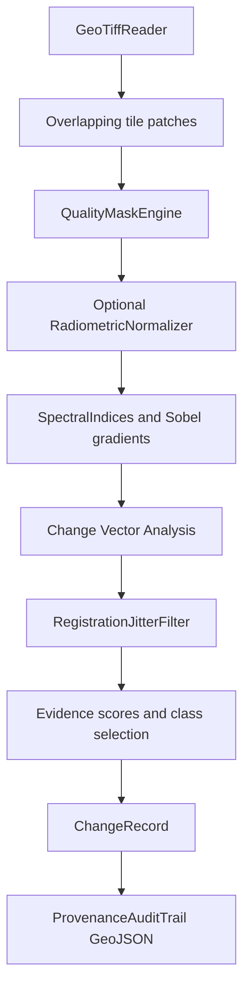
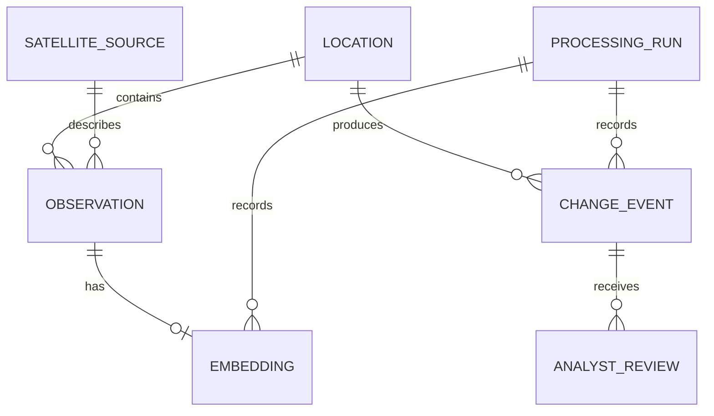

# Implementation Reference

This page is the detailed source reference for algorithms, data flow, API behavior,
and desktop components. It complements the short topic pages and is written from
the current source tree.

## 1. Backend processing

### 1.1 Ingestion

`POST /api/v1/ingest` accepts a relative path below `DATA_ROOT`. The handler:

1. Resolves the path and rejects traversal, non-GeoTIFF extensions, missing files,
   missing CRS, empty rasters, and rasters above the configured pixel limit.
2. Reads up to three bands at a maximum output shape of `256 x 256`.
3. Applies global min-max scaling:

$$
X' = \frac{X - X_{min}}{X_{max} - X_{min} + 10^{-6}}
$$

4. Transforms the dataset bounds to EPSG:4326 and stores the footprint as WKT.
5. Creates or reuses `Location` and `SatelliteSource` rows.
6. Stores an `Observation`, then creates a 96-dimensional histogram embedding.
7. Records a `ProcessingRun` with status and provenance.

The baseline embedding is three bands times 32 histogram bins. Missing bands are
repeated from the last available band, and the final vector is L2-normalized. It
is a visual distribution descriptor, not a language-aligned semantic embedding.

### 1.2 Backend image retrieval

For image search, the API loads all matching `Embedding` rows, normalizes the
query and each candidate, computes a dot product, sorts descending, and returns
the first `top_k` records:

$$
\operatorname{cos}(q, v) =
\frac{q \cdot v}{\lVert q \rVert_2\lVert v \rVert_2}
$$

Because the vectors are stored as JSON and loaded through SQLAlchemy, the request
path is a linear scan. The FAISS dependency and `scripts/build_index.py` are a
separate artifact-generation path.

### 1.3 Backend change analysis

`POST /api/v1/change/analyze` requires two observations from the same location.
Each raster is read with up to 12 bands and resampled to `256 x 256`. Every band
is standardized independently:

$$
Z_b(x,y) = \frac{X_b(x,y) - \operatorname{mean}(X_b)}
                 {\operatorname{std}(X_b)}
$$

The CVA magnitude is accumulated across shared bands:

$$
M(x,y) = \sqrt{\sum_{b=1}^{B}
  \left(Z_b^{after}(x,y)-Z_b^{before}(x,y)\right)^2}
$$

The reported `spectral_difference` is the spatial mean of $M$. The current
classification rules are:

| Rule | Class |
| --- | --- |
| `score < 0.22` | `NO_CHANGE` |
| mean `delta_ndvi < -0.15` and `score > 0.40` | `CLEARANCE` |
| mean `delta_ndvi > 0.15` and `score > 0.40` | `VEGETATION_GROWTH` |
| `score > 0.65` | `CONSTRUCTION` |
| otherwise | `OTHER` |

Confidence is derived from the score and the lower observation quality score,
with an upper bound of `0.98`. The evidence explicitly reports
`mask_available: false`; the backend path does not apply the desktop quality-mask,
CUSUM, radiometric-normalization, or jitter-suppression pipeline.

## 2. Desktop change pipeline

`MultiTemporalChangeDetector` compares overlapping patches, defaults to a 16 by
16 patch size, masks unusable pixels, optionally normalizes T2 to T1, and computes
spectral and spatial evidence. The trajectory angle used by the classifier is:

$$
\theta = \operatorname{atan2}(\Delta NDBI, \Delta NDVI)
$$

The desktop change types include `Construction`, `Clearance`,
`WaterExtentVariation`, `RoadDevelopment`, and `ActivityConcentration`.
Water detection is MNDWI-gated; NDWI alone is not sufficient because concrete can
also reduce NIR reflectance.

### 2.1 Spectral indices

For compatible bands, `SpectralIndices` implements:

$$
NDVI = \frac{NIR - Red}{NIR + Red + 10^{-6}}
$$

$$
NDWI = \frac{Green - NIR}{Green + NIR + 10^{-6}}
$$

$$
MNDWI = \frac{Green - SWIR}{Green + SWIR + 10^{-6}}
$$

$$
NDBI = \frac{SWIR - NIR}{SWIR + NIR + 10^{-6}}
$$

$$
BSI = \frac{(SWIR + Red) - (NIR + Blue)}
           {(SWIR + Red) + (NIR + Blue) + 10^{-6}}
$$

RGB-only inputs use documented visible-band proxies instead of silently creating
constant indices.

### 2.2 Quality masks

`QualityMaskEngine` represents cloud, cloud shadow, snow, haze, saturation, and
water flags. `QualityMaskEngine.IsUsable(flags)` is the authoritative decision;
water and high haze are informational flags and are not automatically equivalent
to an unusable pixel.

### 2.3 Registration jitter

`RegistrationJitterFilter` evaluates a 3 by 3 integer shift neighborhood, estimates
fractional movement by parabolic interpolation, applies bilinear residual
comparison, and suppresses a candidate when alignment explains the apparent
change. The interpolation for a row of correlation values is:

$$
\delta_x =
\frac{C_{-1}-C_{+1}}
{2(2C_0-C_{-1}-C_{+1})}
$$

The denominator is guarded in code; callers should not assume a valid fractional
shift for a flat correlation surface.

### 2.4 Radiometric normalization

`RadiometricNormalizer` fits a target-to-reference relation over pseudo-invariant
features and iteratively downweights residual outliers. The Tukey biweight is:

$$
w(r) =
\begin{cases}
(1-(r/c)^2)^2, & |r| \le c \\
0, & |r| > c
\end{cases}
$$

The implementation uses IRLS so changed pixels do not dominate the gain and bias
estimate.

### 2.5 Temporal onset

`OnsetEstimator` sorts observations, rejects scenes with less than 40 percent usable
pixels, builds a baseline from up to three usable observations, and applies a
 two-sided CUSUM:

$$
S_k^+ = \max(0, S_{k-1}^+ + (Y_k-\mu_0)-0.5\sigma_0)
$$

$$
S_k^- = \max(0, S_{k-1}^- - (Y_k-\mu_0)-0.5\sigma_0)
$$

An onset is reported when either accumulator exceeds:

$$
H = \max(0.12, 3.5\sigma_0)
$$

## 3. Desktop embeddings and retrieval

`SemanticEmbeddingLayout` is the single source of truth for the 128-dimensional
vector. The layout contains an image appearance block and shared semantic axes.
The text encoder writes only shared semantic axes; image-to-image comparison can
use the full vector. Never write text values into appearance dimensions.

`MultiSpectralVisionEncoder` derives normalized features from band statistics,
semantic material axes, gradients, continuity, texture/activity, and quadrant
layout. `TextQueryEncoder` normalizes input, removes stop words, maps known
remote-sensing terms, and uses stable FNV-1a hashing for unknown tokens.

`VectorIndex` persists vectors in the custom GSSV format:

| Offset | Field | Meaning |
| --- | --- | --- |
| `0x00` | 4 bytes | ASCII magic `GSSV` |
| `0x04` | Int32 | Format version |
| `0x08` | Int32 | Vector dimension, normally 128 |
| `0x0C` | Int32 | Record count |
| `0x10` | records | Patch metadata and float vector data |

Search is a normalized dot-product linear scan. `System.Numerics.Vector<float>`
can accelerate the dot product when supported by the runtime, but the repository
does not provide a general asymptotic or latency guarantee.

Rocchio feedback in `RelevanceFeedbackReranker` updates a query from relevant and
non-relevant examples:

$$
q' = \alpha q + \frac{\beta}{|D_R|}\sum_{d\in D_R}d
     - \frac{\gamma}{|D_{NR}|}\sum_{d\in D_{NR}}d
$$

## 4. Spatial clustering

`SpatialSemanticClusterer` uses DBSCAN semantics with a spatial hash to reduce
neighbor candidates. Embedding distance is cosine distance:

$$
d_{cos}(a,b) = 1 - \frac{a\cdot b}{\lVert a\rVert_2\lVert b\rVert_2}
$$

Spatial distance is geographic kilometers. Cluster centroids are normalized and
labels are inferred from semantic axes such as structural, water, linear,
activity, clearance, and vegetation. The hash is a candidate-pruning structure;
it does not change DBSCAN's core/noise definitions.

## 5. Persistence model

The backend creates these SQLAlchemy tables at application startup:

`geometry_wkt` and `footprint_wkt` are text columns. The default SQLite schema does
not use PostGIS geometry types. PostgreSQL is optional and requires a compatible
`DATABASE_URL`; enabling the Compose profile alone does not migrate existing data.

## 6. Verification surface

- Backend tests: `tests/test_api.py` with `pytest -v`.
- Desktop tests: all files under `GeoSemanticSat.Tests`, run with `dotnet test`.
- Generated benchmark outputs are evidence artifacts, not a substitute for unit
  tests or a promise of production performance.
