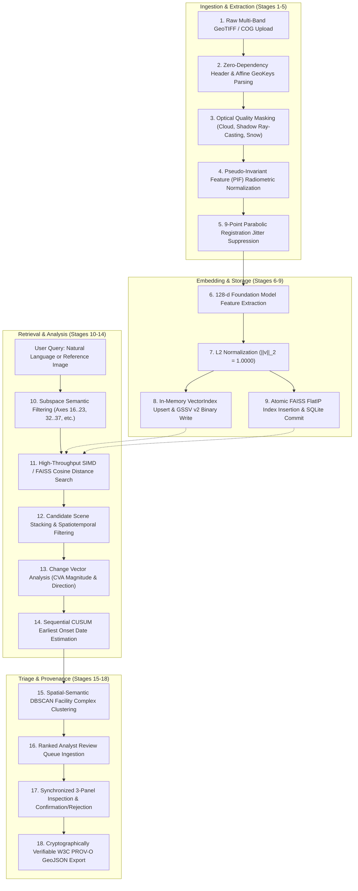

# 08. Data Flows, Schemas & System Contracts

**Project**: GeoSemanticSat / UPAGRAHA-V2 Sovereign Architecture  
**Document**: Data Flow Tracing & Persistence Contracts Specification  
**Classification**: SYSTEM INTEGRITY / DATA SPECIFICATION  

---

## 1. Complete End-to-End Data Flow (18 Stages)

Every query and observation in UPAGRAHA traverses a deterministic 18-stage data pipeline:



---

## 2. Core Data Contracts

### 1. `TilePatch` Contract (`TilePatch.cs`)
```csharp
public class TilePatch
{
    public string PatchId { get; set; } = string.Empty;
    public string ParentTileId { get; set; } = string.Empty;
    public SensorPlatform Platform { get; set; }
    public DateTime Timestamp { get; set; }
    public BoundingBox Bounds { get; set; }
    public int PixelX { get; set; }
    public int PixelY { get; set; }
    public int PatchWidth { get; set; }
    public int PatchHeight { get; set; }
    public float[] EmbeddingVector { get; set; } = Array.Empty<float>(); // Length: 128
    public double QualityScore { get; set; } = 1.0;
    public bool HasCloudOrShadow { get; set; }
    public double CloudCoverPercentage { get; set; }
    public double SunElevationDegrees { get; set; } = 45.0;
    public double? ViewZenithDegrees { get; set; }
    public string SourceFilePath { get; set; } = string.Empty;
}
```

### 2. `ChangeRecord` Contract (`ChangeRecord.cs`)
```csharp
public class ChangeRecord
{
    public string Id { get; set; } = string.Empty;
    public string TileId { get; set; } = string.Empty;
    public ChangeType Type { get; set; }
    public double Confidence { get; set; }
    public DateTime TimestampT1 { get; set; }
    public DateTime TimestampT2 { get; set; }
    public DateTime EarliestObservationTimestamp { get; set; }
    public double AreaSqMeters { get; set; }
    public int AffectedPixels { get; set; }
    public BoundingBox Bounds { get; set; }
    public bool ConfirmedByAnalyst { get; set; }
    public bool RejectedByAnalyst { get; set; }
    public string AnalystNotes { get; set; } = string.Empty;
    public string ProcessingNotes { get; set; } = string.Empty;
    public Dictionary<string, double> Metrics { get; set; } = new();
}
```

---

## 3. Compact Binary Serialization Format (`GSSV` Version 2)

`VectorIndex.cs` persists the entire index into an ultra-fast, compact binary format optimized for air-gapped on-premises loading without network overhead:

| Byte Offset | Field Name | Data Type | Description |
|---|---|---|---|
| **00..03** | Magic Header | `char[4]` | ASCII `"GSSV"` (GeoSemanticSat Vector) |
| **04..07** | Format Version | `int32` | Version number (`2`) |
| **08..11** | Vector Dimension | `int32` | Fixed vector dimension (`128`) |
| **12..15** | Record Count | `int32` | Total number of serialized `TilePatch` records |
| **Per Record** | `PatchId`, `ParentTileId` | String (Prefix) | UTF-8 Length-prefixed string identifiers |
| | `Platform` | `int32` | Enum integer representation |
| | `Timestamp` | `int64` | Binary date representation (`ToBinary()`) |
| | `Bounds` | `double[4]` | `MinLon`, `MinLat`, `MaxLon`, `MaxLat` in WGS84 |
| | `PixelX`, `PixelY`, `W`, `H` | `int32[4]` | Sub-region pixel raster bounding box |
| | `QualityScore` | `double` | Usability score $[0.0, 1.0]$ |
| | `HasCloudOrShadow` | `bool` | Quality flag |
| | `CloudCoverPercentage` | `double` | **Version 2**: Optical cloud coverage percent |
| | `SunElevationDegrees` | `double` | **Version 2**: Solar elevation angle |
| | `ViewZenithDegrees` | `bool` + `double` | **Version 2**: Sensor off-nadir zenith angle |
| | `SourceFilePath` | String (Prefix) | **Version 2**: Absolute path to source raster |
| | `EmbeddingVector` | `float32[128]` | 128 normalized floating point weights (512 bytes) |

---

## 4. W3C PROV-O GeoJSON Specification

Exported audit trails (`analyst_review_audit.geojson`) adhere to OGC CRS84 FeatureCollection standards with embedded W3C PROV-O attributes:

```json
{
  "type": "FeatureCollection",
  "crs": {
    "type": "name",
    "properties": { "name": "urn:ogc:def:crs:OGC:1.3:CRS84" }
  },
  "metadata": {
    "systemVersion": "1.0.0-PROV",
    "generatedAt": "2026-09-12T14:53:00Z",
    "sourceImageSha256": "e3b0c44298fc1c149afbf4c8996fb92427ae41e4649b934ca495991b7852b855",
    "cvaThreshold": 0.05
  },
  "features": [
    {
      "type": "Feature",
      "geometry": {
        "type": "Polygon",
        "coordinates": [[[77.216, 28.603], [77.217, 28.603], [77.217, 28.605], [77.216, 28.605], [77.216, 28.603]]]
      },
      "properties": {
        "changeId": "260002be8cb440e782bbca2eea03fe6d",
        "tileId": "S2_20240320_T3",
        "changeType": "Construction",
        "confidence": 0.99,
        "earliestObservation": "2024-03-20T10:30:00Z",
        "confirmedByAnalyst": true,
        "analystNotes": "Confirmed runway extension under construction.",
        "provenance": {
          "prov:wasGeneratedBy": "GeoSemanticSat-Engine-1.0.0-PROV",
          "prov:generatedAtTime": "2026-09-12T14:53:00Z",
          "prov:primarySource": "S2_20240320_T3"
        }
      }
    }
  ]
}
```
