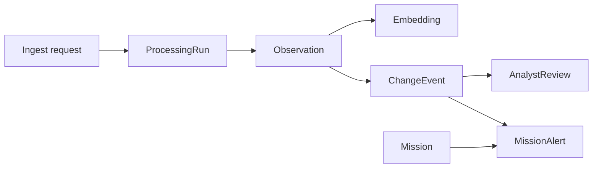

# Data flows and persisted contracts

## Backend

SQLAlchemy entities define `Location`, `SatelliteSource`, `Observation`, `ProcessingRun`, `Embedding`, `ChangeEvent`, `AnalystReview`, `Mission`, and `MissionAlert`. Geometry-like values are WKT text or JSON fields, not native PostGIS columns.

Ingestion creates or reuses a location and source, detects duplicate observations by raster path/date/sensor, stores metadata and a quality estimate, persists an embedding, and records run provenance.

## Desktop

The desktop vector index supports save/load; CLI indexing writes a caller-selected file. Change detection can be exported as GeoJSON through `ProvenanceAuditTrail.SaveGeoJson`. Compatibility rules belong to the implementation, not a stable-format claim here.