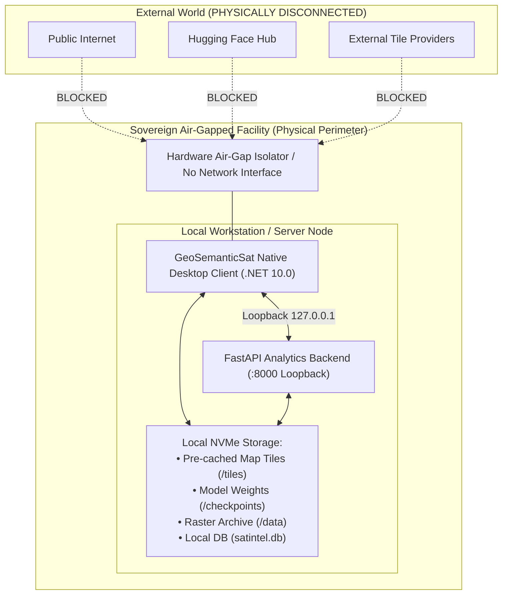

# 09. Deployment, Security & Sovereign Offline Air-Gap

**Project**: GeoSemanticSat / UPAGRAHA-V2 Sovereign Architecture  
**Document**: Air-Gap Deployment & Infrastructure Hardening Guide  
**Classification**: TOP SECRET / SOVEREIGN AIR-GAPPED DEPLOYMENT  

---

## 1. Sovereign Air-Gap Philosophy & Zero-Trust Mandate

The UPAGRAHA platform is engineered from the ground up for strict, zero-network, air-gapped military deployments. Under no operational condition is the system permitted to initiate outbound sockets, resolve external DNS names, query cloud model registries, or stream third-party map tiles over the internet.



---

## 2. Air-Gap Environment Configuration

The following environment variables and settings are permanently enforced across all runtimes:

```bash
# Python & PyTorch Offline Enforcement
export HF_HUB_OFFLINE=1
export TRANSFORMERS_OFFLINE=1
export TORCH_HOME=/models/torch
export HF_HOME=/models/huggingface

# Application Configuration
export HOST=127.0.0.1
export PORT=8000
export OFFLINE_MODE=true
export ALLOWED_HOSTS="127.0.0.1,localhost"
```

### Verification Command:
Operators can audit active network sockets during live execution to prove zero external egress:
```powershell
# Windows PowerShell Socket Audit
Get-NetTCPConnection -State Established | Where-Object { $_.RemoteAddress -notmatch '^(127\.0\.0\.1|::1)$' }
```
**Required Output**: 0 non-loopback connections established.

---

## 3. Hardware Sizing & Recommended Specifications

| Deployment Tier | Workstation Form Factor | Target Role | CPU / RAM | GPU Acceleration | Storage |
|---|---|---|---|---|---|
| **Tactical Field Terminal** | Ruggedized Laptop | Field deployable mobile analysis unit | 8 Cores (AMD Ryzen 7 / Intel Core i7), 16 GB DDR5 | NVIDIA RTX 4060 / 5070 Mobile (8 GB VRAM) | 1 TB NVMe PCIe 4.0 SSD |
| **Command HQ Workstation** | Tower Desktop | Full-scene regional intelligence analysis | 16 Cores (AMD Ryzen 9 / Intel Core i9), 32 GB DDR5 | NVIDIA RTX 4080 / 4090 Desktop (16-24 GB VRAM) | 2 TB NVMe PCIe 4.0 SSD |
| **Archive Enterprise Server** | 2U Rackmount Server | Multi-analyst concurrent archive search | 32-64 Cores (AMD EPYC / Intel Xeon), 128 GB ECC | 2x NVIDIA RTX 6000 Ada / A100 (80 GB VRAM) | 16 TB NVMe U.2 RAID-10 Array |

---

## 4. Containerized & Bare-Metal Deployment

### Bare-Metal Windows / Linux Setup:
```bash
# 1. Install .NET 10 SDK and Python 3.11+ (from sovereign local media)
# 2. Extract application artifacts into target path:
cd /opt/upagraha/Unified-RSanalytics

# 3. Create virtual environment using pre-staged wheels:
python -m venv .venv
source .venv/bin/activate
pip install --no-index --find-links=/media/wheels -r requirements.txt

# 4. Start backend service on loopback:
uvicorn app.main:app --host 127.0.0.1 --port 8000 --workers 4

# 5. Launch native desktop client:
dotnet run --project Desktop_App/Upgrahan2/src/GeoSemanticSat.UI/GeoSemanticSat.UI.csproj
```

### Docker Compose Offline Deployment:
```yaml
version: "3.8"

services:
  analytics-backend:
    build: .
    network_mode: "host"
    environment:
      - HF_HUB_OFFLINE=1
      - TRANSFORMERS_OFFLINE=1
      - HOST=127.0.0.1
      - PORT=8000
    volumes:
      - ./data:/app/data:ro
      - ./checkpoints:/app/checkpoints:ro
      - ./indexes:/app/indexes
    restart: always
```
