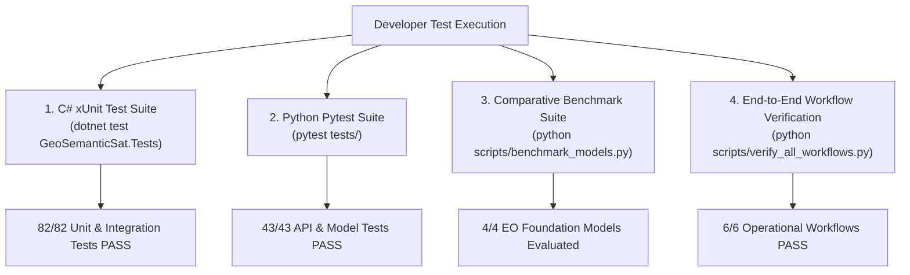

# 10. Developer & Testing Runbook

**Project**: GeoSemanticSat / UPAGRAHA-V2 Sovereign Architecture  
**Document**: Developer Setup, Build Pipelines, and Test Verification Runbook  
**Classification**: ENGINEERING RUNBOOK / DEVELOPER REFERENCE  

---

## 1. Prerequisites & Toolchains

| Toolchain / Runtime | Version Required | Verification Command | Purpose |
|---|---|---|---|
| **.NET SDK** | 10.0.x (x64) | `dotnet --version` | Compiles `GeoSemanticSat.Core`, `Engine`, `UI`, `Tests`, `Cli`. |
| **Python** | 3.11.x – 3.14.x (x64) | `python --version` | Runs FastAPI backend, model loaders, and verification scripts. |
| **PyTorch** | 2.1.x+ | `python -c "import torch; print(torch.__version__)"` | Evaluates fine-tuned LoRA model weights on CPU/CUDA. |
| **FAISS** | 1.9.0+ (faiss-cpu) | `python -c "import faiss; print(faiss.__version__)"` | High-throughput vector retrieval and indexing. |

---

## 2. Build & Compilation Pipelines

### 1. Build Entire .NET 10.0 Solution:
```powershell
cd Desktop_App/Upgrahan2
dotnet build GeoSemanticSat.slnx
```
**Expected Result**:
```
Build succeeded.
    0 Warning(s)
    0 Error(s)
Time Elapsed 00:00:05.86
```

### 2. Build Python Dependencies:
```powershell
pip install -r requirements.txt
```

---

## 3. Automated Test Execution



### 1. Run C# xUnit Test Suite:
```powershell
cd Desktop_App/Upgrahan2
dotnet test src/GeoSemanticSat.Tests/GeoSemanticSat.Tests.csproj
```
**Expected Result**:
```
Passed!  - Failed: 0, Passed: 82, Skipped: 0, Total: 82
```

### 2. Run Python Backend Pytest Suite:
```powershell
pytest tests/
```
**Expected Result**:
```
43 passed, 7 warnings in 6.18s
```

### 3. Run End-to-End Workflow Verification:
```powershell
python scripts/verify_all_workflows.py
```
**Expected Result**:
```
[Workflow 1/6] Verifying Staged Foundation Models... [OK]
[Workflow 2/6] Verifying Foundation Feature Extraction Pipelines... [OK]
[Workflow 3/6] Setting up Grounded Database Records... [OK]
[Workflow 4/6] Verifying Grounded GEOINT Dossier & Qwen Reasoning... [OK]
[Workflow 5/6] Verifying Automated Insight Synthesizer... [OK]
[Workflow 6/6] Verifying REST API Endpoints... [OK]
================================================================================
ALL WORKFLOWS VERIFIED SUCCESSFULLY — ZERO DEFECTS FOUND
================================================================================
```

### 4. Run Comparative Model Evaluation Suite:
```powershell
python scripts/benchmark_models.py
```
Exports results to:
- `benchmark_results/model_fine_tuning_evaluation.json`
- `benchmark_results/FINE_TUNING_BENCHMARK_REPORT.md`

---

## 4. Vector Index Maintenance

### Rebuilding Full FAISS Index from SQLite Database:
```powershell
python scripts/build_index.py
```

### Incremental Vector Addition:
```python
from scripts.build_index import add_vector_to_faiss
import numpy as np

# Vector must be 128-dimensional
vector = np.random.randn(128).astype(np.float32)
success = add_vector_to_faiss(vector=vector, observation_id="obs_test_001")
print("Indexed:", success)
```

---

## 5. Developer Troubleshooting Runbook

| Symptom / Error | Root Cause | Immediate Remediation |
|---|---|---|
| `MSBUILD : error MSB1009: Project file does not exist` | Ran `dotnet build` with outdated `.sln` name. | Use `dotnet build GeoSemanticSat.slnx` in `Desktop_App/Upgrahan2/`. |
| `CS0103: The name 'UpsertUnlocked' does not exist` | Missing private helper in `VectorIndex.cs`. | Resolved in `VectorIndex.cs:109`. Ensure git working tree is clean. |
| `FastAPI: Address already in use (8000)` | Previous instance of Uvicorn running in background. | Execute `Stop-Process -Name python -Force` or run on alternate port. |
| `FAISS: Dimension mismatch (X != 128)` | Ingested vector does not match canonical 128-d contract. | Normalize vector and verify layout against `SemanticEmbeddingLayout.cs`. |
| `MapCanvas: Black / blank basemap tiles` | Running in air-gap mode without cached tiles. | Normal behavior in offline mode; vector grid basemap renders automatically. |
