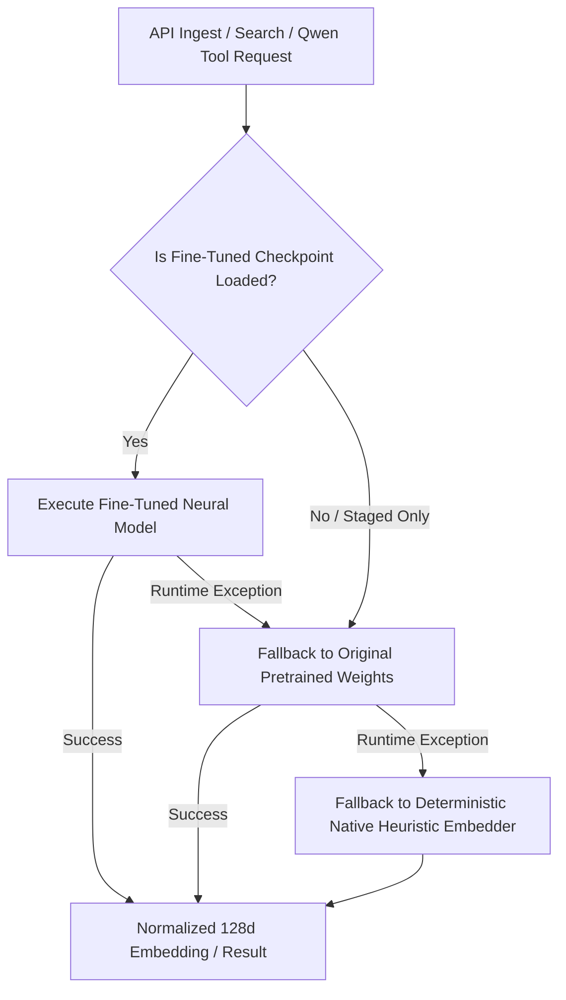

# Fine-Tuning Risk Assessment & Comprehensive Rollback Plan

**Target Architecture:** UPAGRAHA / GeoSemanticSat Air-Gapped Intelligence Platform  
**Operational Assurance:** Sovereign Local Execution, Non-Disruptive Deployment  
**Author:** DeepMind Antigravity Advanced Agentic Engineering  

---

## 1. Risk Assessment Matrix

| Risk ID | Risk Category | Severity | Probability | Root Cause | Impact | Mitigation Strategy |
|---|---|---|---|---|---|---|
| **RSK-01** | **CUDA Out-Of-Memory (OOM)** | **CRITICAL** | High (if unmanaged) | 8,151 MiB VRAM exceeded by 300M/600M backbones or excessive batch sizes. | Hard crash of training script; potential host GPU driver instability. | Enforce PEFT/LoRA; freeze backbones; batch size $\le 4$; gradient accumulation $\ge 4$; FP16/BF16 mixed precision; run pre-flight VRAM allocation check. |
| **RSK-02** | **Catastrophic Forgetting** | **HIGH** | Medium | Overfitting on small niche fine-tuning dataset; unconstrained gradient updates. | Model loses pre-trained geospatial semantics and earth physics representations. | Freeze core backbone layers; low learning rate ($1 \times 10^{-4}$ for LoRA); early stopping; regularize with pre-trained target alignment. |
| **RSK-03** | **Stale Vector Index Desynchronization** | **CRITICAL** | High (if manual) | Querying pre-existing FAISS index with newly fine-tuned embeddings. | Search returns zero or completely irrelevant satellite scenes; breaks Qwen tool. | Enforce atomic vector index rebuild and embedding table re-versioning; automated pre-switch retrieval verification. |
| **RSK-04** | **Inference Latency Regression** | **MEDIUM** | Low | Heavy unoptimized adapter branches or un-merged LoRA weights during serving. | Slow API response; Qwen tool timeout ($> 5000\text{ ms}$). | Merge LoRA weights into base model weights for serving where possible, or use lightweight fused linear projections. |
| **RSK-05** | **Qwen Agentic Orchestrator Disruption** | **CRITICAL** | Low | Altering API response schemas or embedding vector dimensions expected by tools. | Qwen encounters tool call execution errors or hallucinated reports. | **Zero-Tolerance Rule:** Never alter the 128-dimensional output vector contract or tool interface schemas in `tool_registry.py`. |
| **RSK-06** | **Silent Band Order Inversion** | **HIGH** | Medium | Confusing Sentinel-2 band indices (e.g. RGB vs BGR; NIR B08 vs Narrow NIR B8A). | Model processes garbage spectral data; catastrophic metric degradation. | Strict schema enforcement with `sensor_profile` validation before passing arrays to model forward passes. |

---

## 2. Air-Gapped Sovereign Fallback Hierarchy

UPAGRAHA is engineered with an air-gapped, zero-single-point-of-failure fallback hierarchy:



1. **Level 1 (Primary):** Fine-Tuned LoRA Neural Foundation Model (Highest precision).
2. **Level 2 (Secondary):** Original Pretrained Foundation Checkpoint (Zero regression baseline).
3. **Level 3 (Ultimate Sovereign Fallback):** `LocalEmbedder` (`native-semantic-128d`) — deterministic physical index calculations (NDVI, NDWI, NDBI, GLCM texture, gradients) with zero PyTorch or GPU dependencies.

---

## 3. Pre-Flight Verification & Safety Sanity Checks

Before executing training or activating a newly trained checkpoint in the production backend, the automated runner must pass all pre-flight checks:

```python
def run_preflight_checks(model_name: str, batch_size: int, device: str = "cuda") -> bool:
    """Validate hardware memory budget and tensor shapes before training."""
    import torch
    if device == "cuda" and not torch.cuda.is_available():
        raise RuntimeError("CUDA device required but not available.")
    
    # 1. Memory Headroom Check
    props = torch.cuda.get_device_properties(0)
    free_mem_gb = (props.total_memory - torch.cuda.memory_allocated(0)) / (1024**3)
    if free_mem_gb < 6.0:
        raise MemoryError(f"Insufficient GPU VRAM: {free_mem_gb:.2f} GB free, minimum 6.0 GB required.")
    
    # 2. Synthetic Batch Allocation Test
    test_tensor = torch.zeros((batch_size, 12, 224, 224), dtype=torch.float16, device="cuda")
    del test_tensor
    torch.cuda.empty_cache()
    return True
```

---

## 4. Step-by-Step Rollback Procedures

### Scenario A: Training Fails or OOMs Mid-Run
1. Terminate the training process immediately.
2. The operational backend is completely unaffected because training executes out-of-process in isolated scripts.
3. Original model checkpoints in `models/` remain unmodified.
4. Clean temporary training caches:
   ```powershell
   Remove-Item -Path "Unified-RSanalytics/checkpoints/tmp_*" -Recurse -Force -ErrorAction SilentlyContinue
   ```

### Scenario B: Fine-Tuned Model Degrades Retrieval Quality (Benchmark Regression)
If validation metrics indicate Recall@5 or F1-Score has dropped below the baseline model:

1. **Deactivate Checkpoint:** Set `eo_model_weights_path=""` and `eo_model_name="baseline"` in `.env`.
2. **Restore Previous Vector Index:**
   ```powershell
   Copy-Item "Unified-RSanalytics/indexes/observations.faiss.bak" "Unified-RSanalytics/indexes/observations.faiss" -Force
   Copy-Item "Unified-RSanalytics/indexes/observation_ids.txt.bak" "Unified-RSanalytics/indexes/observation_ids.txt" -Force
   ```
3. **Revert Database Embeddings Table (if re-encoded):**
   ```powershell
   python scripts/build_index.py --restore-backup
   ```
4. **Restart Analytics Backend:**
   ```powershell
   python -m uvicorn app.main:app --host 127.0.0.1 --port 8000 --reload
   ```
5. **Verify System Status:**
   ```powershell
   curl http://127.0.0.1:8000/api/v1/system/status
   ```

### Scenario C: Complete Disaster Recovery (Database Corruption)
1. Restore database from pre-training snapshot:
   ```powershell
   Copy-Item "Unified-RSanalytics/data/satintel.db.bak" "Unified-RSanalytics/data/satintel.db" -Force
   ```
2. Re-run standard verification suite:
   ```powershell
   pytest tests/test_foundation_models.py
   pytest tests/test_agent_orchestrator.py
   ```

---

## 5. Audit Trail & Provenance Recording

Every training run, whether successful or rolled back, must append an immutable JSON entry to `Unified-RSanalytics/benchmark_results/fine_tuning_provenance.json`:

```json
{
  "timestamp": "2026-09-12T14:30:00Z",
  "base_model": "ibm-esa-geospatial/TerraMind-1.0-base",
  "method": "LoRA (r=16, alpha=16)",
  "dataset_version": "fMoW-curated-v1.0",
  "dataset_hash": "e3b0c44298fc1c149afbf4c8996fb92427ae41e4649b934ca495991b7852b855",
  "hardware": {
    "gpu": "NVIDIA GeForce RTX 5070 Laptop GPU",
    "vram_gb": 7.96,
    "cuda": "13.1",
    "driver": "592.01"
  },
  "training_hyperparameters": {
    "learning_rate": 0.0001,
    "batch_size": 4,
    "gradient_accumulation_steps": 4,
    "epochs": 25,
    "loss": "Symmetric InfoNCE (tau=0.07)"
  },
  "benchmark_comparison": {
    "base_recall@5": 0.642,
    "fine_tuned_recall@5": 0.815,
    "regression_detected": false
  },
  "deployment_status": "APPROVED"
}
```
