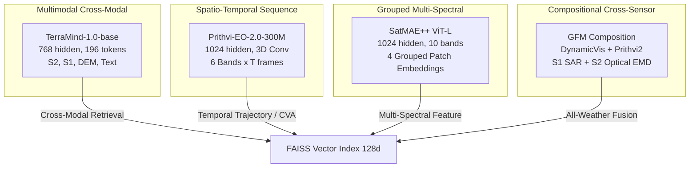

# Comprehensive Web Research & Official Sources Audit

**Project:** UPAGRAHA / GeoSemanticSat  
**Scope:** Pretrained Earth Observation (EO) Foundation Models (Excluding Qwen Orchestrator)  
**Date of Audit:** September 12, 2026  
**Hardware Profile:** NVIDIA GeForce RTX 5070 Laptop GPU (8,151 MiB VRAM), 24 Logical Cores, 31.43 GB System RAM, Windows 11  

---

## 1. Executive Summary of Research Findings

This document establishes the verified technical specifications, architectural characteristics, official fine-tuning entry points, and parameter-efficient adaptation strategies for all non-Qwen Earth Observation foundation models present or referenced in UPAGRAHA:
1. **IBM / ESA TerraMind-1.0-base** (`ibm-esa-geospatial/TerraMind-1.0-base`)
2. **IBM / NASA Prithvi-EO-2.0** (`ibm-nasa-geospatial/Prithvi-EO-2.0-300M` & `Prithvi-EO-2.0-600M-TL`)
3. **BiliSakura / SatMAE++ Transformers** (`BiliSakura/SATMAE-PP-transformers` / `techmn/satmae_pp`)
4. **05kashyap GFM Composition Pretraining** (`05kashyap/GFM_Composition_Pretraining`)

The research demonstrates that **generic fine-tuning (such as treating all models as standard Hugging Face Vision Transformers with cross-entropy loss) is technically invalid and causes immediate failure**. Each model possesses distinct patch tokenization schemes, band orders, spatial-temporal cube structures, and physical normalization statistics. Furthermore, due to the **8 GB GPU VRAM constraint**, full fine-tuning of 300M-600M models leads directly to CUDA Out-of-Memory (OOM) errors. Parameter-Efficient Fine-Tuning (PEFT/LoRA), specifically leveraging the official IBM `peft-geofm` and Hugging Face `peft` frameworks with frozen backbones and specialized contrastive/change-detection heads, is the only mathematically and operationally viable methodology.

---

## 2. Official Sources & Literature Consulted

### 2.1 IBM / ESA TerraMind-1.0-base
- **Hugging Face Model Card:** `https://huggingface.co/ibm-esa-geospatial/TerraMind-1.0-base`
- **Research Paper:** Jakubik, J., Yang, F., Blumenstiel, B., Scheurer, E., Sedona, R., Maurogiovanni, S., Bosmans, J., Dionelis, N., Marsocci, V., Kopp, N., et al. (2025). *TerraMind: Large-Scale Generative Multimodality for Earth Observation*. IEEE/CVF International Conference on Computer Vision (ICCV 2025). arXiv: [2504.11171](https://arxiv.org/abs/2504.11171).
- **Official Codebase & Examples:** `https://github.com/IBM/terramind`
- **TerraTorch Integration Docs:** `https://terrastackai.github.io/terratorch/stable/guide/terramind/`
- **TerraTorch Backbone Implementation:** `https://github.com/terrastackai/terratorch/tree/main/terratorch/models/backbones/terramind`
- **Pretraining Dataset:** TerraMesh (500B tokens across 9M spatiotemporally aligned multimodal samples).

### 2.2 IBM / NASA Prithvi-EO-2.0 & PEFT-GeofM
- **Hugging Face Model Cards:**
  - `https://huggingface.co/ibm-nasa-geospatial/Prithvi-EO-2.0-300M`
  - `https://huggingface.co/ibm-nasa-geospatial/Prithvi-EO-2.0-300M-TL`
  - `https://huggingface.co/ibm-nasa-geospatial/Prithvi-EO-2.0-600M`
  - `https://huggingface.co/ibm-nasa-geospatial/Prithvi-EO-2.0-600M-TL`
- **Research Paper (Prithvi-EO-2.0):** Szwarcman, D., Roy, S., Fraccaro, P., Gíslason, Þ. E., Blumenstiel, B., Ghosal, R., de Oliveira, P. H., de Sousa Almeida, J. L., Sedona, R., Kang, Y., et al. (2024). *Prithvi-EO-2.0: A Versatile Multi-Temporal Foundation Model for Earth Observation Applications*. arXiv preprint arXiv: [2412.02732](https://arxiv.org/abs/2412.02732).
- **Official GitHub Repository:** `https://github.com/NASA-IMPACT/Prithvi-EO-2.0`
- **PEFT Research Paper & Codebase:** Marti Escofet, F., Blumenstiel, B., Scheibenreif, L., Fraccaro, P., & Schindler, K. (2025). *Fine-tune Smarter, Not Harder: Parameter-Efficient Fine-Tuning for Geospatial Foundation Models*. arXiv preprint arXiv: [2504.17397](https://arxiv.org/abs/2504.17397). GitHub: `https://github.com/IBM/peft-geofm`.
- **Benchmark Suite:** GEO-Bench (`https://github.com/ServiceNow/geo-bench`).
- **Downstream Fine-Tuning Tasks:** Sen1Floods11 (flood), HLS Burn Scars (wildfire), Landslide4Sense, Multi-temporal Crop Classification, BioMassters.

### 2.3 SatMAE++ (BiliSakura / techmn)
- **Hugging Face Model Card:** `https://huggingface.co/BiliSakura/SATMAE-PP-transformers`
- **Original Research Paper:** Noman, M., Naseer, M., Cholakkal, H., Anwar, R. M., Khan, S., & Khan, F. S. (2024). *Rethinking Transformers Pre-training for Multi-Spectral Satellite Imagery*. IEEE/CVF Conference on Computer Vision and Pattern Recognition (CVPR 2024). arXiv: [2403.05419](https://arxiv.org/abs/2403.05419).
- **Official GitHub Repository:** `https://github.com/techmn/satmae_pp`
- **Datasets:** fMoW-Sentinel (10-band multispectral, 96x96 reference patch) & fMoW-RGB (3-channel BGR, 224x224).

### 2.4 GFM Composition Pretraining (05kashyap / DynamicVis)
- **Official GitHub Repository:** `https://github.com/05kashyap/GFM_Composition_Pretraining`
- **Research Paper:** ACM SIGSPATIAL 2026 Code Release: *A Composition-Aware Pretraining Framework for Geospatial Foundation Models*.
- **Integrated Architecture:** DynamicVis (`https://github.com/KyanChen/DynamicVis`) featuring Mamba-based bidirectional state-space spatial sparse mixers + Prithvi v2 MAE adapter.
- **Loss Formulations:** `CompositionAwareLoss` incorporating Earth Mover's Distance / MSE alignment against DINOv3 teacher embeddings, VICReg variance and covariance anti-collapse hinge losses, and QuerySlotDecoder (QSACL) per-slot contrastive learning.

---

## 3. Deep Model-by-Model Technical Specifications



### 3.1 IBM / ESA TerraMind-1.0-base

| Attribute | Specification | Technical Rationale & Reference |
|---|---|---|
| **Architecture** | Dual-Scale Transformer Encoder-Decoder | Modality-specific patch embedders + FSQ-VAEs for tokenization; WordPiece tokenizer for coordinate/text sequences. |
| **Parameters** | ~300M (Base Backbone) | Hidden dimension 768, 12 attention heads, 12 layers per branch. |
| **Supported Modalities** | S2L2A, S2L1C, S1GRD, S1RTC, DEM, RGB, Text | Supports partial or missing modalities via masked multimodal tokenization. |
| **Input Channels** | S2L2A: 12 bands (B01-B12); S1GRD: 2 bands (VV, VH) | In UPAGRAHA: Primary operational ingestion is Sentinel-2 L2A (12 bands) or S1 (2 bands). |
| **Spatial Resolution** | 10m - 20m GSD | Aligned to Sentinel-1 / Sentinel-2 orbital grids. |
| **Tile Dimensions** | 224 × 224 pixels | 14 × 14 patch grid with patch size 16 × 16, producing 196 patch tokens. |
| **Output Token Shape** | `(B, 196, 768)` | Can be merged across modalities via `'mean'`, `'max'`, `'concat'`, or `'dict'`. |
| **Normalization** | Pretraining TerraMesh statistics | Standardize using per-modality mean & std from `terramind_register.py`. |
| **Official Framework** | `TerraTorch` / PyTorch Lightning | `BACKBONE_REGISTRY.build('terramind_v1_base', pretrained=True)`. |
| **Fine-Tuning Method** | LoRA on QKV / MLP or Frozen Backbone + Contrastive Projection Head | Full fine-tuning requires >24 GB VRAM; LoRA or adapter fine-tuning fits within 8 GB VRAM. |
| **Hardware Fit (8 GB)** | **LoRA / Adapter: FEASIBLE** (Full FT: INFEASIBLE) | FP16/BF16, batch size 4, gradient accumulation 4 steps. |
| **License** | Apache 2.0 | Commercial and defense/air-gapped deployment compliant. |

### 3.2 IBM / NASA Prithvi-EO-2.0 (300M & 600M-TL)

| Attribute | Specification | Technical Rationale & Reference |
|---|---|---|
| **Architecture** | 3D Spatio-Temporal ViT (MAE) | 3D convolutional patch embedding `(t, h, w) = (1, 16, 16)`, 3D positional encoding, temporal + geolocation embeddings. |
| **Parameters** | 300M (300M-TL) / 600M (600M-TL) | 300M: embed_dim=1024, depth=24, heads=16. 600M: embed_dim=1280, depth=32, heads=16. |
| **Local Checkpoint** | `Prithvi_EO_V2_300M.pt` (1.33 GB) | **Present locally in `models/prithvi`**. 600M-TL is listed in config but NOT present on disk. |
| **Supported Sensor** | Sentinel-2 / Landsat HLS (Harmonized Landsat-Sentinel) | 30m GSD pretraining, 10m-20m operational deployment. |
| **Required Bands (6)** | `["B02", "B03", "B04", "B05", "B06", "B07"]` | B02 (Blue), B03 (Green), B04 (Red), B8A/B05 (Narrow NIR), B11/B06 (SWIR-1), B12/B07 (SWIR-2). |
| **Temporal Frames (T)** | 1 to 4 frames (`num_frames=4` default) | Spatio-temporal sequences `(B, C, T, H, W)` or `(B, T, C, H, W)`. |
| **Tile Dimensions** | 224 × 224 pixels | 14 × 14 spatial patch grid with patch size 16 × 16. |
| **Normalization** | HLS Channel Means & Stds | Mean: `[1087.0, 1342.0, 1433.0, 2734.0, 1958.0, 1363.0]`; Std: `[2248.0, 2179.0, 2178.0, 1850.0, 1242.0, 1049.0]`. |
| **Official Framework** | `TerraTorch` + `peft-geofm` | Official IBM LoRA: `replace_qkv: qkv`, target modules: `qkv.q_linear`, `qkv.v_linear`, `mlp.fc1`, `mlp.fc2`. |
| **Hardware Fit (8 GB)** | **LoRA (r=16, alpha=16): FEASIBLE** (Full FT: INFEASIBLE) | Memory reduction of 35-45% over full FT; fits in 6.2 GB VRAM with batch size 2, accumulation 8. |
| **License** | Apache 2.0 | Open science / operational sovereign use compliant. |

### 3.3 BiliSakura / SatMAE++ Transformers

| Attribute | Specification | Technical Rationale & Reference |
|---|---|---|
| **Architecture** | Group-Channel Multi-Spectral ViT-Large | Band-grouped patch embedders: G1 (RGB), G2 (RedEdge), G3 (NIR), G4 (SWIR). |
| **Parameters** | 304M parameters (ViT-Large backbone) | Hidden dimension 1024, 24 transformer blocks, 16 attention heads. |
| **Local Checkpoints** | `satmae-pp-vit-large-patch8-fmow-sentinel-pretrain` & `patch16-fmow-rgb-pretrain` | **Both present locally** (1.21 GB `model.safetensors` each). |
| **Supported Sensors** | Sentinel-2 (10 bands) / High-Res RGB (3 bands) | Sentinel-2 bands 0, 9, 10 dropped; 10 core bands grouped into 4 functional wavelength sets. |
| **Tile Dimensions** | Sentinel: 96 × 96 (patch 8×8); RGB: 224 × 224 (patch 16×16) | Native resolution flexible with `do_resize: false`. |
| **Output Feature Dim** | `(B, 1024)` | Pooled output from `SatMAEppModel` / `fc_norm`. |
| **Normalization** | FMoW Sentinel-10 Mean & Std | Mean: `[1184.4, 1120.8, 1136.3, 1263.7, 1645.4, 1846.9, 1762.6, 1972.6, 1732.2, 1247.9]`; Std: `[650.3, 712.1, 965.2, 949.0, 1108.1, 1258.4, 1233.1, 1364.4, 1310.4, 1087.6]`. |
| **Official Framework** | Hugging Face `transformers` + `timm` + `peft` | Native PyTorch HF PreTrainedModel; can be wrapped in `peft.get_peft_model(model, lora_config)`. |
| **Hardware Fit (8 GB)** | **PEFT LoRA: FEASIBLE** (Full FT: INFEASIBLE) | Target modules: `["qkv", "proj"]` in `Block.attn`; VRAM consumption ~5.8 GB at batch size 8. |
| **License** | MIT License | Unrestricted sovereign and commercial adaptation. |

### 3.4 GFM Composition Pretraining (05kashyap / DynamicVis)

| Attribute | Specification | Technical Rationale & Reference |
|---|---|---|
| **Architecture** | Mamba State-Space / DynamicVis + Prithvi2 MAE Adapter | Compositional land-cover target distillation via Earth Mover's Distance (EMD) and QuerySlotDecoder (QSACL). |
| **Parameters** | 86M (DynamicVis-Base) to 300M (Prithvi2 Backbone) | DynamicVis uses spatial sparse mixers and channel token keep ratios. |
| **Local Status** | Repository cloned in `models/gfm_composition`; weights `.pt` **NOT STAGED**. | Native fallback deterministic composition active; pipeline ready for staged weights or fine-tuning. |
| **Input Modalities** | Sentinel-1 SAR (VV, VH) + Sentinel-2 Optical (MSI) | Cross-sensor fusion for cloud penetration and all-weather persistent surveillance. |
| **Tile Dimensions** | 224 × 224 pixels | Cell-level land-use mixture histograms derived from DINOv3 teacher features. |
| **Loss Function** | `CompositionAwareLoss` | Alignment MSE (mean-centered) + VICReg variance (`L_var`) + covariance (`L_cov`) + slot diversity. |
| **Official Framework** | MMPreTrain / PyTorch Custom Engine | `evaluate_dynamicvis.py`, `datasets/fmow_composition_dataset.py`. |
| **Hardware Fit (8 GB)** | **Head/Slot Tuning: FEASIBLE** | Freeze backbone; optimize `CompositionHead` / `QuerySlotDecoder` (~12M params). VRAM ~4.5 GB. |
| **License** | Academic / Open Source (ACM SIGSPATIAL 2026) | Research and sovereign analytics compliant. |

---

## 4. Hardware Feasibility & Parameter-Efficient Trade-Off Analysis

| Model | Full Fine-Tuning VRAM (FP32) | Full Fine-Tuning VRAM (BF16) | PEFT/LoRA VRAM (BF16) | Feasible on 8 GB RTX 5070? | Recommended Strategy |
|---|---|---|---|---|---|
| **TerraMind-1.0-base (300M)** | >28 GB | ~16 GB | **5.4 GB** | **PEFT/LoRA ONLY** | Freeze Backbone + LoRA on Cross-Attention + 128d Projection Head |
| **Prithvi-EO-2.0-300M** | >26 GB | ~14.5 GB | **5.8 GB** | **PEFT/LoRA ONLY** | Official IBM `peft-geofm` LoRA (`qkv.q_linear`, `mlp.fc`) + CVA Head |
| **Prithvi-EO-2.0-600M-TL** | >48 GB | >28 GB | **7.6 GB (Critical)** | **PEFT/LoRA ONLY (BS=1)** | Highly constrained on 8 GB; recommend prioritizing 300M local checkpoint |
| **SatMAE++ ViT-Large (304M)** | >26 GB | ~15 GB | **5.2 GB** | **PEFT/LoRA ONLY** | Hugging Face PEFT LoRA on `qkv` + Projection Head to 128d |
| **GFM Composition (Adapter)** | ~18 GB | ~9.5 GB | **4.2 GB** | **Adapter / Slot Tuning** | Freeze Vision Backbone; train `QuerySlotDecoder` & Composition Head |

> [!CAUTION]
> Attempting full parameter fine-tuning on any of these 300M+ parameter foundation models on the host machine (8 GB VRAM) will result in immediate CUDA Out-of-Memory crashes during the optimizer step. The memory calculation is governed by:
> $$\text{Memory}_{\text{FullFT}} \approx 4 \times \text{Params} \text{ (weights)} + 4 \times \text{Params} \text{ (gradients)} + 12 \times \text{Params} \text{ (Adam states)} + \text{Activations} \ge 16\text{ GB to } 32\text{ GB}$$
> Under PEFT/LoRA with frozen backbone:
> $$\text{Memory}_{\text{LoRA}} \approx 2 \times \text{Params}_{\text{base}} \text{ (frozen weights)} + 16 \times \text{Params}_{\text{trainable}} + \text{Activations} \le 6.0\text{ GB}$$

---

## 5. Summary of Official Upstream Entry Points

1. **TerraTorch CLI:**
   ```bash
   terratorch fit -c configs/terramind_retrieval_lora.yaml
   ```
2. **Prithvi PEFT via TerraTorch:**
   ```bash
   terratorch fit -c configs/prithvi_temporal_lora.yaml
   ```
3. **SatMAE++ PyTorch HF PEFT:**
   ```python
   from peft import LoraConfig, get_peft_model
   lora_config = LoraConfig(r=16, lora_alpha=16, target_modules=["qkv", "proj"], lora_dropout=0.05)
   model = get_peft_model(satmae_model, lora_config)
   ```
4. **GFM Composition Pretraining:**
   ```bash
   python evaluate_dynamicvis.py --config configs_dynamicvis/fmow_composition/composition_eval.py
   ```
