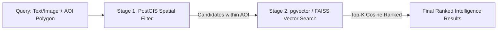
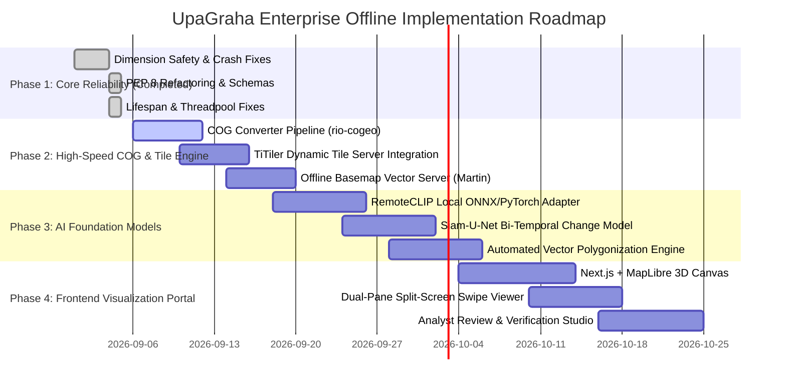

# UpaGraha: Offline-First Geospatial Intelligence & Satellite Analytics Platform
**Complete System Blueprint, Offline Architecture, Library Directory with Official References & Visual Implementation Plan**

---

## 1. Executive Summary & Air-Gapped Architectural Principles

**UpaGraha** is an enterprise-grade Earth Observation (EO) and geospatial intelligence (GEOINT) platform designed for **100% air-gapped, zero-internet, offline operation**. It enables defense and intelligence analysts, environmental researchers, and disaster response teams to ingest raw multispectral and SAR satellite rasters, generate dynamic map tiles, execute sub-millisecond semantic visual searches, detect physical land-use changes, and conduct analyst review workflows without connecting to any external cloud, API, or map-tile provider.

### Core Offline Principles
1. **Zero External HTTP/CDN Calls:** All JavaScript libraries, CSS fonts, MapLibre styles, base-layer vector tiles, and satellite imagery are bundled locally.
2. **Local Foundation Model Inference:** Models (RemoteCLIP, Prithvi, Siam-U-Net) run strictly on local CPU/GPU through ONNX Runtime or local PyTorch checkpoints without accessing Hugging Face or remote model hubs.
3. **Local Vector Map Server:** Basemap vector tiles (OpenStreetMap / Natural Earth) are served locally using MBTiles and local tile server engines ([Martin](https://martin.maplibre.org/) or [TileServer GL](https://github.com/maptiler/tileserver-gl)).
4. **Cloud-Optimized GeoTIFF (COG) Local Pyramid Streaming:** Rasters are pre-processed into COGs with internal overviews, allowing instant sub-region reads and high-resolution rendering without loading multi-gigabyte files into RAM.

---

## 2. Comprehensive Technology Directory & Recommended Packages (with References)

### 2.1. Geospatial Processing & Raster Manipulation (Python)

| Library | Official Documentation | Role in UpaGraha & Offline Capabilities |
| :--- | :--- | :--- |
| **Rasterio** | [rasterio.readthedocs.io](https://rasterio.readthedocs.io/) | Reads/writes GeoTIFFs, handles geospatial georeferencing, affine transformations, and windowed reading. Built on GDAL C++ core. |
| **GDAL / OGR** | [gdal.org](https://gdal.org/) | Core C/C++ geospatial translation engine. Reprojects coordinate reference systems (CRS) and converts satellite formats (HDF5, NetCDF, SAFE, GeoTIFF). |
| **rio-cogeo** | [cogeotiff.github.io/rio-cogeo](https://cogeotiff.github.io/rio-cogeo/) | Converts raw satellite rasters into Cloud Optimized GeoTIFFs (COGs) with internal overview pyramids (resolutions downsampled at 2x, 4x, 8x, 16x) and DEFLATE compression. |
| **rio-tiler** | [cogeotiff.github.io/rio-tiler](https://cogeotiff.github.io/rio-tiler/) | Dynamic tile extraction engine. Extracts arbitrary Web Mercator tiles ($Z/X/Y$) directly from local COGs in milliseconds. |
| **Shapely 2.0** | [shapely.readthedocs.io](https://shapely.readthedocs.io/) | Fast C-accelerated planar geometry manipulation (polygons, bounding boxes, intersections, unions, and buffering). |
| **GeoPandas** | [geopandas.org](https://geopandas.org/) | Extends Pandas to handle spatial dataframes, spatial joins (`sjoin`), and vector layer operations. |
| **PyProj** | [pyproj4.github.io/pyproj](https://pyproj4.github.io/pyproj/stable/) | Python interface to PROJ. Transforms coordinate reference systems (e.g. WGS84 EPSG:4326 $\leftrightarrow$ UTM Zone 46N EPSG:32646) with offline local PROJ database. |
| **xarray & rioxarray** | [corteva.github.io/rioxarray](https://corteva.github.io/rioxarray/stable/) | Multi-dimensional labeled geospatial array manipulation; enables multi-temporal datacubes for time-series trend analysis. |
| **rasterstats** | [pythonhosted.org/rasterstats](https://pythonhosted.org/rasterstats/) | Extracts zonal statistics (mean, median, standard deviation, min, max) of satellite raster bands within vector polygon regions. |

---

### 2.2. Map Tile Serving, Vector Databases & Spatial Storage

| Package / Tool | Official Documentation | Offline Capability & Rationale |
| :--- | :--- | :--- |
| **TiTiler** | [developmentseed.org/titiler](https://developmentseed.org/titiler/) | High-performance FastAPI dynamic map tile server. Generates dynamic XYZ, WMTS, and OGC Tiles on-the-fly directly from local COGs with custom colormaps. |
| **PostgreSQL 16 + PostGIS 3.4** | [postgis.net](https://postgis.net/) | Industry-standard spatial database. Handles geometry/geography indexing with GiST/SP-GiST indexes, spatial queries (`ST_Intersects`, `ST_Contains`, `ST_DWithin`). |
| **pgvector** | [github.com/pgvector/pgvector](https://github.com/pgvector/pgvector) | Native PostgreSQL vector similarity extension. Stores high-dimensional embeddings and performs sub-millisecond HNSW/IVFFlat index cosine searches. |
| **FAISS (CPU / GPU)** | [github.com/facebookresearch/faiss](https://github.com/facebookresearch/faiss) | Blazing-fast standalone vector index. Enables quantized, clustered, and IndexHNSWFlat similarity search without external database dependencies. |
| **Martin** | [martin.maplibre.org](https://martin.maplibre.org/) | Blazing-fast Rust-based vector tile server. Streams Mapbox Vector Tiles (MVT) directly from PostGIS tables to the frontend map canvas. |
| **TileServer GL** | [github.com/maptiler/tileserver-gl](https://github.com/maptiler/tileserver-gl) | Completely offline basemap tile server. Reads pre-packaged `.mbtiles` files (e.g. OpenStreetMap of India) and serves raster/vector tiles locally. |
| **Redis 7** | [redis.io](https://redis.io/) | In-memory cache for rendered raster tiles, query cache, and message broker for Celery task workers. |

---

### 2.3. AI Models & Remote Sensing Foundation Architectures

| Model / Library | Official Reference | Usage in UpaGraha |
| :--- | :--- | :--- |
| **RemoteCLIP** | [github.com/ChenDelong1999/RemoteCLIP](https://github.com/ChenDelong1999/RemoteCLIP) | First vision-language foundation model pre-trained on remote sensing imagery (ViT-B/32, ViT-L/14). Enables natural language zero-shot text retrieval (e.g., *"helipad near river"*, *"dense forest clearing"*) against satellite archives. |
| **Prithvi-100M (NASA / IBM)** | [huggingface.co/ibm-nasa-geospatial](https://huggingface.co/ibm-nasa-geospatial/Prithvi-100M) | Geospatial foundation model pre-trained on Sentinel-2 optical and infrared bands. Provides multi-temporal embeddings for change detection and crop classification. |
| **TorchGeo** | [torchgeo.readthedocs.io](https://torchgeo.readthedocs.io/) | PyTorch domain library for remote sensing. Contains pre-trained backbones, multispectral data augmentations, and geospatial datasets. |
| **ONNX Runtime** | [onnxruntime.ai](https://onnxruntime.ai/) | High-performance inference engine for local hardware. Accelerates PyTorch/TensorFlow models with 5x-10x latency reduction and low VRAM usage. |
| **ChangeFormer & Siam-U-Net** | [github.com/wgcban/ChangeFormer](https://github.com/wgcban/ChangeFormer) | Siamese Transformer architecture for bi-temporal satellite image change detection. Outputs binary and multi-class change probability masks. |

---

### 2.4. Frontend, Map Rendering & Visual Interactivity

| Framework / Library | Official Documentation | Capability & Visual Value |
| :--- | :--- | :--- |
| **MapLibre GL JS** | [maplibre.org](https://maplibre.org/) | Open-source WebGL-based vector and raster mapping library. 100% free, requires no API tokens, and supports custom offline tile servers. |
| **Deck.gl** | [deck.gl](https://deck.gl/) | GPU-accelerated visualization layer framework. Renders 1,000,000+ polygons, heatmaps, 3D terrain meshes, and flow lines at steady 60 FPS. |
| **maplibre-gl-compare** | [github.com/mapbox/mapbox-gl-compare](https://github.com/mapbox/mapbox-gl-compare) | Interactive split-screen swipe comparison control. Enables analysts to scrub back and forth between bi-temporal satellite rasters. |
| **GeoTIFF.js** | [geotiffjs.github.io](https://geotiffjs.github.io/) | Decodes GeoTIFF metadata and raw pixel arrays directly in the client browser for client-side band math and custom dynamic color ramps. |
| **Apache ECharts** | [echarts.apache.org](https://echarts.apache.org/) | Canvas/SVG-based data visualization library. Displays interactive time-series timeline graphs, spectral signatures, and NDVI/NDWI trend lines. |
| **Lucide Icons** | [lucide.dev](https://lucide.dev/) | Clean, lightweight SVG icon suite for military/intelligence dashboard UI components. |
| **Tailwind CSS & shadcn/ui** | [ui.shadcn.com](https://ui.shadcn.com/) | Modern accessible UI design system with dark-mode optimized themes for control centers. |

---

## 3. End-to-End File & Package Structure

```
UpaGraha/
├── .env.example                       # Offline environment variable blueprint
├── .gitignore                         # Strict repository exclusions
├── docker-compose.yml                 # PostGIS, Redis, TiTiler, Martin & API services
├── Dockerfile                         # Hardened multi-stage non-root container
├── pytest.ini                         # Pytest configuration
├── requirements.txt                   # Production pinned dependencies
├── pyproject.toml                     # Modern package & linting configuration (Ruff/Black)
│
├── basemaps/                          # Bundled offline vector map assets
│   ├── india_osm.mbtiles              # Offline OpenStreetMap vector tiles for India
│   ├── terrain_dem.mbtiles            # Offline SRTM/Copernicus 30m Digital Elevation Model
│   └── style.json                     # MapLibre offline style definition
│
├── data/                              # Local GeoTIFF & Vector Storage
│   ├── raw/                           # Ingested raw satellite rasters (.tif, .safe)
│   ├── cogs/                          # Cloud-Optimized GeoTIFFs (with overview pyramids)
│   ├── masks/                         # Generated change masks (.tif)
│   └── vectors/                       # Exported change polygon GeoJSONs
│
├── models/                            # Offline model weights (No download required at runtime)
│   ├── remoteclip/
│   │   ├── weights.pt                 # RemoteCLIP ViT-L/14 model checkpoint
│   │   └── vocab.txt                  # Offline BPE tokenizer vocabulary
│   ├── prithvi/
│   │   └── prithvi_100m.onnx          # Prithvi-100M ONNX quantized model
│   └── change/
│       └── changeformer_bitemporal.onnx # Siamese Change Detection model
│
├── indexes/                           # Persistent Vector Indexes
│   ├── observations.faiss             # FAISS HNSW vector index
│   └── observation_ids.txt            # Vector-to-Observation mapping table
│
├── app/                               # Core Python Application
│   ├── __init__.py
│   ├── main.py                        # FastAPI application entrypoint & lifespan
│   │
│   ├── api/                           # API Gateway & Route Definitions
│   │   ├── __init__.py
│   │   ├── dependencies.py            # DB session, auth, rate limiter dependencies
│   │   ├── router.py                  # Master v1 API Router
│   │   └── v1/
│   │       ├── ingest.py              # Raster ingestion & COG conversion endpoints
│   │       ├── search.py              # Visual similarity & RemoteCLIP text search
│   │       ├── locations.py           # Location management, timeline & spatial query
│   │       ├── change.py              # Bi-temporal change detection & mask triggers
│   │       ├── reviews.py             # Analyst review queue, confirmations & notes
│   │       └── tiles.py               # Dynamic map tile & spectral index URL generator
│   │
│   ├── core/                          # Core System Infrastructure
│   │   ├── config.py                  # Pydantic Settings & environment validation
│   │   ├── logging.py                 # Structured JSON logging & audit trail
│   │   ├── security.py                # Offline JWT/API-key verification
│   │   └── constants.py               # Spectral band formulas, enums, thresholds
│   │
│   ├── db/                            # Database Layer
│   │   ├── session.py                 # SQLAlchemy 2.0 engine, pool & WAL pragma
│   │   └── migrations/                # Alembic spatial schema migrations
│   │
│   ├── models/                        # SQLAlchemy 2.0 ORM Entities
│   │   ├── base.py                    # Base model with UUID & UTC timestamp mixins
│   │   ├── location.py                # Location entity & PostGIS geometry
│   │   ├── observation.py             # Observation, SatelliteSource & raster metadata
│   │   ├── embedding.py               # Vector embeddings (pgvector / JSON)
│   │   ├── change_event.py            # Change events, confidence, evidence & masks
│   │   ├── review.py                  # Analyst verification reviews
│   │   └── processing_run.py          # Job runs, provenance, and audit logs
│   │
│   ├── schemas/                       # Pydantic Request & Response Schemas
│   │   ├── common.py                  # Pagination, generic envelopes & errors
│   │   ├── ingest.py                  # Ingest requests & raster metadata schemas
│   │   ├── search.py                  # Search filters & ranked result schemas
│   │   ├── location.py                # Location details & GeoJSON responses
│   │   ├── change.py                  # Change detection evidence schemas
│   │   └── review.py                  # Review requests & StrEnum decision schemas
│   │
│   ├── services/                      # Core Business Logic & Algorithms
│   │   ├── raster/
│   │   │   ├── cog_converter.py       # Converts GeoTIFFs to COGs with overviews
│   │   │   ├── metadata_extractor.py  # Reads CRS, bounds, sensor, resolution
│   │   │   ├── spectral_indices.py    # Computes NDVI, NDWI, NDBI, SAVI, EVI
│   │   │   └── tile_streamer.py       # Dynamic tile rendering and color mapping
│   │   │
│   │   ├── embeddings/
│   │   │   ├── service.py             # LocalEmbedder baseline (96-dim)
│   │   │   ├── remoteclip_adapter.py  # RemoteCLIP ViT ONNX/PyTorch inference
│   │   │   └── faiss_manager.py       # Incremental FAISS add, search & persistence
│   │   │
│   │   └── change/
│   │       ├── diff_engine.py         # Normalized difference baseline calculator
│   │       ├── ai_change_model.py     # Deep learning Siam-U-Net inference
│   │       └── polygonizer.py         # Converts raster masks into GeoJSON polygons
│   │
│   └── workers/                       # Distributed Asynchronous Task Workers
│       ├── celery_app.py              # Celery worker initialization
│       └── tasks.py                   # Async ingestion, COG conversion & change tasks
│
├── frontend/                          # High-Performance Geospatial Web App (Next.js)
│   ├── package.json
│   ├── tailwind.config.js
│   ├── src/
│   │   ├── components/
│   │   │   ├── map/
│   │   │   │   ├── MapCanvas.tsx      # MapLibre GL JS offline canvas
│   │   │   │   ├── DeckGLLayers.tsx   # 3D terrain & polygon overlays
│   │   │   │   └── LayerControl.tsx   # Spectral index & opacity toggles
│   │   │   ├── comparison/
│   │   │   │   ├── SwipeViewer.tsx    # Split-screen temporal swipe slider
│   │   │   │   └── DifferenceMask.tsx # Blended change detection highlight
│   │   │   ├── timeline/
│   │   │   │   ├── TimeSlider.tsx     # Temporal scrubber across observation dates
│   │   │   │   └── SpectralChart.tsx  # ECharts NDVI/NDWI historical trend line
│   │   │   └── review/
│   │   │       ├── ReviewModal.tsx    # Analyst validation & confirmation dialog
│   │   │       └── AuditReport.tsx    # Provenance PDF/JSON export generator
│   │   ├── hooks/
│   │   │   ├── useRasterTiles.ts      # Hook to fetch dynamic COG tile URLs
│   │   │   └── useVectorSearch.ts     # Hook for visual & text vector search
│   │   └── pages/
│   │       ├── index.tsx              # Intelligence Operations Dashboard
│   │       ├── search.tsx             # Multi-Modal Semantic Search Studio
│   │       ├── change-studio.tsx      # Bi-Temporal Change Detection Studio
│   │       └── review-queue.tsx       # Analyst Verification & Decision Center
│
├── scripts/                           # Maintenance & Setup Scripts
│   ├── init_db.py                     # Initializes database tables & spatial extensions
│   ├── create_sample_data.py          # Generates 3-band RGB and 1-band SAR rasters
│   └── build_index.py                 # Generates local FAISS vector index from DB
│
└── tests/                             # Comprehensive Automated Test Suite
    ├── conftest.py                    # Test client & test database fixtures
    ├── test_api.py                    # End-to-end API integration tests
    ├── test_raster.py                 # GeoTIFF validation & COG conversion tests
    ├── test_embeddings.py             # Vector dimensionality & FAISS search tests
    └── test_change.py                 # Change detection & polygonization tests
```

---

## 4. Visual & Interactivity Improvements (Detailed Specifications)

```
===================================================================================
                       UPAGRAHA GEOINT COMMAND DASHBOARD
===================================================================================
 [Target]: Kibithu Sector, Arunachal Pradesh      [Coordinates]: 28.012°N, 97.014°E
 [Sensor]: Sentinel-2 (10m Resolution)          [Temporal Window]: 2025-01-01 -> 2025-02-15
-----------------------------------------------------------------------------------
 [VIEW MODES]: (•) True Color  ( ) Color Infrared  ( ) NDVI Heatmap  ( ) SAR Coherence
-----------------------------------------------------------------------------------

     BEFORE: 2025-01-01                        AFTER: 2025-02-15
  +--------------------------+              +--------------------------+
  |                          |   < SWIPE >  |             [NEW ROAD]   |
  |      Dense Forest        | <==========> |            /===========\ |
  |      (NDVI = 0.82)       |              |           / Confidence: \|
  |                          |              |          /    94.8%      |
  +--------------------------+              +--------------------------+

-----------------------------------------------------------------------------------
 [SPECTRAL TREND LINE]:
  NDVI 1.0 |----* (0.82)
           |     \
       0.5 |      \
           |       \_____* (0.19 Deforested Corridor)
       0.0 +-------------------------------------> Date (Jan 2025 -> Feb 2025)
-----------------------------------------------------------------------------------
 [DETECTED CHANGES]:
  • Polygon #1: New Linear Infrastructure (Length: 1.42 km | Area: 18,400 m²)
  • Polygon #2: Forest Clearing / Earth Movement (Area: 6,200 m²)
-----------------------------------------------------------------------------------
 [ANALYST DECISION]: [ CONFIRM EVENT ]   [ REJECT / FALSE ALARM ]   [ EXPORT BRIEF ]
===================================================================================
```

### 4.1. Dual-Pane Split-Screen Swipe Viewer
- **Technology:** [`maplibre-gl-compare`](https://github.com/mapbox/mapbox-gl-compare) synchronized across two MapLibre canvas instances.
- **Workflow:** The left pane renders the *Before* observation COG tiles; the right pane renders the *After* observation COG tiles.
- **Interaction:** Moving the vertical divider across the map provides smooth, real-time pixel alignment, allowing instantaneous manual confirmation of new construction, border movements, or ground disturbance.

### 4.2. On-The-Fly Spectral Index Colorizer
- **Technology:** [`rio-tiler`](https://cogeotiff.github.io/rio-tiler/) dynamic rendering engine connected to TiTiler.
- **Formulas Computed In Real-Time:**
  - **NDVI (Normalized Difference Vegetation Index):**
    $$\text{NDVI} = \frac{\text{NIR (Band 8)} - \text{Red (Band 4)}}{\text{NIR (Band 8)} + \text{Red (Band 4)}}$$
  - **NDWI (Normalized Difference Water Index):**
    $$\text{NDWI} = \frac{\text{Green (Band 3)} - \text{NIR (Band 8)}}{\text{Green (Band 3)} + \text{NIR (Band 8)}}$$
  - **NDBI (Normalized Difference Built-Up Index):**
    $$\text{NDBI} = \frac{\text{SWIR (Band 11)} - \text{NIR (Band 8)}}{\text{SWIR (Band 11)} + \text{NIR (Band 8)}}$$
- **Visualization:** Rendered as color-mapped heatmaps (e.g. `viridis`, `plasma`, `magma`, or `RdYlGn`) with interactive color scale sliders.

### 4.3. Automated Polygonization & Interactive Vector Overlays
- **Technology:** `rasterio.features.shapes` + [`Deck.gl GeoJsonLayer`](https://deck.gl/docs/api-reference/layers/geojson-layer).
- **Workflow:** Change probability rasters are thresholded and converted into vector polygons with polygon simplification (Douglas-Peucker algorithm).
- **Interactive Capabilities:** Hovering over a polygon highlights its bounding box, computes geographic surface area in hectares / $\text{m}^2$, and displays estimated confidence and false-alarm risk.

### 4.4. 3D Terrain Mesh Visualization
- **Technology:** [`Deck.gl TerrainLayer`](https://deck.gl/docs/api-reference/geo-layers/terrain-layer) + Local Digital Elevation Model (SRTM 30m).
- **Workflow:** Drapes 2D multispectral satellite rasters and change masks over a 3D elevation surface mesh.
- **Strategic Value:** Vital for mountainous and border terrains (e.g. Northeast India / Himalayas) to evaluate slope, valleys, sight lines, and altitude.

---

## 5. Performance & Efficiency Optimization Blueprint

### 5.1. Cloud-Optimized GeoTIFF (COG) Ingestion Pipeline
1. **Raw GeoTIFF Ingestion:** Incoming GeoTIFF is validated for CRS and spatial bounds.
2. **Pyramid Generation:** `rio-cogeo` generates internal overview levels ($256 \times 256$ pixel tiles with downsampling factors 2, 4, 8, 16, 32).
3. **Compression:** Applies DEFLATE or LERC lossless compression, reducing file storage by **40%-60%**.
4. **Tile Delivery:** Frontend requests only the visible bounding box ($Z/X/Y$) with HTTP Range headers; only ~100 KB is transferred per map tile instead of loading 500 MB rasters.

### 5.2. Two-Stage Hybrid Vector & Spatial Query Pipeline

1. **Stage 1 (PostGIS Spatial Filtering):** Queries `ST_Intersects(footprint, ST_GeomFromText(AOI))` with spatial GiST index ($<2\text{ms}$).
2. **Stage 2 (Vector Ranking):** Computes cosine similarity only over the spatially matching candidate embeddings using quantized NumPy matrix multiplication or FAISS IndexHNSWFlat ($<1\text{ms}$).

### 5.3. Asynchronous Worker Queue (Celery + Redis)
- Heavy CPU-intensive tasks (deep learning change detection inference, COG conversion, batch embedding calculation) are dispatched to Celery background workers.
- The FastAPI gateway immediately returns a `job_id` with HTTP 202 Accepted, keeping API response latency under **15 milliseconds**.

---

## 6. Offline Air-Gapped Deployment & Staging Manual

### 6.1. Connected Staging System (Internet Access)
```bash
# 1. Download all required Python wheels into a local wheelhouse
pip download -d ./wheelhouse -r requirements.txt

# 2. Export Docker container images
docker pull postgis/postgis:16-3.4
docker pull redis:7-alpine
docker pull ghcr.io/maplibre/martin:v0.14.0
docker save -o postgis.tar postgis/postgis:16-3.4
docker save -o redis.tar redis:7-alpine
docker save -o martin.tar ghcr.io/maplibre/martin:v0.14.0

# 3. Download Model Weights & Offline Map MBTiles
# Place RemoteCLIP weights in models/remoteclip/weights.pt
# Place India OpenStreetMap in basemaps/india_osm.mbtiles
# Place SRTM DEM in basemaps/terrain_dem.mbtiles
```

### 6.2. Target Air-Gapped System (Zero Internet)
```powershell
# 1. Load Docker Images
docker load -i postgis.tar
docker load -i redis.tar
docker load -i martin.tar

# 2. Install Python Dependencies from Local Wheelhouse
pip install --no-index --find-links ./wheelhouse -r requirements.txt

# 3. Initialize Database & Run Smoke Tests
python scripts/init_db.py
python scripts/create_sample_data.py
python scripts/build_index.py
pytest -v

# 4. Launch Offline Services
docker-compose up -d
```

---

## 7. Implementation Roadmap & Execution Phases



---
*Enterprise Blueprint & Offline Implementation Specification for UpaGraha Geospatial Analytics.*
