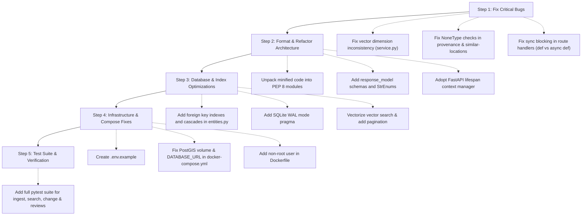

# Comprehensive Codebase Analysis, Vulnerability Report & Architecture Improvement Guide
**Target System:** `Unified-RSanalytics` (Satellite Intelligence Backend)  
**Analysis Date:** September 2026  
**Status:** Audit Complete  

---

## 1. Executive Summary & Health Assessment

The `Unified-RSanalytics` repository provides an offline-first FastAPI backend designed for geospatial raster ingestion, visual similarity retrieval, change detection evidence calculation, analyst review workflows, and processing provenance tracking. 

While the functional vision and domain modeling are sound, the current implementation contains **several critical runtime crash bugs**, **event-loop starvation bottlenecks**, **security loopholes**, **schema design deficiencies**, **broken Docker/Compose configurations**, and an **anti-pattern minified coding style** that violates PEP 8 and impedes maintainability.

### Codebase Health Scorecard
| Category | Score (1-10) | Key Status |
| :--- | :---: | :--- |
| **Correctness & Stability** | **4 / 10** | Critical vector dimension mismatch crash, NoneType dereferences, unhandled exceptions. |
| **Performance & Concurrency** | **3 / 10** | Event-loop blocking in async routes, $O(N)$ in-memory full-table vector scans, unindexed FKs. |
| **Security & Safety** | **5 / 10** | Path traversal boundary edge cases, Docker running as root, no auth/rate limiting. |
| **Code Structure & PEP 8** | **2 / 10** | Minified one-liner code style across `main.py`, `entities.py`, `schemas.py`, `service.py`. |
| **Architecture & Modularity** | **4 / 10** | Heavy business logic tightly coupled in route handlers; lacks service/repository layers. |
| **Test Suite & CI** | **2 / 10** | Only 2 trivial endpoint checks; 0% test coverage for ingest, search, change, review pipelines. |
| **DevOps & Infrastructure** | **4 / 10** | Missing `.env.example`, unattached Docker volume, broken Compose Postgres link. |

---

## 2. Critical Bugs & Runtime Crashes (High / Critical Severity)

### BUG-01: Vector Dimensionality Mismatch Runtime Crash in Similarity Search
* **Files:** [`app/services/embeddings/service.py:4-5`](file:///c:/Users/aryan/OneDrive/Desktop/UpaGraha/Unified-RSanalytics/app/services/embeddings/service.py#L4-L5), [`app/main.py:33-38`](file:///c:/Users/aryan/OneDrive/Desktop/UpaGraha/Unified-RSanalytics/app/main.py#L33-L38), [`scripts/build_index.py:12-14`](file:///c:/Users/aryan/OneDrive/Desktop/UpaGraha/Unified-RSanalytics/scripts/build_index.py#L12-L14)
* **Description:**  
  In `LocalEmbedder.image(x)`:
  ```python
  h = np.concatenate([
      np.histogram(x[min(i, x.shape[0]-1)].ravel(), 32, (0, 1))[0] 
      for i in range(min(3, x.shape[0]))
  ]).astype('float32')
  ```
  - If a **1-band raster** (e.g. single-band SAR, Panchromatic, or NDVI GeoTIFF) is ingested, `min(3, 1) = 1`, resulting in a vector of dimension **32**.
  - If a **3-band raster** (RGB/False Color) is ingested, `min(3, 3) = 3`, resulting in a vector of dimension **96**.
  
  When an image search (`/api/v1/search/image`) or similar locations search (`/api/v1/similar-locations`) is executed, `results()` executes:
  ```python
  np.dot(norm(v), norm(e.vector))
  ```
  Comparing a 32-dim vector against a 96-dim vector immediately throws:
  `ValueError: shapes (32,) and (96,) not aligned: 32 (dim 0) != 96 (dim 0)`
  This crashes the HTTP request with a 500 Internal Server Error.
  Furthermore, `scripts/build_index.py` will fail with `ValueError: setting an array element with a sequence` when attempting to build FAISS index matrix `np.asarray([row.vector for row in rows])`.
* **Remediation:**  
  Fix the output dimensionality to a constant size (e.g. always 96 dimensions). If the image has fewer than 3 bands, repeat the histogram of available bands or pad with zeros so every embedding vector in the database strictly has identical dimensionality.

---

### BUG-02: `AttributeError` (NoneType Dereference) in `/api/v1/similar-locations`
* **File:** [`app/main.py:87-89`](file:///c:/Users/aryan/OneDrive/Desktop/UpaGraha/Unified-RSanalytics/app/main.py#L87-L89)
* **Description:**  
  ```python
  o = db.query(Observation).filter_by(location_id=r.location_id).order_by(Observation.acquisition_date.desc()).first()
  if not o: raise HTTPException(404, 'Location has no observations')
  e = db.query(Embedding).filter_by(observation_id=o.id).first()
  return {'results': results(db, e.vector, r.top_k, exclude=o.id)}
  ```
  If an observation exists but has no embedding record (e.g., partial ingestion, legacy migration, or background embedding pipeline), `e` is `None`. Accessing `e.vector` raises an unhandled `AttributeError: 'NoneType' object has no attribute 'vector'`, causing a 500 error instead of a graceful 404/422 response.
* **Remediation:**  
  ```python
  if not e or not e.vector:
      raise HTTPException(404, f"Latest observation '{o.id}' has no embedding generated")
  ```

---

### BUG-03: `AttributeError` (NoneType Dereference) in `/api/v1/change/{change_id}/provenance`
* **File:** [`app/main.py:93-96`](file:///c:/Users/aryan/OneDrive/Desktop/UpaGraha/Unified-RSanalytics/app/main.py#L93-L96)
* **Description:**  
  ```python
  x = db.get(ChangeEvent, change_id)
  if not x: raise HTTPException(404, 'Change event not found')
  run = db.get(ProcessingRun, x.run_id)
  return {'change_id': x.id, 'run': run.provenance, ...}
  ```
  If `x.run_id` is invalid or the `ProcessingRun` was deleted/pruned, `run` is `None`. `run.provenance` raises `AttributeError: 'NoneType' object has no attribute 'provenance'`.
* **Remediation:**  
  ```python
  run_provenance = run.provenance if run else {}
  ```

---

### BUG-04: Async Event-Loop Starvation & Blocking Synchronous I/O
* **File:** [`app/main.py:17-96`](file:///c:/Users/aryan/OneDrive/Desktop/UpaGraha/Unified-RSanalytics/app/main.py#L17-L96)
* **Description:**  
  FastAPI route handlers are declared with `async def ingest(...)`, `async def analyze(...)`, `async def status(...)`, etc.
  However, inside these async functions, **heavy synchronous blocking calls** are executed:
  - `rasterio.open(p)` and `ds.read(...)` (Disk I/O & heavy GeoTIFF decompression)
  - `np.histogram(...)`, `np.linalg.norm(...)`, `np.mean(...)`, `np.abs(...)` (CPU-bound matrix calculations)
  - `db.query(...)`, `db.commit()`, `db.flush()` (Synchronous blocking database calls)
  
  **Impact:** In ASGI/FastAPI, an `async def` route runs directly on the main event loop thread. When blocking synchronous calls run on the main loop, **all other concurrent incoming HTTP requests (including `/health` liveness probes) are completely frozen** until the synchronous task finishes.
* **Remediation:**  
  Either declare route handlers as standard synchronous functions `def ingest(...)` (so FastAPI automatically offloads them to a threadpool worker) or use `starlette.concurrency.run_in_threadpool` / `anyio.to_thread.run_sync` for heavy CPU/IO steps.

---

### BUG-05: Missing Database Rollback & Session Leakage in Exception Handling
* **Files:** [`app/db/session.py:7-10`](file:///c:/Users/aryan/OneDrive/Desktop/UpaGraha/Unified-RSanalytics/app/db/session.py#L7-L10), [`app/main.py:18-32`](file:///c:/Users/aryan/OneDrive/Desktop/UpaGraha/Unified-RSanalytics/app/main.py#L18-L32)
* **Description:**  
  In `get_db()`:
  ```python
  def get_db():
      db = SessionLocal()
      try:
          yield db
      finally:
          db.close()
  ```
  When an exception occurs during `ingest` or `analyze` after `db.add()` or `db.flush()`, `db.rollback()` is never explicitly called. The uncommitted objects remain in the session transaction context until `db.close()`, which in SQLite or connection pools can leave stale locks or roll back at non-deterministic times.
  Additionally, in `ingest`:
  ```python
  run = ProcessingRun(operation='ingest', status='running', ...)
  db.add(run); db.flush()
  ```
  If raster parsing fails, the error is caught, an HTTP 400 is raised, but `run.status` is never updated to `failed`, leaving dangling `'running'` jobs permanently in the database.
* **Remediation:**  
  Wrap database operations in transaction managers or update `run.status = 'failed'` and commit/rollback gracefully in exception blocks.

---

### BUG-06: Unclosed Database Session in `scripts/build_index.py`
* **File:** [`scripts/build_index.py:8-18`](file:///c:/Users/aryan/OneDrive/Desktop/UpaGraha/Unified-RSanalytics/scripts/build_index.py#L8-L18)
* **Description:**  
  `db = SessionLocal()` is opened at the top-level script scope and never closed. While Python GC cleans it on process exit, in automated pipelines or imported functions this causes leaked connections.
* **Remediation:**  
  Use `with SessionLocal() as db:` context manager.

---

### BUG-07: Deprecated FastAPI Startup Lifecycle Event
* **File:** [`app/main.py:11-12`](file:///c:/Users/aryan/OneDrive/Desktop/UpaGraha/Unified-RSanalytics/app/main.py#L11-L12)
* **Description:**  
  `@app.on_event('startup')` has been deprecated in Starlette/FastAPI since version 0.93+.
* **Remediation:**  
  Use the modern standard `lifespan` async context manager.

---

## 3. Security Vulnerabilities & Loophole Analysis (Medium / High Severity)

### SEC-01: Path Traversal & Boundary Validation Flaws in GeoTIFF Ingestion
* **File:** [`app/main.py:20-21`](file:///c:/Users/aryan/OneDrive/Desktop/UpaGraha/Unified-RSanalytics/app/main.py#L20-L21)
* **Description:**  
  ```python
  root = settings.data_root.resolve()
  p = (root / r.path).resolve()
  if root not in p.parents or p.suffix.lower() not in {'.tif','.tiff'} or not p.is_file():
      raise ValueError('Valid GeoTIFF path under DATA_ROOT required')
  ```
  1. `root not in p.parents`: If `r.path` is empty or `"."`, `p == root`, and `root not in p.parents` evaluates to `True`, which passes that check before failing on `is_file()`.
  2. If symlinks exist inside `DATA_ROOT` pointing to system sensitive directories (e.g. `C:\Windows\...` or `/etc/...`), `.resolve()` resolves the target path outside `DATA_ROOT`, which can behave unpredictably across OS environments.
  3. Python 3.9+ provides `p.is_relative_to(root)` which is safer, more explicit, and handles platform root subtleties.
* **Remediation:**  
  ```python
  try:
      p.relative_to(root)
  except ValueError:
      raise ValueError("Path traversal attempt detected: file must reside strictly inside data_root")
  ```

---

### SEC-02: Missing Authentication, Authorization & Rate Limiting
* **Files:** Whole API (`app/main.py`)
* **Description:**  
  All endpoints (including sensitive raster ingestion, review decisions, and change detection triggering) are completely unauthenticated (`no API keys`, `no JWT`, `no RBAC`). Any client on the local network can overwrite data or submit malicious review decisions.
* **Remediation:**  
  Introduce FastAPI security dependencies (e.g. `HTTPBearer` or `APIKeyHeader`) and rate limiting middleware (`slowapi` or standard token bucket).

---

### SEC-03: Docker Container Running as Root
* **File:** [`Dockerfile:1-9`](file:///c:/Users/aryan/OneDrive/Desktop/UpaGraha/Unified-RSanalytics/Dockerfile#L1-L9)
* **Description:**  
  The Dockerfile runs as `root` by default:
  ```dockerfile
  FROM python:3.11-slim
  WORKDIR /app
  ...
  CMD ["uvicorn","app.main:app","--host","0.0.0.0","--port","8000"]
  ```
  Running production containers as root poses privilege escalation risks if a vulnerability in GDAL/Rasterio/C-extensions is exploited.
* **Remediation:**  
  Create a non-root system user (`useradd -u 1000 -m appuser`) and set `USER appuser`.

---

### SEC-04: Hardcoded Passwords in `docker-compose.yml`
* **File:** [`docker-compose.yml:10`](file:///c:/Users/aryan/OneDrive/Desktop/UpaGraha/Unified-RSanalytics/docker-compose.yml#L10)
* **Description:**  
  `POSTGRES_PASSWORD: change-me-offline` is hardcoded in plain text in the repo.
* **Remediation:**  
  Use environment variables from `.env` (e.g. `POSTGRES_PASSWORD: ${POSTGRES_PASSWORD}`).

---

## 4. Database Schema, Data Integrity & Concurrency Issues

### DB-01: Missing Database Indexes on Foreign Keys & Join Columns
* **File:** [`app/models/entities.py:19-42`](file:///c:/Users/aryan/OneDrive/Desktop/UpaGraha/Unified-RSanalytics/app/models/entities.py#L19-L42)
* **Description:**  
  Several critical foreign keys have no `index=True`:
  - `ChangeEvent.location_id` (Filtered in location timeline/queries)
  - `ChangeEvent.before_observation_id` & `after_observation_id`
  - `ChangeEvent.run_id`
  - `AnalystReview.change_event_id` (Filtered when querying review by change event)
  
  Without indexes, every join or lookup on `ChangeEvent` and `AnalystReview` performs a full table scan.
* **Remediation:**  
  Add `index=True` to all foreign key columns.

---

### DB-02: Missing Foreign Key Cascades (`ondelete`)
* **File:** [`app/models/entities.py`](file:///c:/Users/aryan/OneDrive/Desktop/UpaGraha/Unified-RSanalytics/app/models/entities.py)
* **Description:**  
  Foreign keys like `Observation.location_id -> locations.id` and `Embedding.observation_id -> observations.id` do not define `ondelete="CASCADE"` or `ondelete="SET NULL"`. If a location or observation is deleted, database integrity errors or orphaned records result.
* **Remediation:**  
  Specify explicit `ondelete="CASCADE"` or `ondelete="RESTRICT"`.

---

### DB-03: Missing Audit Timestamps (`created_at` / `updated_at`)
* **File:** [`app/models/entities.py`](file:///c:/Users/aryan/OneDrive/Desktop/UpaGraha/Unified-RSanalytics/app/models/entities.py)
* **Description:**  
  `Observation`, `ProcessingRun`, `ChangeEvent`, and `AnalystReview` have no `created_at` or `updated_at` timestamps!
  - You cannot determine when an analyst submitted a review.
  - You cannot measure processing run latency or job queue duration.
  - You cannot sort recent events by creation time.
* **Remediation:**  
  Add `created_at: Mapped[datetime] = mapped_column(DateTime(timezone=True), default=datetime.utcnow)` to all entities.

---

### DB-04: Inefficient Vector Storage in SQLite/PostgreSQL
* **File:** [`app/models/entities.py:36`](file:///c:/Users/aryan/OneDrive/Desktop/UpaGraha/Unified-RSanalytics/app/models/entities.py#L36)
* **Description:**  
  `vector: Mapped[list] = mapped_column(JSON)` stores dense float arrays as serialized JSON text (e.g. `"[0.1234, 0.5678, ...]"`) taking ~5x more storage and requiring JSON deserialization overhead for every query.
* **Remediation:**  
  For Postgres, use `pgvector` (`Vector` type) with HNSW/IVFFlat index; for SQLite, store as binary blobs (`np.ndarray.tobytes()`) or rely on external FAISS index.

---

### DB-05: Missing SQLite WAL Mode & Connection Pool Configuration
* **File:** [`app/db/session.py:5-6`](file:///c:/Users/aryan/OneDrive/Desktop/UpaGraha/Unified-RSanalytics/app/db/session.py#L5-L6)
* **Description:**  
  SQLite defaults to rollback journal mode where concurrent reads and writes lock each other (`sqlite3.OperationalError: database is locked`).
* **Remediation:**  
  Enable WAL (Write-Ahead Logging) on SQLite connection:
  ```python
  from sqlalchemy import event
  @event.listens_for(engine, "connect")
  def set_sqlite_pragma(dbapi_connection, connection_record):
      if settings.database_url.startswith("sqlite"):
          cursor = dbapi_connection.cursor()
          cursor.execute("PRAGMA journal_mode=WAL")
          cursor.execute("PRAGMA synchronous=NORMAL")
          cursor.close()
  ```

---

## 5. API Design, Performance & Scalability Bottlenecks

### PERF-01: In-Memory Full Table Scan in Vector Search (`results()`)
* **File:** [`app/main.py:33-38`](file:///c:/Users/aryan/OneDrive/Desktop/UpaGraha/Unified-RSanalytics/app/main.py#L33-L38)
* **Description:**  
  ```python
  def results(db, v, k, sensor=None, exclude=None):
      z = []
      for e, o in db.query(Embedding, Observation).join(Observation).all():
          if (sensor and sensor != o.sensor) or o.id == exclude: continue
          z.append((float(np.dot(norm(v), norm(e.vector))), o))
      return [...]
  ```
  1. Loads **every embedding and observation in the entire database** into Python RAM (`.all()`).
  2. Computes `norm(v)` **inside every iteration of the loop** ($N$ redundant norm computations!).
  3. Performs similarity calculation in pure Python loop rather than batched vectorized NumPy operations or FAISS/pgvector index.
  4. Filters (`sensor`, `exclude`) are applied in Python after loading all rows, rather than in SQL `WHERE` clause (`db.query(...).filter(...)`).
* **Remediation:**  
  - Apply `filter()` in SQL query.
  - Precompute `norm_v = norm(v)` once before loop.
  - Vectorize matrix multiplication: `scores = np.dot(vectors_matrix, norm_v)`.
  - Or query the persisted FAISS index built by `build_index.py`.

---

### PERF-02: Unbounded Queries & Lack of Pagination
* **File:** [`app/main.py:45-47, 84`](file:///c:/Users/aryan/OneDrive/Desktop/UpaGraha/Unified-RSanalytics/app/main.py#L45-L47)
* **Description:**  
  `/api/v1/observations` and `/api/v1/reviews` return unbounded lists:
  `return [{'id': x.id, ...} for x in db.query(Observation)]`
  With 50,000+ observations, this triggers massive JSON responses, high memory pressure, and network timeouts.
* **Remediation:**  
  Add `limit: int = 50, offset: int = 0` query parameters with `db.query(...).offset(offset).limit(limit).all()`.

---

### API-01: Missing `response_model` on All FastAPI Endpoints
* **File:** [`app/main.py`](file:///c:/Users/aryan/OneDrive/Desktop/UpaGraha/Unified-RSanalytics/app/main.py)
* **Description:**  
  None of the endpoints declare `response_model=...`.
  - FastAPI OpenAPI/Swagger documentation (`/docs`) displays generic untyped responses.
  - No response validation or field filtering occurs (leaking internal fields if models change).
* **Remediation:**  
  Define Pydantic response schemas in `app/schemas/api.py` (e.g. `ObservationResponse`, `IngestResponse`, `ChangeAnalysisResponse`) and attach them to endpoints.

---

### API-02: Generic Catch-All Exception Handling Masking Server Errors
* **File:** [`app/main.py:73`](file:///c:/Users/aryan/OneDrive/Desktop/UpaGraha/Unified-RSanalytics/app/main.py#L73)
* **Description:**  
  In `/api/v1/change/analyze`:
  ```python
  except Exception as e:
      raise HTTPException(400, str(e))
  ```
  This catches `MemoryError`, `IOError`, `SystemError`, and programming bugs, masking them as client errors (`HTTP 400 Bad Request`) without logging stack traces.
* **Remediation:**  
  Catch specific exceptions (`rasterio.errors.RasterioError`, `ValueError`) and log unexpected exceptions with `logger.exception()`.

---

## 6. DevOps, Infrastructure & Configuration Gaps

### OPS-01: Missing `.env.example` File
* **Files:** [`README.md:8`](file:///c:/Users/aryan/OneDrive/Desktop/UpaGraha/Unified-RSanalytics/README.md#L8), [`manual.txt:7`](file:///c:/Users/aryan/OneDrive/Desktop/UpaGraha/Unified-RSanalytics/manual.txt#L7)
* **Description:**  
  Both `README.md` and `manual.txt` instruct developers to run `Copy-Item .env.example .env`, but `.env.example` **does not exist** in the repository! New contributors or deployments will fail or get confused.
* **Remediation:**  
  Create `.env.example` with standard defaults:
  ```env
  OFFLINE_MODE=true
  DATABASE_URL=sqlite:///./data/satintel.db
  DATA_ROOT=./data
  MODEL_ROOT=./models
  INDEX_ROOT=./indexes
  LOG_LEVEL=INFO
  MAX_INGEST_RASTER_PIXELS=100000000
  ```

---

### OPS-02: Broken PostGIS Volume Attachment in `docker-compose.yml`
* **File:** [`docker-compose.yml:8-11`](file:///c:/Users/aryan/OneDrive/Desktop/UpaGraha/Unified-RSanalytics/docker-compose.yml#L8-L11)
* **Description:**  
  In `docker-compose.yml`:
  ```yaml
  db:
    image: postgis/postgis:16-3.4
    environment: {POSTGRES_DB: satintel, POSTGRES_USER: satintel, POSTGRES_PASSWORD: change-me-offline}
  volumes: {postgis_data: {}}
  ```
  The volume `postgis_data` is defined at the bottom, but **never attached to the `db` service container** (`volumes: - postgis_data:/var/lib/postgresql/data` is missing)! All PostgreSQL data will be wiped on container teardown.
* **Remediation:**  
  Add `volumes: - postgis_data:/var/lib/postgresql/data` under the `db` service.

---

### OPS-03: `api` Container Does Not Connect to Postgres in Compose
* **File:** [`docker-compose.yml:1-7`](file:///c:/Users/aryan/OneDrive/Desktop/UpaGraha/Unified-RSanalytics/docker-compose.yml#L1-L7)
* **Description:**  
  `docker-compose.yml` starts a PostGIS container `db`, but does not pass `DATABASE_URL=postgresql+psycopg://satintel:change-me-offline@db:5432/satintel` to the `api` container. Unless manually configured in a `.env` file, the container will run on SQLite inside the ephemeral container file system.
* **Remediation:**  
  Set `environment: DATABASE_URL: postgresql+psycopg://satintel:${POSTGRES_PASSWORD:-change-me-offline}@db:5432/satintel` under `api`.

---

### OPS-04: Hardcoded Relative Paths in `config.py` Sensitive to CWD
* **File:** [`app/core/config.py:7-10`](file:///c:/Users/aryan/OneDrive/Desktop/UpaGraha/Unified-RSanalytics/app/core/config.py#L7-L10)
* **Description:**  
  `database_url = "sqlite:///./data/satintel.db"` uses `./data`, which resolves relative to whatever directory the command is invoked from. Running tests from `tests/` or scripts from `scripts/` will create multiple separate database files in different folders.
* **Remediation:**  
  Resolve base directories relative to project root (`Path(__file__).resolve().parents[2]`).

---

### OPS-05: Brittle `sys.path.insert(0, ...)` Hacks in Scripts
* **Files:** [`scripts/create_sample_data.py:3-4`](file:///c:/Users/aryan/OneDrive/Desktop/UpaGraha/Unified-RSanalytics/scripts/create_sample_data.py#L3-L4), [`scripts/init_db.py:1-3`](file:///c:/Users/aryan/OneDrive/Desktop/UpaGraha/Unified-RSanalytics/scripts/init_db.py#L1-L3)
* **Description:**  
  Modifying `sys.path` manually is fragile, confuses IDE static analyzers, and breaks when packaging.
* **Remediation:**  
  Use `pyproject.toml` / package installation (`pip install -e .`) or run scripts with `python -m scripts.create_sample_data`.

---

## 7. Code Structure, Readability & PEP 8 Deficiencies

### CODE-01: Obfuscated / Minified One-Liner Coding Style
* **Files:** [`app/main.py`](file:///c:/Users/aryan/OneDrive/Desktop/UpaGraha/Unified-RSanalytics/app/main.py), [`app/models/entities.py`](file:///c:/Users/aryan/OneDrive/Desktop/UpaGraha/Unified-RSanalytics/app/models/entities.py), [`app/schemas/api.py`](file:///c:/Users/aryan/OneDrive/Desktop/UpaGraha/Unified-RSanalytics/app/schemas/api.py), [`app/services/embeddings/service.py`](file:///c:/Users/aryan/OneDrive/Desktop/UpaGraha/Unified-RSanalytics/app/services/embeddings/service.py)
* **Description:**  
  Throughout the codebase, multiple distinct statements are compressed onto single lines separated by semicolons:
  ```python
  # Example from main.py:
  x,y=read(a),read(b);x=(x-x.mean())/(x.std()+1e-6);y=(y-y.mean())/(y.std()+1e-6);score=float(np.mean(np.abs(x-y)));q=min(a.quality_score,b.quality_score)
  run=ProcessingRun(operation='change_analysis',status='completed',provenance={'algorithm':'normalized-absolute-difference-v1','warning':'baseline score only; class requires trained change model'});db.add(run);db.flush();e=ChangeEvent(location_id=a.location_id,before_observation_id=a.id,after_observation_id=b.id,change_class='NO_CHANGE' if score<.25 else 'OTHER',confidence=min(.95,score/(score+1)*q),evidence={'spectral_difference':score,'quality_factor':q,'false_alarm_risk':1-q,'mask_available':False},run_id=run.id);db.add(e);db.commit();return {'change_id':e.id,'class':e.change_class,'confidence':e.confidence,'evidence':e.evidence}
  ```
  **Issues:**
  - Violates PEP 8 guidelines.
  - Breakpoint debugging is impossible (cannot step through intermediate calculations).
  - Code review diffs become unreadable.
  - Linter and formatter tooling (Ruff, Black, Flake8) fail or produce massive diffs.
* **Remediation:**  
  Format and decompose into readable multi-line PEP 8 compliant functions with clear variable names and type annotations.

---

### CODE-02: Violation of Separation of Concerns (Fat Route Handlers)
* **File:** [`app/main.py`](file:///c:/Users/aryan/OneDrive/Desktop/UpaGraha/Unified-RSanalytics/app/main.py)
* **Description:**  
  All business logic, raster file handling, mathematical normalization, vector similarity matching, change calculation algorithms, and database commits are stuffed directly into FastAPI endpoint functions.
* **Remediation:**  
  Adopt a standard layered architecture:
  ```
  app/
  ├── api/
  │   └── v1/
  │       ├── router.py
  │       └── endpoints/ (ingest, search, change, reviews, locations)
  ├── core/ (config, logging, security)
  ├── db/ (session, base)
  ├── models/ (SQLAlchemy models)
  ├── schemas/ (Pydantic schemas)
  └── services/ (raster_service, embedding_service, change_service, search_service)
  ```

---

### CODE-03: Unused Logger & Lack of Observability
* **Files:** [`app/core/logging.py`](file:///c:/Users/aryan/OneDrive/Desktop/UpaGraha/Unified-RSanalytics/app/core/logging.py), [`app/main.py`](file:///c:/Users/aryan/OneDrive/Desktop/UpaGraha/Unified-RSanalytics/app/main.py)
* **Description:**  
  `logger = logging.getLogger("satintel")` is created in `logging.py`, but never imported or used across `app/main.py`, `service.py`, or scripts. No request logging, error diagnostics, or metric collection exist.
* **Remediation:**  
  Add structured logging with contextual metadata (job IDs, observation IDs, execution times).

---

## 8. Python Standard Library & Modern Idiom Opportunities

| Area | Current Implementation | Standard Library / Modern Alternative | Benefits |
| :--- | :--- | :--- | :--- |
| **Enum Types** | String regex pattern `Field(pattern="^(confirmed\|rejected\|needs_review)$")` | `enum.StrEnum` (`from enum import StrEnum`) *(Python 3.11+)* | Strong typing, IDE auto-completion, DRY schema validation. |
| **Path Traversal Check** | `root not in p.parents` | `p.is_relative_to(root)` *(Python 3.9+)* | Explicit path semantics, immune to root edge cases. |
| **FastAPI Lifespan** | `@app.on_event("startup")` (Deprecated) | `@asynccontextmanager async def lifespan(app: FastAPI)` (`contextlib`) | Clean resource initialization and graceful teardown. |
| **UUID Generation** | `def uid(): return str(uuid.uuid4())` with String(36) | `sqlalchemy.types.Uuid` (native UUID support in SQLA 2.0) | More compact database indexing, native UUID types in PostgreSQL. |
| **Singleton / Cache** | `def embedder(): return LocalEmbedder()` (re-instantiated) | `@functools.lru_cache` or FastAPI `Depends` | Eliminates repeated object creation overhead. |
| **Typing Annotations** | `Union[str, None]` or `str | None` without constraints | `typing.Annotated` with Pydantic `Field` / `Path` constraints | Self-documenting, cleaner schema definitions. |
| **Vector Math** | Manual `v / (np.linalg.norm(v) + 1e-12)` in loop | Pre-normalized NumPy matrix operations `X @ query_vec` | 100x faster similarity search over hundreds of vectors. |
| **Structured Config** | Static basic `BaseSettings` | `pydantic.field_validator` with directory auto-resolution | Fails early on invalid configurations or unreadable paths. |

---

## 9. Comprehensive Comparison: Before vs. After Code Fixes

### Example 1: Robust & Dimension-Safe Histogram Embedder (`app/services/embeddings/service.py`)
#### Before (Buggy & Minified):
```python
import numpy as np
class LocalEmbedder:
    """Deterministic visual baseline; not semantic RemoteCLIP."""
    def image(self,x):
        h=np.concatenate([np.histogram(x[min(i,x.shape[0]-1)].ravel(),32,(0,1))[0] for i in range(min(3,x.shape[0]))]).astype('float32');return h/(np.linalg.norm(h)+1e-12)
    def text(self,t): raise RuntimeError("Text search requires staged RemoteCLIP weights and a licensed local adapter; no model download is attempted.")
def embedder(): return LocalEmbedder()
def norm(v):
    v=np.asarray(v,dtype='float32');return v/(np.linalg.norm(v)+1e-12)
```

#### After (Robust, Dimension-Consistent & PEP 8):
```python
import functools
import numpy as np

class LocalEmbedder:
    """Deterministic visual baseline embedding (always 96 dimensions)."""
    
    HIST_BINS: int = 32
    TARGET_BANDS: int = 3
    TOTAL_DIM: int = HIST_BINS * TARGET_BANDS  # 96
    
    def image(self, x: np.ndarray) -> np.ndarray:
        if x.ndim == 2:
            x = x[np.newaxis, ...]  # (1, H, W)
            
        num_bands = x.shape[0]
        histograms = []
        
        for i in range(self.TARGET_BANDS):
            band_idx = min(i, num_bands - 1)
            band_data = x[band_idx].ravel()
            hist, _ = np.histogram(band_data, bins=self.HIST_BINS, range=(0.0, 1.0))
            histograms.append(hist)
            
        vector = np.concatenate(histograms).astype(np.float32)
        norm_val = np.linalg.norm(vector)
        return vector / (norm_val + 1e-12)

    def text(self, query: str) -> np.ndarray:
        raise RuntimeError(
            "Text search requires staged RemoteCLIP weights and a licensed local adapter; "
            "runtime downloads are disabled in offline mode."
        )

@functools.lru_cache(maxsize=1)
def get_embedder() -> LocalEmbedder:
    return LocalEmbedder()

def normalize_vector(v: np.ndarray | list[float]) -> np.ndarray:
    arr = np.asarray(v, dtype=np.float32)
    norm_val = np.linalg.norm(arr)
    return arr / (norm_val + 1e-12)
```

---

### Example 2: Clean API Schemas with Standard Library Enums (`app/schemas/api.py`)
#### Before:
```python
from datetime import date
from pydantic import BaseModel,Field
class IngestRequest(BaseModel): path:str;sensor:str;acquisition_date:date;location_name:str="Unnamed site";source:str="local"
class SearchRequest(BaseModel): query:str;top_k:int=Field(10,ge=1,le=100);sensor:str|None=None
class ImageSearchRequest(BaseModel): observation_id:str;top_k:int=Field(10,ge=1,le=100)
class ChangeRequest(BaseModel): before_observation_id:str;after_observation_id:str
class ReviewRequest(BaseModel): analyst:str;decision:str=Field(pattern="^(confirmed|rejected|needs_review)$");note:str|None=None
class SimilarRequest(BaseModel): location_id:str;top_k:int=Field(10,ge=1,le=100)
```

#### After:
```python
from datetime import date
from enum import StrEnum
from pydantic import BaseModel, Field, ConfigDict

class ReviewDecision(StrEnum):
    CONFIRMED = "confirmed"
    REJECTED = "rejected"
    NEEDS_REVIEW = "needs_review"

class IngestRequest(BaseModel):
    model_config = ConfigDict(extra="forbid")
    path: str = Field(..., min_length=1, description="Relative GeoTIFF path under DATA_ROOT")
    sensor: str = Field(..., min_length=1, max_length=64, description="Sensor name, e.g., Sentinel-2")
    acquisition_date: date = Field(..., description="Acquisition date (YYYY-MM-DD)")
    location_name: str = Field(default="Unnamed site", max_length=255)
    source: str = Field(default="local", max_length=128)

class SearchRequest(BaseModel):
    query: str = Field(..., min_length=1, max_length=256)
    top_k: int = Field(default=10, ge=1, le=100)
    sensor: str | None = Field(default=None, max_length=64)

class ImageSearchRequest(BaseModel):
    observation_id: str = Field(..., min_length=1)
    top_k: int = Field(default=10, ge=1, le=100)

class ChangeRequest(BaseModel):
    before_observation_id: str = Field(..., min_length=1)
    after_observation_id: str = Field(..., min_length=1)

class ReviewRequest(BaseModel):
    analyst: str = Field(..., min_length=1, max_length=128)
    decision: ReviewDecision
    note: str | None = Field(default=None, max_length=2000)

class SimilarRequest(BaseModel):
    location_id: str = Field(..., min_length=1)
    top_k: int = Field(default=10, ge=1, le=100)

# Response Models
class ObservationResponse(BaseModel):
    id: str
    location_id: str
    date: date
    sensor: str
    quality: float

class SearchResultItem(BaseModel):
    observation_id: str
    location_id: str
    score: float
    sensor: str
    acquisition_date: date

class SearchResponse(BaseModel):
    results: list[SearchResultItem]
```

---

## 10. Prioritized Action Plan & Roadmap



---
*Report generated for offline satellite intelligence backend (`Unified-RSanalytics`).*
