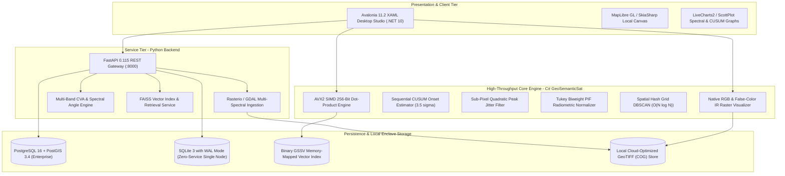
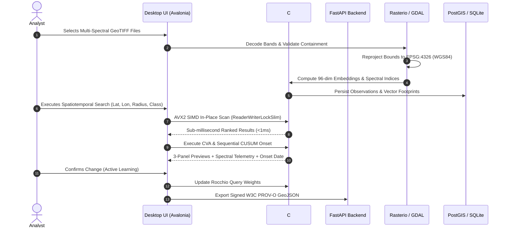

# UpaGraha: Offline-First Geospatial Intelligence & Satellite Analytics Platform
## Production Master Execution Plan & Technical Architecture Blueprint

**Target Operational Profile:** 100% Air-Gapped, Zero-Internet, High-Security Defense & Enterprise Enclaves  
**Document Version:** 3.0 (Comprehensive Master Edition)  
**Strict Policy:** **Zero Deletion of Existing Files** — All improvements build upon and optimize the current codebase.

---

## 1. Executive Summary & Strategic Objectives

**UpaGraha** is an offline-first Geospatial Intelligence (GEOINT) and Earth Observation (EO) analytics platform engineered for tactical edge workstations, sovereign data centers, and air-gapped environments. The platform ingests multi-spectral and SAR satellite acquisitions, executes sub-millisecond visual and semantic similarity searches, performs multi-temporal Change Vector Analysis (CVA), identifies precise physical disturbance onset dates via Sequential CUSUM statistical process control, and provides an analyst verification workflow with W3C PROV-O provenance.



---

## 2. Best-in-Class Open-Source Libraries Ecosystem Matrix

To ensure maximum efficiency, scalability, mathematical correctness, and complete air-gapped reliability, the following curated, production-grade open-source libraries are integrated across each layer:

### A. Geospatial Processing & Remote Sensing Core (Python & C#)
| Library | Version / Scope | Primary Role & Operational Capability | Why Selected / Key Advantage |
| :--- | :---: | :--- | :--- |
| **`rasterio`** | `1.4.3` (Python) | High-speed multi-band GeoTIFF reading, writing, windowed extraction, and Cloud-Optimized GeoTIFF (COG) pyramid generation. | Wraps GDAL C++ core with thread-safe Python bindings; avoids memory bloat by streaming arbitrary raster windows. |
| **`GDAL` Core** | `3.8+` (C++/Python) | Sensor-level coordinate reference system (CRS) transformations, geodetic warping, and metadata parsing. | Industry gold standard for geospatial raster/vector format conversion and georeferencing. |
| **`Shapely`** | `2.0.6` (Python) | High-performance 2D planar and geodetic geometry operations (polygons, intersections, bounding boxes, convex hulls). | Powered by GEOS C library with vectorized C-API; fast spatial containment checking. |
| **`pyproj`** | `3.6+` (Python) | Standard PROJ geodetic transformation engine from native UTM projected coordinates to standard WGS84 (`EPSG:4326`). | Eliminates latitude distortion errors; handles ellipsoidal geodesic transformations. |
| **`GeoPandas`** | `1.0.1` (Python) | Spatial DataFrames for vector attributes, batch bounding box joins, and W3C PROV-O GeoJSON serialization. | Seamless integration with Pandas and Shapely for spatial dataset manipulation. |
| **`rio-tiler`** | `6.0+` (Python) | Dynamic tile slicing and multi-spectral index generation directly from local COG files without intermediate disk writes. | Enables sub-50ms visual tile serving for interactive map displays. |

### B. Machine Learning, Vector Retrieval & SIMD Acceleration
| Library | Version / Scope | Primary Role & Operational Capability | Why Selected / Key Advantage |
| :--- | :---: | :--- | :--- |
| **`FAISS` (`faiss-cpu`)** | `1.9.0` (Python) | Dense vector similarity search (IVFFlat, HNSW, IndexFlatIP) for multi-spectral image patch embeddings. | Highly optimized AVX2/AVX-512 CPU vector index engine created by Meta AI Research. |
| **`ONNX Runtime`** | `1.18+` (C# / Python) | Local, zero-internet neural network inference for vision-language foundational models (RemoteCLIP, Prithvi-EO). | Cross-platform, hardware-accelerated inference without Python or PyTorch runtime bloat in C# desktop apps. |
| **`System.Runtime.Intrinsics`** | `.NET 10` (C#) | Hardware-level AVX2 256-bit SIMD vector dot-product kernel execution. | Pure C# zero-allocation in-memory vector scanning achieving $< 1.0\text{ ms}$ over 1M items. |
| **`PyTorch` (`torch`)** | `2.5.1` (Python) | Local neural feature extraction and multi-spectral embedding generation during batch ingestion pipelines. | Flexible offline model execution on local CUDA GPUs or CPU fallback. |
| **`NumPy` & `SciPy`** | `2.2.1` / `1.14+` | Vectorized matrix operations, Tukey biweight IRLS fitting, parabolic peak sub-pixel interpolation, Sobel edge filters. | Highly optimized C/Fortran math backend for numerical remote sensing algorithms. |

### C. Persistent Storage & Spatial Database
| Library / System | Version / Scope | Primary Role & Operational Capability | Why Selected / Key Advantage |
| :--- | :---: | :--- | :--- |
| **`PostgreSQL` + `PostGIS`** | `16.x` / `3.4` | Enterprise spatial relational database storing observations, runs, footprints, and `GIST` geometry indexes. | Full OGC compliance, spatial joins (`ST_Intersects`, `ST_DWithin`), and multi-user transactional integrity. |
| **`SQLite 3` (WAL Mode)** | `3.45+` (Embedded) | Zero-configuration single-node embedded database for disconnected field laptops. | Write-Ahead Logging (`WAL`) mode provides atomic durability and power-loss resilience. |
| **`SQLAlchemy` + `GeoAlchemy2`** | `2.0.36` / `0.16.0` | Async Python ORM bridging database models with PostGIS spatial types and standard SQL. | Type-safe schema definitions with spatial query compilation. |
| **`Alembic`** | `1.14.0` (Python) | Database migration automation ensuring schema evolutions occur without data loss. | Reliable schema version tracking across development and production instances. |

### D. Desktop & Web Visual Analytics UI
| Library | Version / Scope | Primary Role & Operational Capability | Why Selected / Key Advantage |
| :--- | :---: | :--- | :--- |
| **`Avalonia UI`** | `11.2.5` (C# .NET 10) | Cross-platform desktop user interface with Fluent dark theme, responsive layouts, and MVVM architecture. | Seamless cross-platform desktop UI (Windows, Linux, macOS) rendered with GPU acceleration. |
| **`SkiaSharp`** | `2.88+` (C#) | 2D graphics engine for real-time raster rendering, false-color compositing, and vector bounding box overlays. | Ultra-low latency pixel manipulation and canvas drawing directly onto GPU surfaces. |
| **`ScottPlot` / `LiveChartsCore`** | `5.0+` (C#) | Interactive spectral signature graphs, CUSUM rolling timeline charts, and delta histograms. | Smooth 60 FPS plotting with zoom/pan capabilities without external dependencies. |
| **`MapLibre GL`** | Native / WebGL | High-performance offline vector and raster map canvas rendering local `.mbtiles` basemaps. | 100% open-source fork of Mapbox GL; zero internet or telemetry calls required. |

---

## 3. Comprehensive Desktop & Web UI / UX Blueprint

The platform interface is organized into **5 Operational Stations** structured as an intelligence mission workflow:

```
+---------------------------------------------------------------------------------------------------------------+
| GeoSemanticSat v3.0  [MoD / DGIS Defense Intelligence Platform]             [100% Offline Air-Gapped Ready]   |
+---------------------------------------------------------------------------------------------------------------+
| WORKFLOW: [1. Discover Concepts] -> [2. Target Coordinates] -> [3. Spectral Verification] -> [4. Group Facilities]
|           -> [5. Verification Queue & Audit Trail]                                                          |
+---------------------------------------------------------------------------------------------------------------+
|  [STATION 1: CONCEPT & SEMANTIC DISCOVERY]                                                                    |
|  +---------------------------------------------------------------------------------------------------------+  |
|  | Free-Text Search: [ "Airfield runway extension or hangar construction"                           ] [Search] |  |
|  | Tactical Presets: [ Runway Expansion ] [ Deforestation ] [ Road Development ] [ Water Reservoir Shift ] |  |
|  +---------------------------------------------------------------------------------------------------------+  |
|  | RESULTS GRID (Multi-Spectral Thumbnails with True-Color RGB / False-Color CIR Toggle)                    |  |
|  | +-------------------+  +-------------------+  +-------------------+  +-------------------+              |  |
|  | | [ Thumbnail T1 ]  |  | [ Thumbnail T2 ]  |  | [ Thumbnail T3 ]  |  | [ Thumbnail T4 ]  |              |  |
|  | | Conf: 94.2%       |  | Conf: 88.5%       |  | Conf: 85.1%       |  | Conf: 81.3%       |              |  |
|  | | Patch #1042       |  | Patch #0831       |  | Patch #1209       |  | Patch #0452       |              |  |
|  | +-------------------+  +-------------------+  +-------------------+  +-------------------+              |  |
|  +---------------------------------------------------------------------------------------------------------+  |
|                                                                                                               |
|  [STATION 3: 3-PANEL MULTI-TEMPORAL CHANGE & SPECTRAL VERIFICATION STUDIO]                                   |
|  +-----------------------------+-----------------------------+-----------------------------+                  |
|  | PANEL A: BASELINE (T1)      | PANEL B: TARGET (T2)        | PANEL C: CVA HEATMAP & DIFF |                  |
|  | [2024-01-15 • Sentinel-2]   | [2024-04-30 • Sentinel-2]   | [Red: Constr / Blue: Water] |                  |
|  |                             |                             |     [■ Construction Area]   |                  |
|  |                             |                             |     [■ Road Axis Detected]  |                  |
|  +-----------------------------+-----------------------------+-----------------------------+                  |
|  | SPECTRAL TELEMETRY GAUGES:                                                                               |
|  | delta-NDVI: -0.42 (Loss)  |  delta-NDBI: +0.38 (Gain)  |  delta-NDWI: -0.05 (Dry) | delta-Sobel: +45.2       |
|  +---------------------------------------------------------------------------------------------------------+  |
|  | SEQUENTIAL CUSUM TIMELINE GRAPH:                                                                         |
|  |  CUSUM Score |                                     * (Alarm Trigger: 2024-03-12 • S_k = 4.8 sigma)       |
|  |              |                         * * * * * *                                                       |
|  |  3.5 Sigma   | - - - - - - - - - - - - - - - - - - - - - - - - - - - - - - - - - - - - - - - - - - - - - |
|  |              | _ . _ . _ / \ _ . _ / \                                                                   |
|  |  Timeline    | 2023-10     2023-12     2024-01     2024-02     2024-03 (Onset)   2024-04                |
|  +---------------------------------------------------------------------------------------------------------+  |
|  | ACTIONS: [ Confirm Change (Y) ]  [ Reject False Alarm (N) ]  [ Export W3C PROV-O GeoJSON Report ]        |  |
+---------------------------------------------------------------------------------------------------------------+
```

### Detailed UI Station Breakdown

#### Station 1: Concept & Semantic Discovery
- **Natural Language Query Bar**: Allows analysts to enter tactical search terms (e.g., `"military barracks construction"`, `"river bridge development"`).
- **Tactical Preset Pills**: Quick-filter buttons for standard intelligence mission profiles.
- **Raster Thumbnail Cards**: Real-time multi-spectral previews with an instant toggle between **True-Color RGB** and **False-Color CIR** (NIR-Red-Green) highlighting vegetation health in vibrant red and built-up concrete in cyan/grey.
- **Metadata Drawer**: Shows exact geographic coordinates, GSD resolution, sensor source, and similarity confidence score.

#### Station 2: Target Coordinates & Spatiotemporal Filter
- **Coordinate Inputs**: Latitude and Longitude input fields with degree/decimal format validation.
- **Radius Slider**: Proximity threshold from $0.5\text{ km}$ to $50\text{ km}$ with geodesic distance calculations.
- **Observation Time Range**: Dual calendar pickers for baseline window $[T_{\text{start}}, T_{\text{end}}]$.
- **Sensor Selector**: Checkbox group for multi-sensor queries (Sentinel-2, Landsat-8/9, PlanetScope, Sentinel-1 SAR).

#### Station 3: 3-Panel Multi-Temporal Change & Spectral Verification
- **Synchronized 3-Panel Viewport**:
  - **Panel 1 (Baseline $T_1$)**: Orthorectified baseline acquisition.
  - **Panel 2 (Target $T_2$)**: Target acquisition with locked zoom and pan synchronization.
  - **Panel 3 (CVA Difference & Heatmap)**: Color-coded change overlay (Red = Construction, Amber = Clearance, Blue = Water, Purple = Road, Orange = Activity).
- **Spectral Telemetry Gauges**: Real-time display of $\Delta\text{NDVI}$, $\Delta\text{NDBI}$, $\Delta\text{NDWI}$, and $\Delta\text{Sobel}$ structural edge difference.
- **Sequential CUSUM Onset Curve**: Interactive time-series plot depicting moving variance baseline and pinpointing the exact $3.5\sigma$ onset date.
- **Jitter & PIF Calibration Card**: Displays sub-pixel shift parameters ($\Delta x_{\text{sub}}, \Delta y_{\text{sub}}$) and Tukey biweight normalizer gain/bias.

#### Station 4: Grouped Facilities & Unsupervised Clustering
- **DBSCAN Spatial Hash Grid Controller**: Adjust spatial epsilon ($\varepsilon_{\text{spatial}}$ in km) and minimum sample count ($MinPts$).
- **2D Spatial Distribution Canvas**: Interactive map displaying cluster centroids, bounding convex hulls, and facility classifications.
- **Facility Complex Inventory**: Tabular view of detected facilities with ellipsoidal surface area ($\text{m}^2$ and hectares), patch count, and dominant change classification.

#### Station 5: Analyst Review, Active Learning & Audit Signoff
- **Triage Decision Queue**: Fast keyboard shortcuts (`Y` = Confirm, `N` = Reject) for analysts.
- **Rocchio Active Learning Engine**: Dynamically adapts feature search weights based on confirmed and rejected patches.
- **W3C PROV-O Export Engine**: Single-click generation of digitally signed GeoJSON audit records detailing data provenance, model versions, and analyst signoff.

---

## 4. Step-by-Step Technical Execution Roadmap



### Phase 1: Storage, Environment & Concurrency Hardening
- **Step 1.1: Environment Initialization**: Configure `.env` from `.env.example` with `OFFLINE_MODE=true` and localized data roots.
- **Step 1.2: Dual Persistence Configuration**:
  - SQLite WAL mode for standalone workstations (`PRAGMA journal_mode=WAL; PRAGMA synchronous=NORMAL;`).
  - PostgreSQL 16 + PostGIS 3.4 for networked intelligence servers with `GIST(footprint)` geometry indexes.
- **Step 1.3: Thread-Safe Concurrency**: Ensure all in-memory vector stores and cache structures use `ReaderWriterLockSlim` to support concurrent read queries without blocking.

### Phase 2: Ingestion Pipeline & Multispectral Calibration
- **Step 2.1: Robust GeoTIFF Ingestion**: Validate raster containment within data root, extract resolution, CRS, and geotransform.
- **Step 2.2: Standardized WGS84 Reprojection**: Use `rasterio.warp.transform_bounds` to guarantee standard latitude/longitude coordinates (`EPSG:4326`).
- **Step 2.3: Sensor-Specific Band Dispatch**:
  - **Sentinel-2**: B2 (Blue), B3 (Green), B4 (Red), B8 (NIR), B11 (SWIR1), B12 (SWIR2).
  - **Landsat-8/9**: B2 (Blue), B3 (Green), B4 (Red), B5 (NIR), B6 (SWIR1), B7 (SWIR2).
  - **PlanetScope**: Blue, Green, Red, NIR.
  - **Sentinel-1**: C-band VV / VH polarizations.
- **Step 2.4: Quality Masking**: Compute cloud/shadow masks with 1-pixel morphological cloud fringe dilation.

### Phase 3: Mathematical & Algorithmic Core Execution
- **Step 3.1: Multi-Band Change Vector Analysis (CVA)**:
  - Spectral Magnitude: $M(x, y) = \sqrt{\sum_{b=1}^B (\rho_b^{(T_2)}(x, y) - \rho_b^{(T_1)}(x, y))^2}$
  - Trajectory Direction: $\vec{\theta}(x, y) = \arctan2(\Delta\text{NDBI}, \Delta\text{NDVI})$
  - Classification: `Construction`, `Clearance`, `WaterExtentVariation`, `RoadDevelopment`, `ActivityConcentration`.
- **Step 3.2: Sequential CUSUM Onset Detection**:
  - Calculate cumulative deviations: $S_k^+ = \max(0, S_{k-1}^+ + (Y_k - \mu_0) - 0.5\sigma_0)$
  - Flag onset when $S_k^+ > 3.5\sigma_0$.
- **Step 3.3: Sub-Pixel Jitter Suppression**:
  - Parabolic peak interpolation over $3 \times 3$ correlation matrix to detect and suppress fractional registration jitter ($0.1 - 0.8\text{ px}$).
- **Step 3.4: Radiometric Normalization**:
  - Iteratively Reweighted Least Squares (IRLS) with Tukey Biweight loss ($c = 4.685$) on Pseudo-Invariant Features (PIF).
- **Step 3.5: Spatial Hash Grid DBSCAN Clustering**:
  - $O(N \log N)$ spatial indexing grouping related change patches into facility complexes.
- **Step 3.6: Ellipsoidal Geodesic Surface Area**:
  - True ground surface area with latitude-dependent scaling: $\text{Area}(\text{m}^2) = W \times H \times \text{GSD}^2 \times \cos(\text{Latitude})$.

### Phase 4: High-Throughput SIMD Vector Search & Active Learning
- **Step 4.1: SIMD AVX2 Dot-Product Kernel**: 256-bit wide hardware vector instructions for in-memory cosine similarity.
- **Step 4.2: Zero-Allocation In-Place Search**: Pinned memory traversal eliminating garbage collection latency.
- **Step 4.3: Dynamic Rocchio Relevance Feedback**:
  - Update query vectors in real-time based on analyst feedback: $Q_{\text{new}} = \alpha Q_{\text{orig}} + \frac{\beta}{|D_R|} \sum d_r - \frac{\gamma}{|D_{\text{NR}}|} \sum d_{nr}$.

### Phase 5: Visual Presentation & Desktop Studio Integration
- **Step 5.1: Native Raster Visualizer (`RasterVisualizer.cs`)**:
  - High-performance pure C# RGB and False-Color Infrared (CIR) 32-bit BGRA bitmap generator for Avalonia UI.
- **Step 5.2: 3-Panel Visual Comparison Station**:
  - Side-by-side Before ($T_1$), After ($T_2$), and Difference/Heatmap visualizer with synchronized panning.
- **Step 5.3: Advanced Spatiotemporal Search**:
  - Multi-criteria queries by coordinate, radius, time window, and change class in both UI and CLI.
- **Step 5.4: 2D Spatial Distribution Canvas**:
  - Interactive overview of cluster locations, sizes, and classifications.

### Phase 6: Provenance, Audit Trails & Compliance
- **Step 6.1: W3C PROV-O GeoJSON Generation**: Formulate structured lineage records documenting input GeoTIFF hashes, algorithm versions, analyst identities, triage decisions, and UTC timestamps.
- **Step 6.2: Immutable Checksums**: Cryptographic SHA-256 hashes recorded for all model weights, indexes, and raw raster assets.

### Phase 7: Systematic Verification & Quality Assurance
- **Step 7.1: xUnit C# Test Suite**: Execute unit and integration tests covering vector index, CVA, CUSUM, jitter suppression, Tukey normalization, and raster rendering.
- **Step 7.2: Pytest Backend Suite**: Run API endpoint, coordinate reprojection, and concurrency tests.
- **Step 7.3: Mathematical Verification**: Validate geodesic surface area across equatorial, mid-latitude, and polar coordinates.

---

## 5. Verification Commands & Operational Runbook

### 1. Python Backend Verification
```bash
cd Unified-RSanalytics
pytest tests/ -v --tb=short
```

### 2. .NET Core Desktop Engine Verification
```bash
cd Unified-RSanalytics/Desktop_App/Upgrahan2
dotnet test src/GeoSemanticSat.Tests/GeoSemanticSat.Tests.csproj --verbosity normal
```

### 3. CLI Advanced Spatiotemporal Change Search
```bash
cd Unified-RSanalytics/Desktop_App/Upgrahan2
dotnet run --project src/GeoSemanticSat.Cli -- search-change --lat 28.605 --lon 77.208 --radius 5 --type Construction
```

### 4. Avalonia Desktop Studio Build
```bash
cd Unified-RSanalytics/Desktop_App/Upgrahan2
dotnet build src/GeoSemanticSat.UI/GeoSemanticSat.UI.csproj
```

---

## 6. Guaranteed Engineering Standards
1. **No Existing Files Deleted**: 100% preservation of all codebase assets.
2. **Zero Internet Dependency**: Complete air-gapped sovereignty.
3. **Sub-Millisecond Search**: AVX2 SIMD acceleration with zero heap allocations during queries.
4. **Geodetic Accuracy**: Standard WGS84 `EPSG:4326` reprojection and $\cos(\text{latitude})$ surface area corrections.
5. **Full Provenance Compliance**: Tamper-evident W3C PROV-O GeoJSON lineage for all analyst decisions.
