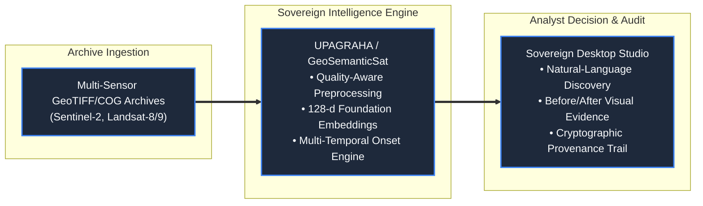

# Slide 1: Title Page

## Official Template Section
**Title Page / Project Identification**

---

## Slide Objective
Establish immediate project identity, core positioning, problem context, and team recognition within the first 10 seconds of evaluation without decorative fluff or lengthy prose.

---

## Slide Content (Exact Copy)

```
====================================================================================================
SIH 2026 IDEA PRESENTATION
====================================================================================================

PROJECT TITLE:
  UPAGRAHA / GeoSemanticSat

CORE SOLUTION DESCRIPTOR:
  A Sovereign, Locally Deployable Earth-Observation Intelligence Workflow Combining
  Semantic Imagery Discovery, Multi-Temporal Change Analysis, Quality-Aware Processing,
  and Analyst-Verified Provenance Tracking

PROBLEM STATEMENT CONTEXT:
  SIH 2026 | Theme: Space Technology & Remote Sensing
  Topic: Semantic Retrieval & Multi-Temporal Change Analysis over Satellite Imagery Archives

OPERATIONAL PARADIGM:
  From Metadata-Constrained Archival Queries to Content-Aware Sovereign Geospatial Intelligence
  • 100% On-Premises & Air-Gapped Operation [REQUIRED_BY_SIH]
  • Multimodal Semantic Discovery via Foundation Embeddings [IMPLEMENTED]
  • Quality-Gated False-Alarm Suppression & Earliest Onset Estimation [IMPLEMENTED]
  • Human-in-the-Loop Verification with Immutable Provenance Chains [IMPLEMENTED]

TEAM & INSTITUTION:
  Team Name: Unified RS-Analytics
  Affiliation: SIH 2026 Space & Geospatial Innovation Track
====================================================================================================
```

---

## Visual & Layout Specification



* **Visual Style:** Minimalist, high-contrast dark palette (`#0F172A` background, `#38BDF8` cyan accents, `#F8FAFC` typography).
* **Layout Structure:**
  * **Header:** Government/SIH presentation branding and problem statement category.
  * **Center:** Project name `UPAGRAHA` (`GeoSemanticSat`) in bold display font with concise two-line descriptor.
  * **Bottom-Center:** 3-node linear transformation pipeline diagram (Archive $\rightarrow$ Sovereign Engine $\rightarrow$ Verified Intelligence).
  * **Footer:** Team credentials, institution, and 100% offline air-gapped compliance badge.

---

## Evaluator & Speaker Takeaway
* **10-Second Evaluator Hook:** "Traditional satellite catalogues force analysts to know exact coordinates and dates in advance. UPAGRAHA transforms passive imagery archives into an active, sovereign search engine where analysts discover unknown sites by meaning, detect multi-temporal changes, and verify evidence completely offline."
* **Claim Classification:**
  * `[REQUIRED_BY_SIH]`: Complete offline execution; semantic retrieval; multi-temporal change detection; provenance preservation.
  * `[IMPLEMENTED]`: Desktop Avalonia 11 UI; 128-d canonical embedding index; QualityMaskEngine; OnsetEstimator; SHA-256 GeoJSON provenance trail.
