# Slide 2: Proposed Solution & Innovation

## Official Template Section
**Idea Title / Proposed Solution**

---

## Slide Objective
Clearly contrast the operational bottlenecks of conventional metadata catalogues against UPAGRAHA's integrated semantic discovery and quality-gated temporal intelligence workflow, proving technical uniqueness in under 20 seconds.

---

## Slide Content (Exact Copy)

### 1. Operational Problem: The Discovery Gap in Conventional EO
* **Coordinate Dependency:** Analysts must know *where* and *when* to look; catalogues only filter by acquisition time, bounding box, and platform metadata `[REQUIRED_BY_SIH]`.
* **Manual Pixel Screening:** Content examination requires downloading hundreds of gigabytes before verifying visual presence `[RESEARCH_SUPPORTED: SRC-02]`.
* **High False Alarm Burden:** Seasonal phenology, sun elevation, clouds, and registration jitter create false positive change triggers `[RESEARCH_SUPPORTED: SRC-03, SRC-05]`.
* **Disconnected Provenance:** Change detection and search exist in isolated scripts with no auditable human decision trail `[REQUIRED_BY_SIH]`.

### 2. The UPAGRAHA Approach: Integrated Semantic Discovery
* **Natural-Language Search:** Free-text queries (e.g., *"newly built structures near a river"*) mapped directly to multispectral image tiles `[IMPLEMENTED]`.
* **Quality-Gated Temporal Monitoring:** Atmospheric, radiometric, and geometric confounders suppressed before computing change metrics `[IMPLEMENTED]`.
* **Earliest Onset Estimation:** Flags the exact observation epoch where genuine ground transition materialized `[IMPLEMENTED]`.
* **Human-in-the-Loop Sovereignty:** Air-gapped verification queue preserving analyst approvals into an immutable GeoJSON audit trail `[IMPLEMENTED]`.

### 3. Core Capability Matrix

| Operational Capability | Conventional Catalogues | Standalone Change Tools | UPAGRAHA / GeoSemanticSat |
| :--- | :--- | :--- | :--- |
| **Search Mechanism** | Metadata only (Lat/Lon, Date) | Coordinate-bounded ROI | **Semantic Natural Language + Metadata** `[IMPLEMENTED]` |
| **Spectral Depth** | RGB previews / browse imagery | Single-index diff (NDVI/NDWI) | **Native Multi-Band (VNIR/SWIR/Thermal)** `[IMPLEMENTED]` |
| **Confounder Handling** | None (Raw pixels displayed) | Post-hoc manual masking | **Bitmask Quality Gating (Cloud/Shadow/Sat)** `[IMPLEMENTED]` |
| **Earliest Onset** | Manual time-series scrubbing | Static epoch pair diff | **Temporal Trajectory Breakpoint Search** `[IMPLEMENTED]` |
| **Deployment Mode** | Cloud-tethered portal | Fragmented command-line | **100% Air-Gapped Sovereign Desktop Engine** `[IMPLEMENTED]` |

### 4. Technical Innovation Pillars
1. **Unified Semantic-Temporal Embedding:** Bridges zero-shot language queries with 128-d foundation vector projections `[IMPLEMENTED]`.
2. **Deterministic Quality Gating:** Confounder-first filtering avoids reporting environmental fluctuations as physical change `[IMPLEMENTED]`.
3. **Analyst-Adaptive Refinement:** Human confirmation/rejection modulates retrieval ranking weights in real-time `[IMPLEMENTED]`.
4. **End-to-End Cryptographic Auditability:** SHA-256 scene hashing binds imagery, algorithms, and human sign-offs `[IMPLEMENTED]`.

---

## Visual & Layout Specification

```mermaid
graph TD
    subgraph Problem["CONVENTIONAL WORKFLOW (High Latency, High False Alarms)"]
        P1["Massive Archive<br/>(Petabytes)"] --> P2["Metadata Query<br/>(Requires Known Bounding Box)"]
        P2 --> P3["Manual Scene Download<br/>& Visual Scrubbing"]
        P3 --> P4["Severe Confounders<br/>(Clouds, Seasons, Angle)"]
        P4 --> P5["High False Alarm Fatigue<br/>Unrecorded Decisions"]
    end

    subgraph Solution["UPAGRAHA INTELLIGENCE PIPELINE (Sovereign & Content-Driven)"]
        S1["GeoTIFF/COG Tiles"] --> S2["Bitmask Quality Gate<br/>(Cloud, Shadow, Saturation)"]
        S2 --> S3["Foundation Vector Projection<br/>(128-d Canonical Index)"]
        S4["Analyst Natural-Language Query"] --> S3
        S3 --> S5["Ranked Discovery<br/>& Temporal Onset Engine"]
        S5 --> S6["Human-in-the-Loop Verification<br/>+ Immutable GeoJSON Audit"]
    end

    classDef redBox fill:#3b1111,stroke:#ef4444,stroke-width:1.5px,color:#fee2e2;
    classDef greenBox fill:#062e24,stroke:#10b981,stroke-width:1.5px,color:#d1fae5;
    class P1,P2,P3,P4,P5 redBox;
    class S1,S2,S3,S4,S5,S6 greenBox;
```

* **Visual Layout:** Side-by-side split screen.
  * **Left Panel:** Conventional Workflow (Red flow showing latency bottlenecks, blind spots, and false alarms).
  * **Right Panel:** UPAGRAHA Pipeline (Emerald green flow highlighting quality gating, semantic vector retrieval, and analyst verification).
  * **Bottom Banner:** 4 Innovation Pillars with micro-badges (`Semantic-Temporal`, `Quality-Gated`, `Adaptive`, `Sovereign`).

---

## Evaluator & Speaker Takeaway
* **Key Takeaway:** "UPAGRAHA replaces manual search across millions of tiles with intelligent semantic retrieval and quality-gated multi-temporal analysis. Instead of sifting through false alarms caused by clouds and seasonal changes, analysts receive ranked candidate sites with verified before-and-after evidence, all processed locally on sovereign hardware."
* **Evidence Tracing:**
  * USGS Landsat Surface Reflectance QA guidelines (`SRC-04`, `SRC-05`) justify the confounder gating.
  * NASA ARSET methodology (`SRC-07`) confirms multi-temporal onset requirements.
