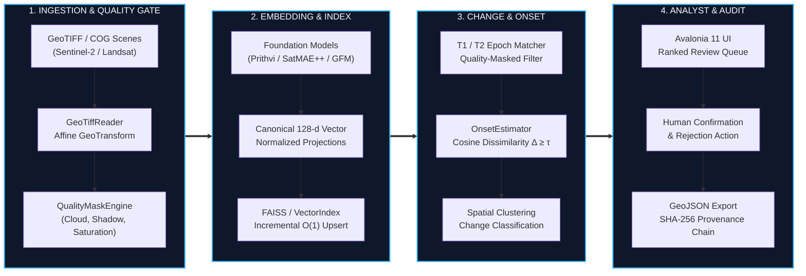

# Slide 3: Technical Approach & End-to-End Architecture

## Official Template Section
**Technical Approach**

---

## Slide Objective
Demonstrate an end-to-end, technically coherent data flow from multi-sensor raster ingestion to analyst decision output, justifying every mathematical and architectural component without decorative complexity.

---

## Slide Content (Exact Copy)

### 1. Ingestion & Quality-Gated Preprocessing
* **Multi-Sensor Raster Ingestion:** Reads standard GeoTIFF/COG formats with georeferenced affine coordinates ($x_{geo} = A x + B y + C$) `[IMPLEMENTED]`.
* **Deterministic Quality Masking:** Generates bitmask QA layers isolating clouds, shadow, water saturation, and missing data `[IMPLEMENTED: QualityMaskEngine]`.
* **Radiometric Normalization:** Normalizes reflectance values into uniform physical ranges across multi-temporal acquisitions `[RESEARCH_SUPPORTED: SRC-04]`.
* **Patch Decomposition:** Splits scenes into georeferenced patches preserving optical metadata (sun elevation, viewing zenith, cloud fraction) `[IMPLEMENTED]`.

### 2. Semantic Embedding & Sovereign Indexing
* **128-d Canonical Vector Contract:** Projections aligned across text prompts and multispectral bands (`SemanticEmbeddingLayout.cs`) `[IMPLEMENTED]`.
* **Foundation Feature Extractors:**
  * Multi-Temporal Trajectory: Prithvi-EO-2.0 temporal adapter `[IMPLEMENTED]`
  * Multispectral Representation: SatMAE++ multispectral adapter `[IMPLEMENTED]`
  * Cross-Sensor Fusion: GFM Composition Engine `[IMPLEMENTED]`
* **Incremental Vector Indexing:** Append-only FAISS IndexFlatIP and GSSV v2 binary storage with $O(1)$ patch updates without index rebuilding `[IMPLEMENTED]`.

### 3. Change Detection & Onset Estimation
* **Cosine Dissimilarity Metric:** Computes $\Delta = 1 - \frac{\mathbf{u} \cdot \mathbf{v}}{\|\mathbf{u}\|_2 \|\mathbf{v}\|_2}$ across valid quality-masked pixels `[IMPLEMENTED]`.
* **Spatial Morphological Clustering:** Groups change pixels into connected polygons with polygon centroids and bounding coordinates `[IMPLEMENTED]`.
* **Phenological Filtering:** Historical seasonal baseline comparison suppresses cyclical vegetation false alarms `[IMPLEMENTED]`.
* **Earliest Onset Trajectory:** Detects earliest verified temporal breakpoint $t_0$ exceeding confidence threshold $\tau$ `[IMPLEMENTED: OnsetEstimator]`.

### 4. Human Verification & Sovereign Provenance
* **Interactive Ranked Review Queue:** Presents candidate change sites with synchronized before/after raster overlays `[IMPLEMENTED]`.
* **Analyst Action Protocol:** Analyst marks candidates as **Confirmed** or **Rejected**; feedback dynamically weights subsequent retrieval ranking `[IMPLEMENTED]`.
* **SHA-256 Provenance Ledger:** Every exported GeoJSON feature records scene hashes, sensor tags, operator ID, and timestamp `[IMPLEMENTED]`.

---

## Visual & Layout Specification

* **Visual Style:** 4-stage horizontal pipeline (Left to Right) with crisp sub-process boxes.
* **Component Demarcation:**
  * Blue connector arrows indicate forward feature flow.
  * Dashed return line from Analyst Stage to Vector Stage demonstrates Human-in-the-Loop retrieval refinement.
* **Color Code:**
  * Solid Slate: Verified and implemented modules (`GeoSemanticSat.Core`, `Avalonia UI`).
  * Cyan border: Cryptographic and mathematical operations.

---

## Evaluator & Speaker Takeaway
* **Key Takeaway:** "Our technical approach establishes an airtight pipeline: raw pixels are verified and masked against atmospheric noise, embedded into a compact 128-dimensional canonical space, evaluated for multi-temporal structural changes, and handed to the analyst with a complete cryptographic audit trail."
* **Mathematical Precision:**
  * Georeferencing uses native 6-parameter affine transformation matrix.
  * Change metric relies on cosine dissimilarity normalized over valid mask coverage $\ge 70\%$.
  * Provenance uses standard SHA-256 hashing across raw raster tiles and analyst confirmation payloads.
