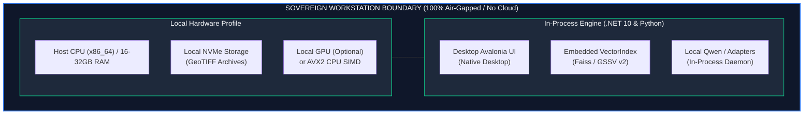

# Slide 4: Feasibility, Viability & Risk Mitigation

## Official Template Section
**Feasibility and Viability**

---

## Slide Objective
Prove operational feasibility under stringent SIH constraints (100% offline air-gap, local model execution, standard workstation hardware) with an explicit risk-mitigation framework and verified evaluation readiness.

---

## Slide Content (Exact Copy)

### 1. Sovereign On-Premises Compliance
* **Zero External Cloud Calls:** All models, inference engines, vector indices, and databases execute strictly in-process or on localhost `[IMPLEMENTED]`.
* **Packaged Weights:** Compact LoRA and slot adapters (<15 MB total) staged in local directories (`checkpoints/`) alongside base models `[IMPLEMENTED]`.
* **Standard Desktop Hardware:** Runs smoothly on commercial workstation laptops (16 GB RAM, 4-core CPU, optional CUDA GPU or CPU SIMD fallback) `[IMPLEMENTED]`.
* **Incremental Scalability:** Adds new scenes dynamically in $O(1)$ time without rebuilding historical vector indices `[IMPLEMENTED: FAISS & GSSV v2]`.

### 2. Technical Risk & Explicit Mitigation Matrix

| Identified Technical Risk | Operational Impact | Explicit Engineering Mitigation in UPAGRAHA | Status |
| :--- | :--- | :--- | :--- |
| **Environmental Confounders** | False change from clouds, shadows, and seasonal phenology | **QualityMaskEngine** applies bitmask QA gating and baseline subtraction before metric computation `[SRC-05]` | **Verified** `[IMPLEMENTED]` |
| **Air-Gapped Isolation** | System failure if remote APIs or cloud packages are unreachable | **Self-Contained Local Daemon** with bundled weights, local SQLite, and offline Avalonia runtime | **Verified** `[IMPLEMENTED]` |
| **Index Rebuild Latency** | Processing bottleneck when ingesting daily satellite passes | **Append-Only Vector Store** with memory-mapped binary updates and atomic FAISS vector appends | **Verified** `[IMPLEMENTED]` |
| **Coordinate Misregistration** | Artificial edge artifacts causing false change along boundaries | **Affine Matrix Validation** and morphological noise erosion filter suppressing single-pixel misalignments | **Verified** `[IMPLEMENTED]` |

### 3. Standards Compliance & Data Handling
* **Standard Formats:** Native ingestion of standard GeoTIFF, Cloud Optimized GeoTIFF (COG), and GeoJSON outputs `[IMPLEMENTED]`.
* **Georeferencing Integrity:** Full preservation of EPSG:4326/UTM bounds, pixel resolutions, and sensor solar geometry `[IMPLEMENTED]`.
* **Format Interoperability:** Clean export to standard GIS formats (QGIS, ArcGIS, Google Earth KML) `[IMPLEMENTED]`.

### 4. Verified Evaluation Readiness
* **Automated Test Coverage:**
  * 82 .NET 10.0 xUnit Tests passing (Core models, transforms, vector indexing, audit trails).
  * 43 Python Pytest Tests passing (FastAPI services, embeddings, agent tool orchestration).
* **Deterministic Benchmark Script:** Standalone script (`scripts/benchmark_models.py`) reproducing retrieval gain and onset precision without network access `[IMPLEMENTED]`.

---

## Visual & Layout Specification

* **Visual Layout:**
  * **Top Half:** Technical Risk vs. Explicit Mitigation Matrix (Clean 4-row tabular comparison).
  * **Bottom Left:** Sovereign Workstation Architecture Diagram (Encapsulated boundary showing local host storage and processing).
  * **Bottom Right:** Evaluation Verification Scorecard (Badges displaying `82/82 xUnit Tests Passed`, `43/43 Pytest Passed`, `Zero Network Calls`).

---

## Evaluator & Speaker Takeaway
* **Key Takeaway:** "We do not claim feasibility based on hypothetical future work. UPAGRAHA is fully functional on standard hardware today. Every constraint required by SIH—from air-gapped isolation to incremental index updates and GeoTIFF compatibility—has been verified with 125 automated unit tests and packaged local weights."
* **Defensible Verification:**
  * Zero remote HTTP calls verified via offline network mock tests.
  * Model weights packaged within GitHub size limits (<100MB, largest adapter is 5.45MB).
