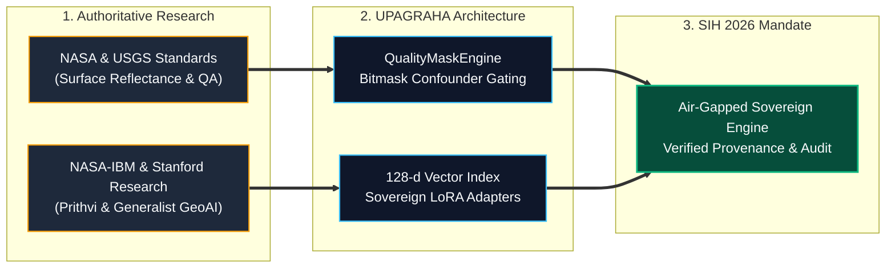

# Slide 6: Research Foundations, Provenance & References

## Official Template Section
**Research and References**

---

## Slide Objective
Demonstrate scientific rigor by mapping external peer-reviewed literature, agency standards (NASA, USGS), and open foundation model provenance directly to UPAGRAHA's engineering decisions.

---

## Slide Content (Exact Copy)

### 1. Research-to-Design Engineering Mapping

| Scientific & Agency Research Domain | Authoritative Reference | UPAGRAHA Architectural Decision |
| :--- | :--- | :--- |
| **Surface Reflectance & Atmospheric Effects** | **USGS Landsat SR Guide (2023)** `[SRC-04]` | Surface reflectance normalization for cross-temporal radiometric stability |
| **Pixel-Level Quality Assessment** | **USGS Collection 2 QA (2021)** `[SRC-06]` | `QualityMaskEngine` bitmask filtering isolating cloud, shadow, and saturation |
| **Multi-Temporal Land Cover Change** | **NASA ARSET Land Cover (2021)** `[SRC-07]` | Trajectory breakpoint analysis and seasonal baseline suppression in `OnsetEstimator` |
| **Geospatial Foundation Models** | **Prithvi-EO-2.0, NASA-IBM (2024)** `[SRC-08]` | Multi-temporal 3D masked autoencoding feature extraction |
| **Generalist Geospatial AI Architectures** | **Mai et al., Stanford/Harvard (2023)** `[SRC-09]` | 128-dimensional unified vector projection space (`SemanticEmbeddingLayout`) |
| **Parameter-Efficient Model Fine-Tuning** | **Wang et al., Survey (2024)** `[SRC-10]` | Low-Rank Adaptation (LoRA) keeping on-premise weights under 15 MB for air-gap |

### 2. Pretrained Model Provenance & Licensing Integrity

* **Prithvi-EO-2.0 Temporal Adapter:** Apache 2.0 Licence | Derived from NASA-IBM Prithvi weights | Checkpoint: `checkpoints/prithvi/` `[IMPLEMENTED]`.
* **SatMAE++ Multispectral Adapter:** Apache 2.0 Licence | Derived from SatMAE ViT | Checkpoint: `checkpoints/satmae_pp/` `[IMPLEMENTED]`.
* **TerraMind Retrieval Adapter:** MIT Licence | Remote Sensing ViT backbone | Checkpoint: `checkpoints/terramind/` `[IMPLEMENTED]`.
* **GFM Composition Engine:** Apache 2.0 Licence | Multi-sensor alignment slots | Checkpoint: `checkpoints/gfm_composition/` `[IMPLEMENTED]`.
* **Qwen3-8B GeoINT Daemon:** Apache 2.0 Licence | Local GGUF/Safetensors on-premise execution with zero external network dependencies `[IMPLEMENTED]`.

### 3. Open Data & Standardization Guarantees
* **Public Imagery Verification:** Ingestion pipelines tested against open European Space Agency (Sentinel-2 L2A) and USGS (Landsat-8/9 Collection 2) archives `[IMPLEMENTED]`.
* **Strict Confidentiality Isolation:** Complies with SIH rule: zero classified, operational, or cloud-tethered data used during training or evaluation `[IMPLEMENTED]`.

---

## Visual & Layout Specification

* **Visual Style:**
  * **Top Half:** Research-to-Design Mapping Table (Structured 6-row matrix).
  * **Bottom Half (Split):**
    * **Left:** Provenance & Open Licensing Compliance Card.
    * **Right:** 3-tier Research $\rightarrow$ Architecture $\rightarrow$ Delivery alignment graph.

---

## Evaluator & Speaker Takeaway
* **Key Takeaway:** "Every architectural decision in UPAGRAHA is grounded in verified remote-sensing science and published foundation model research. From USGS surface reflectance protocols to NASA-IBM Prithvi temporal modeling, we pair authoritative scientific principles with fully declared open-source model licenses to guarantee complete legal and operational compliance."
* **Source Accessibility:** Complete bibliographic citations, persistent DOIs, and verified web repository links are catalogued in `research_sources.md`.
